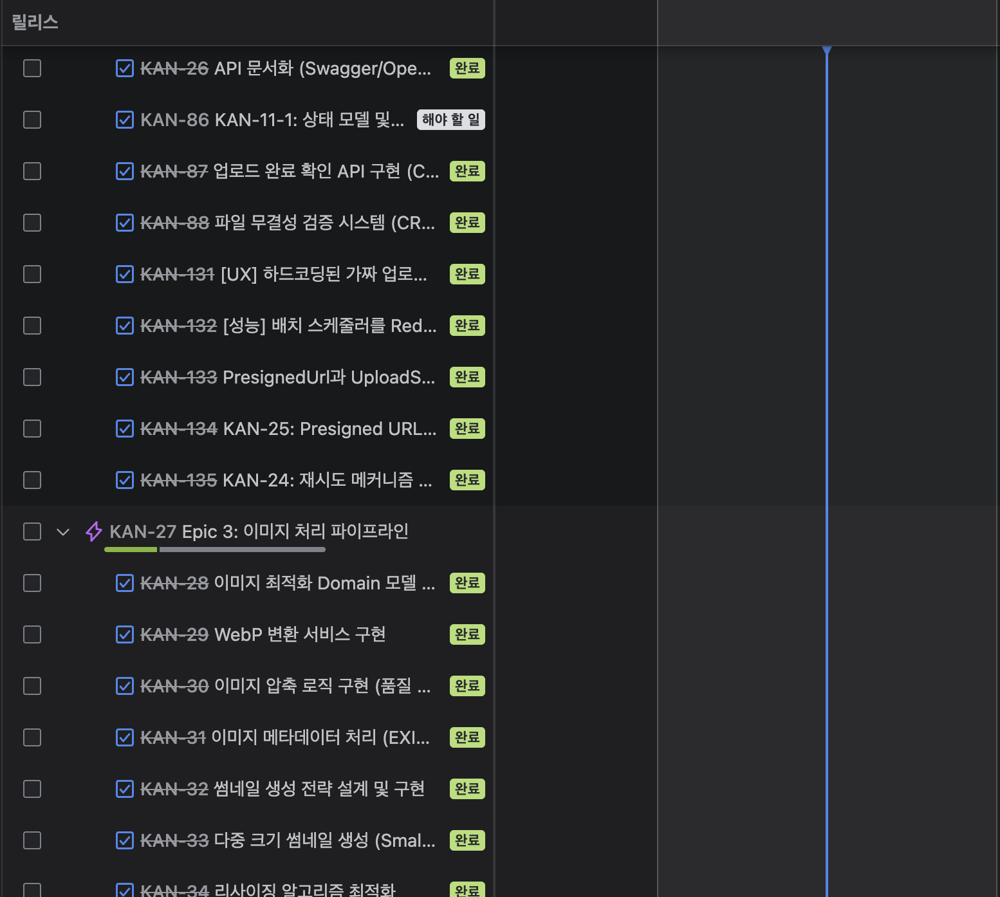

# 📦 FileFlow

테넌트별 정책 기반의 파일 업로드 및 지능형 후처리 파이프라인 플랫폼

## 🔬 실험용 브랜치: pure-claude-code-chaos

이 브랜치는 사람이 직접 코드를 작성하지 않고, 클로드(Claude)만 100% 사용해 개발을 진행했을 때의 결과를 기록하기 위한 "실험" 트랙입니다. 여러 통제 장치를 두었음에도 코드가 얼마나 쉽게 일관성을 잃고 품질이 저하되는지 보여주기 위한 목적입니다.

- **접근**: 아틀라시안/Jira 스타일로 태스크를 최대한 잘개 쪼개 진행했습니다.

  

- **품질 통제 시도**
  - **코딩 컨벤션 강화**: 프로젝트 규칙과 가이드를 엄격 적용
  - **클로드 세션 훅**: 프롬프트/세션 규칙을 자동 주입해 일관성 유지 시도
  - **Git 커밋 훅**: Checkstyle/SpotBugs/테스트를 커밋 단계에서 강제
  - **기타 자동화**: 템플릿, 리뷰 체크리스트 등 다양한 가드레일 시도

- **그러나 드러난 한계**
  - **중복·불일치 증가**: 네이밍/추상화/레이어 규칙이 쉽게 붕괴
  - **맥락 유실**: 생성형 모델 특성상 연속 의사결정의 일관성 약화
  - **테스트 품질 저하**: 목적-결과 불일치, 커버리지 편향 발생
  - **도메인 규칙 누락**: 헥사고날 경계 침범 시도가 빈번해짐

- **주의사항**
  - 본 브랜치는 교육/연구/반면교사 목적입니다. 메인의 품질 기준을 대표하지 않습니다.
  - 단일 소스 오브 트루스는 `main` 입니다. 이 브랜치 변경사항을 직접 병합하지 마세요.

- **요약**: "사람의 최종 설계 책임 없이 생성형 AI만으로는 엔터프라이즈 코드베이스가 빠르게 망가질 수 있다"는 사실을 실증하기 위한 트랙입니다.

하기 문서 내용 부턴 기존 프로젝트 문서 내용
--------


## 🎯 개요

FileFlow는 다양한 파일 타입(이미지, HTML, Excel, PDF)에 대한 업로드, 처리, 후처리를 테넌트별 정책 기반으로 관리하는 엔터프라이즈 플랫폼입니다.

### 핵심 기능

- **테넌트 정책 관리**: 테넌트별 파일 업로드 정책 및 제약 조건 설정
- **지능형 파일 처리**: 이미지 최적화, OCR, 데이터 표준화
- **확장 가능한 파이프라인**: SQS 기반 비동기 후처리 파이프라인
- **완벽한 추적**: 파일 업로드부터 처리까지 전 과정 이력 관리

## 🛠️ 기술 스택

- **Java 21** + **Spring Boot 3.x**
- **Hexagonal Architecture** (Ports & Adapters)
- **AWS**: S3, SQS, Textract, CloudFront
- **Database**: MySQL, Redis
- **NO Lombok Policy** (Pure Java)

## 🏗️ 아키텍처

```
📦 fileflow
├── 🎯 domain                      # 순수 비즈니스 로직
├── 🔄 application                 # 유스케이스 (포트 정의)
├── 🔌 adapter
│   ├── adapter-in-rest-api        # REST API
│   ├── adapter-out-persistence-jpa # 영속성
│   ├── adapter-out-redis          # 캐싱
│   ├── adapter-out-aws-s3         # 파일 저장소
│   ├── adapter-out-aws-sqs        # 메시징
│   └── adapter-out-aws-textract   # OCR
└── 🚀 bootstrap
    └── bootstrap-web-api          # Spring Boot 애플리케이션
```

## 🚀 시작하기

### 사전 요구사항

- Java 21+
- Docker (테스트용 PostgreSQL, Redis, LocalStack)
- Gradle 8.x

### 빌드

```bash
./gradlew clean build
```

### 실행

```bash
./gradlew :bootstrap:bootstrap-web-api:bootRun
```

## 📋 개발 가이드

### 코딩 표준

- **NO Lombok**: 순수 Java 사용
- **Immutability**: `private final` 필드, 정적 팩토리 메서드
- **Pure Domain**: Domain 모듈은 외부 의존성 없음

### 품질 검증

```bash
# 테스트 + 커버리지 검증
./gradlew test

# 코드 품질 검사 (Checkstyle, SpotBugs)
./gradlew check
```

### Git Hooks

프로젝트에는 자동 품질 검증을 위한 Git Hooks가 설정되어 있습니다:
- `pre-commit`: 코드 품질 검사 및 테스트 실행

## 📚 문서

상세한 프로젝트 문서는 [docs/file-flow](./docs/file-flow) 디렉토리를 참조하세요.

### 🔗 Jira 통합

GitHub 이슈를 자동으로 Jira Task로 동기화할 수 있습니다:
- **설정 가이드**: [docs/JIRA_INTEGRATION.md](./docs/JIRA_INTEGRATION.md)
- **기능**: 이슈 생성/수정/닫기 자동 동기화
- **설정 시간**: 약 5분

## 🏛️ 아키텍처 원칙

### Hexagonal Architecture

- **Domain**: 비즈니스 로직 중심, 프레임워크 독립적
- **Application**: 유스케이스 오케스트레이션
- **Adapter**: 외부 시스템 통합 (REST, DB, AWS 등)

### 의존성 규칙

```
Domain ← Application ← Adapter
```

- Domain은 어떤 모듈에도 의존하지 않음
- Application은 Domain에만 의존
- Adapter는 Application과 Domain에 의존

## 📊 프로젝트 로드맵

### Epic 1: 테넌트 정책 관리 시스템 ✅
- [x] 프로젝트 초기 설정
- [ ] 테넌트 정책 도메인 모델
- [ ] 정책 관리 API

### Epic 2: 파일 업로드 & 저장
- [ ] Presigned URL 발급
- [ ] S3 업로드 처리
- [ ] 메타데이터 관리

### Epic 3: 이미지 처리 파이프라인
- [ ] 이미지 최적화
- [ ] 썸네일 생성
- [ ] OCR 처리

### Epic 4: HTML 처리
### Epic 5: Excel 표준화
### Epic 6: 모니터링 & 추적

---

**Made with Hexagonal Architecture & Spring Boot** 🚀
