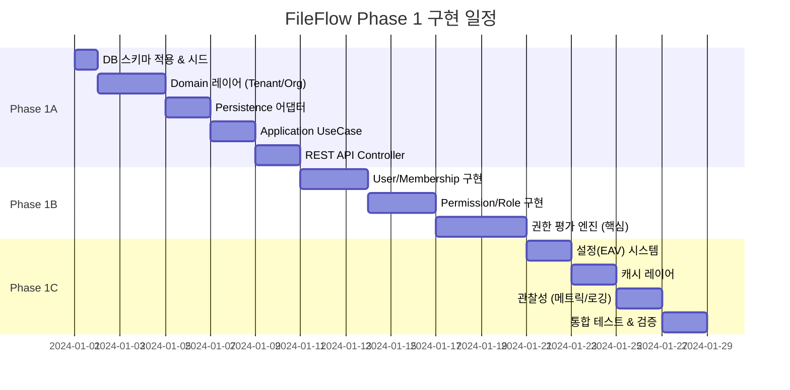

# FileFlow Phase 1 구현 워크플로우

> **목적**: Tenant·Organization·User·RBAC 시스템을 헥사고날 아키텍처로 체계적으로 구현하기 위한 실행 가능한 워크플로우

---

## 📋 목차

1. [전제 조건](#1-전제-조건)
2. [프로젝트 구조](#2-프로젝트-구조)
3. [구현 워크플로우](#3-구현-워크플로우)
4. [Phase별 상세 가이드](#4-phase별-상세-가이드)
5. [테스트 전략](#5-테스트-전략)
6. [배포 및 운영](#6-배포-및-운영)

---

## 1. 전제 조건

### 1.1 필수 문서 숙지

| 문서 | 역할 | 위치 |
|------|------|------|
| **01-tenant-org-user-rbac.md** | Phase 1 최소 10개 기능 명세 | `docs/guide/01/` |
| **01-tenant-organization-user.md** | v2 완전한 설계 (Phase 2 참조용) | `docs/guide/01/` |
| **schema.sql** | 프로덕션 DDL (13개 테이블) | `docs/guide/01/` |
| **seed.sql** | 초기 시드 데이터 (권한/역할/조건) | `docs/guide/01/` |

### 1.2 기술 스택

- **Language**: Java 21 (Record Patterns, Sealed Classes, Virtual Threads)
- **Framework**: Spring Boot 3.5.x
- **Architecture**: Hexagonal (Ports & Adapters) + DDD + CQRS
- **Database**: MySQL 8.x (No FK, Soft Delete, 애플리케이션 레벨 정합성)
- **ABAC Engine**: CEL (Common Expression Language) for conditional permissions
- **Cache**: Redis (Effective Grants Cache, Settings Cache)
- **Testing**: JUnit 5, ArchUnit, Spring Boot Test

### 1.3 코딩 규칙 (Zero-Tolerance)

```yaml
MUST:
  - Lombok 금지 (Pure Java getter/setter)
  - Law of Demeter 준수 (Getter 체이닝 금지)
  - Long FK 전략 (JPA 관계 어노테이션 금지)
  - Transaction 경계 엄격 관리 (외부 API 호출 금지)
  - Javadoc 필수 (모든 public 클래스/메서드)

NEVER:
  - @ManyToOne, @OneToMany, @OneToOne, @ManyToMany
  - order.getCustomer().getAddress().getZip() (체이닝)
  - @Transactional 내 RestTemplate/WebClient 호출
```

---

## 2. 프로젝트 구조

### 2.1 헥사고날 아키텍처 모듈 구조 (Ports & Adapters)

```
fileflow/
├── domain/                          # 핵심 비즈니스 로직 (순수 Java, 외부 의존성 없음)
│   ├── iam/
│   │   ├── tenant/
│   │   │   ├── Tenant.java          # Aggregate Root
│   │   │   ├── TenantId.java        # Value Object
│   │   │   └── TenantStatus.java    # Enum
│   │   ├── organization/
│   │   │   ├── Organization.java
│   │   │   ├── OrganizationId.java
│   │   │   └── OrgCode.java
│   │   ├── user/
│   │   │   ├── UserContext.java
│   │   │   ├── UserContextId.java
│   │   │   └── Membership.java
│   │   └── permission/
│   │       ├── Permission.java
│   │       ├── Role.java
│   │       ├── Grant.java           # 권한 평가 결과
│   │       ├── Scope.java           # SELF/ORG/TENANT/GLOBAL
│   │       └── PermissionEvaluator.java  # Domain Service (선택)
│   └── common/
│       ├── DomainException.java
│       └── SoftDeletable.java
│
├── application/                     # Use Case Layer (애플리케이션 서비스)
│   ├── iam/
│   │   ├── tenant/
│   │   │   ├── CreateTenantUseCase.java
│   │   │   ├── UpdateTenantUseCase.java
│   │   │   ├── port/                           # ⭐ Port 정의 (인터페이스)
│   │   │   │   └── TenantRepositoryPort.java
│   │   │   └── dto/
│   │   │       ├── CreateTenantCommand.java
│   │   │       └── TenantResponse.java
│   │   ├── organization/
│   │   │   ├── CreateOrganizationUseCase.java
│   │   │   ├── UpdateOrganizationUseCase.java
│   │   │   ├── SoftDeleteOrganizationUseCase.java
│   │   │   └── port/
│   │   │       └── OrganizationRepositoryPort.java
│   │   ├── user/
│   │   │   ├── CreateUserContextUseCase.java
│   │   │   ├── AssignMembershipUseCase.java
│   │   │   ├── RevokeMembershipUseCase.java
│   │   │   └── port/
│   │   │       └── UserContextRepositoryPort.java
│   │   ├── permission/
│   │   │   ├── EvaluatePermissionUseCase.java  # 핵심 권한 평가
│   │   │   ├── AssignRoleUseCase.java
│   │   │   ├── RevokeRoleUseCase.java
│   │   │   └── port/                           # ⭐ Port 정의
│   │   │       ├── PermissionRepositoryPort.java
│   │   │       ├── GrantsCachePort.java         # 캐시 Port
│   │   │       └── AbacEvaluatorPort.java       # CEL 평가 Port
│   │   └── setting/
│   │       ├── GetMergedSettingsUseCase.java   # Org>Tenant>Default
│   │       ├── UpdateSettingsUseCase.java
│   │       └── port/
│   │           └── SettingRepositoryPort.java
│   └── config/                      # Application 레벨 Spring 설정
│       ├── ApplicationConfig.java   # Component Scan 등
│       └── TransactionConfig.java   # Transaction Manager
│
├── adapter-in/                      # Primary Adapters (Driving Side)
│   └── rest/                        # REST API Adapter
│       ├── iam/
│       │   ├── tenant/
│       │   │   ├── TenantController.java
│       │   │   └── dto/
│       │   │       ├── CreateTenantRequest.java
│       │   │       └── TenantDto.java
│       │   ├── organization/
│       │   │   └── OrganizationController.java
│       │   ├── user/
│       │   │   └── UserController.java
│       │   └── permission/
│       │       └── PermissionEvaluationController.java  # POST /iam/evaluate
│       └── common/
│           ├── GlobalExceptionHandler.java    # RFC 7807 Problem Details
│           ├── AuthContextInterceptor.java    # 서명 검증 + Context 주입
│           └── SignatureValidator.java
│
├── adapter-out/                     # Secondary Adapters (Driven Side)
│   ├── persistence-jpa/             # JPA 영속성 Adapter
│   │   ├── iam/
│   │   │   ├── tenant/
│   │   │   │   ├── TenantJpaEntity.java
│   │   │   │   ├── TenantJpaRepository.java
│   │   │   │   ├── TenantRepositoryAdapter.java  # Port 구현
│   │   │   │   └── TenantMapper.java
│   │   │   ├── organization/
│   │   │   │   ├── OrganizationJpaEntity.java
│   │   │   │   ├── OrganizationJpaRepository.java
│   │   │   │   └── OrganizationRepositoryAdapter.java
│   │   │   ├── user/
│   │   │   │   ├── UserContextJpaEntity.java
│   │   │   │   ├── UserOrgMembershipJpaEntity.java
│   │   │   │   └── UserContextRepositoryAdapter.java
│   │   │   └── permission/
│   │   │       ├── PermissionJpaEntity.java
│   │   │       ├── RoleJpaEntity.java
│   │   │       ├── RolePermissionJpaEntity.java
│   │   │       ├── UserRoleMappingJpaEntity.java
│   │   │       └── PermissionRepositoryAdapter.java
│   │   ├── common/
│   │   │   ├── BaseJpaEntity.java         # created_at, updated_at
│   │   │   └── SoftDeletableEntity.java   # deleted_at
│   │   └── config/
│   │       ├── JpaConfig.java              # ⭐ JPA 설정 (EntityManager 등)
│   │       └── DataSourceConfig.java       # DataSource 설정
│   │
│   ├── persistence-redis/           # Redis 영속성 Adapter
│   │   ├── cache/
│   │   │   ├── EffectiveGrantsCacheAdapter.java  # GrantsCachePort 구현
│   │   │   └── SettingsCacheAdapter.java
│   │   └── config/
│   │       ├── RedisConfig.java            # ⭐ Redis 설정 (RedisTemplate 등)
│   │       └── RedisCacheConfig.java       # Cache TTL, Serializer
│   │
│   └── abac-cel/                    # CEL ABAC Adapter
│       ├── CelAbacAdapter.java      # AbacEvaluatorPort 구현
│       ├── CelEngine.java           # CEL 평가 엔진 래퍼
│       ├── ConditionEvaluator.java  # 조건 평가 로직
│       └── config/
│           └── CelConfig.java       # ⭐ CEL 엔진 설정
│
└── bootstrap/                       # Application Bootstrap (진입점)
    ├── api/                         # REST API Bootstrap
    │   ├── ApiApplication.java      # @SpringBootApplication (Main)
    │   ├── resources/
    │   │   └── application.yml      # API 서버 설정
    │   └── config/
    │       └── ApiSecurityConfig.java     # API 보안 설정
    └── worker/                      # Background Worker Bootstrap (미래 확장)
        ├── WorkerApplication.java   # @SpringBootApplication
        └── resources/
            └── application.yml      # Worker 설정
```

### 2.2 아키텍처 원칙

| 레이어 | 의존성 방향 | 규칙 |
|--------|------------|------|
| **domain** | 외부 의존성 없음 | 순수 Java만 사용, Spring/JPA 의존 금지 |
| **application** | domain만 의존 | Use Case 구현, Port 인터페이스 사용 |
| **adapter-in** | application + domain | Primary Adapter, 외부 → 내부 방향 |
| **adapter-out** | application + domain | Secondary Adapter, Port 구현 |
| **bootstrap** | 모든 레이어 의존 | 의존성 주입 + 애플리케이션 실행 |

**핵심 규칙**:
- **Domain**: 순수 비즈니스 로직만, 외부 의존성 없음 (Spring/JPA 금지)
- **Application**: Use Case 구현 + **Port 정의** (인터페이스)
- **Adapter**: Application의 Port를 **구현**하여 제공
- **의존성 방향**: Adapter → Application → Domain (단방향)
- **기술별 설정**: 각 Adapter 내부에 배치 (JpaConfig → persistence-jpa/config/)

**Port 원칙**:
- Port는 **Application 레벨**에서 정의 (`application/iam/tenant/port/`)
- Adapter는 Port를 **구현** (`TenantRepositoryAdapter implements TenantRepositoryPort`)
- Use Case는 Port **인터페이스**만 의존 (구체 클래스 모름)

---

## 3. 구현 워크플로우

### 3.1 전체 타임라인 (4주 예상)



### 3.2 Phase별 목표

| Phase | 주요 목표 | DoD (Definition of Done) |
|-------|----------|--------------------------|
| **Phase 1A** | Tenant/Org CRUD + Soft Delete | ✅ 5개 API 정상 동작, ArchUnit 통과 |
| **Phase 1B** | User/Permission + 권한 평가 엔진 | ✅ `/iam/evaluate` API P95 < 50ms |
| **Phase 1C** | 설정/캐시/관찰성 + 통합 검증 | ✅ End-to-End 시나리오 통과 |

---

## 4. Phase별 상세 가이드

### 📦 Phase 1A: Tenant/Organization 기반 구축 (1주)

#### 🎯 목표
- Tenant/Organization CRUD 완성
- Soft Delete 메커니즘 확립
- 헥사고날 아키텍처 기본 패턴 구축

#### 📝 작업 순서

##### Step 1.1: DB 스키마 적용 (0.5일)
```bash
# 1. 로컬 MySQL 실행 확인
docker ps | grep mysql

# 2. 스키마 적용
mysql -h localhost -u root -p fileflow < docs/guide/01/schema.sql

# 3. 시드 데이터 적용
mysql -h localhost -u root -p fileflow < docs/guide/01/seed.sql

# 4. 검증
mysql -h localhost -u root -p fileflow -e "SELECT * FROM tenants; SELECT * FROM organizations;"
```

##### Step 1.2: Domain 레이어 구현 (2일)

**1.2.1 Tenant Aggregate 생성**
```bash
/code-gen-domain Tenant
```

**예상 생성 파일**:
```java
// domain/src/main/java/com/company/fileflow/domain/iam/tenant/Tenant.java
/**
 * 테넌트 Aggregate Root.
 * 서비스 구독 단위(회사/셀러/파트너 등)를 표현.
 *
 * @author FileFlow Team
 * @since 2024-01-01
 */
public class Tenant {
    private TenantId id;
    private TenantName name;
    private TenantStatus status;
    private Instant createdAt;
    private Instant updatedAt;
    private Instant deletedAt;  // Soft Delete

    // Constructors
    public Tenant(TenantId id, TenantName name, TenantStatus status) {
        // 검증 로직 (Law of Demeter 준수)
        if (id == null || name == null || status == null) {
            throw new IllegalArgumentException("Tenant 필수 속성이 null입니다");
        }
        this.id = id;
        this.name = name;
        this.status = status;
        this.createdAt = Instant.now();
        this.updatedAt = Instant.now();
    }

    // Getters (Pure Java, No Lombok)
    public TenantId getId() { return id; }
    public TenantName getName() { return name; }
    public TenantStatus getStatus() { return status; }
    public Instant getCreatedAt() { return createdAt; }
    public Instant getUpdatedAt() { return updatedAt; }
    public Instant getDeletedAt() { return deletedAt; }

    // Business Methods (Tell, Don't Ask)
    public void updateName(TenantName newName) {
        if (this.isDeleted()) {
            throw new IllegalStateException("삭제된 Tenant는 수정할 수 없습니다");
        }
        this.name = newName;
        this.updatedAt = Instant.now();
    }

    public void suspend() {
        if (this.status == TenantStatus.SUSPENDED) {
            throw new IllegalStateException("이미 정지된 Tenant입니다");
        }
        this.status = TenantStatus.SUSPENDED;
        this.updatedAt = Instant.now();
    }

    public void activate() {
        if (this.status == TenantStatus.ACTIVE) {
            throw new IllegalStateException("이미 활성 상태입니다");
        }
        this.status = TenantStatus.ACTIVE;
        this.updatedAt = Instant.now();
    }

    public void softDelete() {
        if (this.isDeleted()) {
            throw new IllegalStateException("이미 삭제된 Tenant입니다");
        }
        this.deletedAt = Instant.now();
    }

    public boolean isDeleted() {
        return this.deletedAt != null;
    }

    public boolean isActive() {
        return this.status == TenantStatus.ACTIVE && !this.isDeleted();
    }
}

// domain/src/main/java/com/company/fileflow/domain/iam/tenant/TenantId.java
/**
 * Tenant ID Value Object (immutable).
 *
 * @author FileFlow Team
 * @since 2024-01-01
 */
public record TenantId(String value) {
    public TenantId {
        if (value == null || value.isBlank()) {
            throw new IllegalArgumentException("TenantId는 비어있을 수 없습니다");
        }
        if (value.length() > 50) {
            throw new IllegalArgumentException("TenantId는 50자를 초과할 수 없습니다");
        }
    }

    public static TenantId of(String value) {
        return new TenantId(value);
    }
}

// domain/src/main/java/com/company/fileflow/domain/iam/tenant/TenantStatus.java
/**
 * Tenant 상태 열거형.
 *
 * @author FileFlow Team
 * @since 2024-01-01
 */
public enum TenantStatus {
    ACTIVE,      // 정상 활성
    SUSPENDED    // 정지됨 (결제 문제, 약관 위반 등)
}
```

**1.2.2 Organization Aggregate 생성**
```bash
/code-gen-domain Organization
```

**핵심 구현 사항**:
- `Organization.java`: Aggregate Root
- `OrganizationId.java`: Long 타입 Value Object
- `OrgCode.java`: 테넌트 내 유니크 코드 (Value Object)
- `OrganizationStatus.java`: ACTIVE/INACTIVE
- **중요**: `private Long tenantId;` (No FK, Long 전략)
- **메서드**: `updateName()`, `deactivate()`, `softDelete()`

##### Step 1.3: Persistence 어댑터 구현 (2일)

**1.3.1 JPA Entity 생성**
```java
// adapter-out/persistence-jpa/src/main/java/com/company/fileflow/adapter/out/persistence/iam/tenant/TenantJpaEntity.java
/**
 * Tenant JPA Entity.
 * Domain Tenant와 분리된 영속성 모델.
 *
 * @author FileFlow Team
 * @since 2024-01-01
 */
@Entity
@Table(name = "tenants")
public class TenantJpaEntity {
    @Id
    @Column(name = "id", length = 50)
    private String id;

    @Column(name = "name", nullable = false, length = 200)
    private String name;

    @Enumerated(EnumType.STRING)
    @Column(name = "status", nullable = false)
    private TenantStatus status;

    @Column(name = "created_at", nullable = false, updatable = false)
    private LocalDateTime createdAt;

    @Column(name = "updated_at", nullable = false)
    private LocalDateTime updatedAt;

    @Column(name = "deleted_at")
    private LocalDateTime deletedAt;

    // Getters & Setters (Pure Java)
    public String getId() { return id; }
    public void setId(String id) { this.id = id; }
    // ... (나머지 생략)

    // Lifecycle Hooks
    @PrePersist
    protected void onCreate() {
        this.createdAt = LocalDateTime.now();
        this.updatedAt = LocalDateTime.now();
    }

    @PreUpdate
    protected void onUpdate() {
        this.updatedAt = LocalDateTime.now();
    }
}
```

**1.3.2 Repository Adapter 구현**
```java
// adapter-out/persistence-jpa/src/main/java/com/company/fileflow/adapter/out/persistence/iam/tenant/TenantRepositoryAdapter.java
/**
 * Tenant Repository Adapter (Port Implementation).
 * Domain Port를 JPA로 구현.
 *
 * @author FileFlow Team
 * @since 2024-01-01
 */
@Component
public class TenantRepositoryAdapter implements TenantRepository {
    private final TenantJpaRepository jpaRepository;
    private final TenantMapper mapper;

    public TenantRepositoryAdapter(TenantJpaRepository jpaRepository, TenantMapper mapper) {
        this.jpaRepository = jpaRepository;
        this.mapper = mapper;
    }

    @Override
    public Tenant save(Tenant tenant) {
        TenantJpaEntity entity = mapper.toEntity(tenant);
        TenantJpaEntity saved = jpaRepository.save(entity);
        return mapper.toDomain(saved);
    }

    @Override
    public Optional<Tenant> findById(TenantId id) {
        return jpaRepository.findByIdAndDeletedAtIsNull(id.value())
            .map(mapper::toDomain);
    }

    @Override
    public boolean existsByName(TenantName name) {
        return jpaRepository.existsByNameAndDeletedAtIsNull(name.value());
    }
}

// adapter-out/persistence-jpa/src/main/java/com/company/fileflow/adapter/out/persistence/iam/tenant/TenantJpaRepository.java
public interface TenantJpaRepository extends JpaRepository<TenantJpaEntity, String> {
    Optional<TenantJpaEntity> findByIdAndDeletedAtIsNull(String id);
    boolean existsByNameAndDeletedAtIsNull(String name);
}
```

##### Step 1.4: Application UseCase 구현 (2일)

**1.4.1 CreateTenantUseCase**
```bash
/code-gen-usecase CreateTenant
```

**생성 파일**:
```java
// application/src/main/java/com/company/fileflow/application/iam/tenant/CreateTenantUseCase.java
/**
 * 테넌트 생성 Use Case.
 * Transaction Boundary: 이 메서드 전체.
 *
 * @author FileFlow Team
 * @since 2024-01-01
 */
@Service
@Transactional
public class CreateTenantUseCase {
    private final TenantRepository tenantRepository;

    public CreateTenantUseCase(TenantRepository tenantRepository) {
        this.tenantRepository = tenantRepository;
    }

    /**
     * 테넌트를 생성합니다.
     *
     * @param command 생성 명령
     * @return 생성된 테넌트 정보
     * @throws TenantAlreadyExistsException 동일 이름 존재 시
     */
    public TenantResponse execute(CreateTenantCommand command) {
        // 1. 중복 검증
        if (tenantRepository.existsByName(TenantName.of(command.name()))) {
            throw new TenantAlreadyExistsException("동일한 이름의 Tenant가 이미 존재합니다: " + command.name());
        }

        // 2. Domain 객체 생성
        Tenant tenant = new Tenant(
            TenantId.of(command.id()),
            TenantName.of(command.name()),
            TenantStatus.ACTIVE
        );

        // 3. 영속화
        Tenant saved = tenantRepository.save(tenant);

        // 4. DTO 변환
        return TenantResponse.from(saved);
    }
}

// application/src/main/java/com/company/fileflow/application/iam/tenant/dto/CreateTenantCommand.java
/**
 * 테넌트 생성 Command DTO.
 *
 * @param id   테넌트 ID (고객 지정 가능)
 * @param name 테넌트 이름
 * @author FileFlow Team
 * @since 2024-01-01
 */
public record CreateTenantCommand(String id, String name) {
    public CreateTenantCommand {
        if (id == null || id.isBlank()) {
            throw new IllegalArgumentException("Tenant ID는 필수입니다");
        }
        if (name == null || name.isBlank()) {
            throw new IllegalArgumentException("Tenant 이름은 필수입니다");
        }
    }
}
```

**1.4.2 UpdateTenantUseCase**
```java
/**
 * 테넌트 수정 Use Case.
 *
 * @author FileFlow Team
 * @since 2024-01-01
 */
@Service
@Transactional
public class UpdateTenantUseCase {
    private final TenantRepository tenantRepository;

    public UpdateTenantUseCase(TenantRepository tenantRepository) {
        this.tenantRepository = tenantRepository;
    }

    public void execute(UpdateTenantCommand command) {
        // 1. 조회
        Tenant tenant = tenantRepository.findById(TenantId.of(command.id()))
            .orElseThrow(() -> new TenantNotFoundException("Tenant를 찾을 수 없습니다: " + command.id()));

        // 2. 비즈니스 로직 (Domain 메서드 호출)
        if (command.name() != null) {
            tenant.updateName(TenantName.of(command.name()));
        }
        if (command.status() != null) {
            if (command.status() == TenantStatus.SUSPENDED) {
                tenant.suspend();
            } else {
                tenant.activate();
            }
        }

        // 3. 영속화 (더티 체킹 or 명시적 save)
        tenantRepository.save(tenant);
    }
}
```

##### Step 1.5: REST API Controller 구현 (2일)

**1.5.1 TenantController**
```bash
/code-gen-controller Tenant
```

**생성 파일**:
```java
// adapter-in/rest/src/main/java/com/company/fileflow/adapter/in/rest/iam/tenant/TenantController.java
/**
 * Tenant REST API Controller.
 *
 * @author FileFlow Team
 * @since 2024-01-01
 */
@RestController
@RequestMapping("/api/tenants")
public class TenantController {
    private final CreateTenantUseCase createTenantUseCase;
    private final UpdateTenantUseCase updateTenantUseCase;

    public TenantController(CreateTenantUseCase createTenantUseCase,
                           UpdateTenantUseCase updateTenantUseCase) {
        this.createTenantUseCase = createTenantUseCase;
        this.updateTenantUseCase = updateTenantUseCase;
    }

    /**
     * 테넌트 생성.
     *
     * @param request 생성 요청
     * @return 201 Created
     */
    @PostMapping
    public ResponseEntity<TenantDto> createTenant(@Valid @RequestBody CreateTenantRequest request) {
        CreateTenantCommand command = new CreateTenantCommand(request.id(), request.name());
        TenantResponse response = createTenantUseCase.execute(command);

        TenantDto dto = TenantDto.from(response);
        return ResponseEntity.status(HttpStatus.CREATED).body(dto);
    }

    /**
     * 테넌트 수정.
     *
     * @param id      테넌트 ID
     * @param request 수정 요청
     * @return 204 No Content
     */
    @PatchMapping("/{id}")
    public ResponseEntity<Void> updateTenant(@PathVariable String id,
                                             @Valid @RequestBody UpdateTenantRequest request) {
        UpdateTenantCommand command = new UpdateTenantCommand(id, request.name(), request.status());
        updateTenantUseCase.execute(command);

        return ResponseEntity.noContent().build();
    }
}

// adapter-in/rest/src/main/java/com/company/fileflow/adapter/in/rest/iam/tenant/dto/CreateTenantRequest.java
/**
 * 테넌트 생성 요청 DTO.
 *
 * @param id   테넌트 ID
 * @param name 테넌트 이름
 * @author FileFlow Team
 * @since 2024-01-01
 */
public record CreateTenantRequest(
    @NotBlank(message = "Tenant ID는 필수입니다")
    @Size(max = 50, message = "Tenant ID는 50자를 초과할 수 없습니다")
    String id,

    @NotBlank(message = "Tenant 이름은 필수입니다")
    @Size(max = 200, message = "Tenant 이름은 200자를 초과할 수 없습니다")
    String name
) {}
```

##### Step 1.6: 검증 및 테스트 (1일)

**1.6.1 ArchUnit 테스트**
```java
// application/src/test/java/com/company/fileflow/architecture/HexagonalArchitectureTest.java
/**
 * 헥사고날 아키텍처 규칙 검증.
 *
 * @author FileFlow Team
 * @since 2024-01-01
 */
class HexagonalArchitectureTest {

    @Test
    void domain_should_not_depend_on_any_layer() {
        noClasses()
            .that().resideInAPackage("..domain..")
            .should().dependOnClassesThat().resideInAnyPackage("..application..", "..adapter..", "..infrastructure..")
            .check(importedClasses);
    }

    @Test
    void application_should_only_depend_on_domain() {
        noClasses()
            .that().resideInAPackage("..application..")
            .should().dependOnClassesThat().resideInAnyPackage("..adapter..", "..infrastructure..")
            .check(importedClasses);
    }

    @Test
    void adapters_should_depend_on_application_or_domain() {
        classes()
            .that().resideInAPackage("..adapter..")
            .should().onlyDependOnClassesThat()
            .resideInAnyPackage("..domain..", "..application..", "..adapter..", "java..", "org.springframework..")
            .check(importedClasses);
    }
}
```

**1.6.2 Integration Test**
```java
// adapter-in/rest/src/test/java/com/company/fileflow/adapter/in/rest/iam/tenant/TenantControllerIntegrationTest.java
/**
 * Tenant API 통합 테스트.
 *
 * @author FileFlow Team
 * @since 2024-01-01
 */
@SpringBootTest
@AutoConfigureMockMvc
class TenantControllerIntegrationTest {

    @Autowired
    private MockMvc mockMvc;

    @Autowired
    private TenantRepository tenantRepository;

    @Test
    void should_create_tenant_successfully() throws Exception {
        // Given
        String requestBody = """
            {
              "id": "tnt_test_001",
              "name": "Test Tenant"
            }
            """;

        // When & Then
        mockMvc.perform(post("/api/tenants")
                .contentType(MediaType.APPLICATION_JSON)
                .content(requestBody))
            .andExpect(status().isCreated())
            .andExpect(jsonPath("$.id").value("tnt_test_001"))
            .andExpect(jsonPath("$.name").value("Test Tenant"))
            .andExpect(jsonPath("$.status").value("ACTIVE"));

        // Verify
        Tenant saved = tenantRepository.findById(TenantId.of("tnt_test_001")).orElseThrow();
        assertThat(saved.getName().value()).isEqualTo("Test Tenant");
    }

    @Test
    void should_return_409_when_duplicate_tenant_name() throws Exception {
        // Given
        tenantRepository.save(new Tenant(TenantId.of("tnt_dup"), TenantName.of("Duplicate"), TenantStatus.ACTIVE));

        String requestBody = """
            {
              "id": "tnt_dup_2",
              "name": "Duplicate"
            }
            """;

        // When & Then
        mockMvc.perform(post("/api/tenants")
                .contentType(MediaType.APPLICATION_JSON)
                .content(requestBody))
            .andExpect(status().isConflict())
            .andExpect(jsonPath("$.type").value("IAM-409-001"))
            .andExpect(jsonPath("$.title").value("Tenant Already Exists"));
    }
}
```

#### ✅ Phase 1A DoD 체크리스트

- [ ] DB 스키마 적용 완료 (schema.sql, seed.sql)
- [ ] Tenant Domain Aggregate 구현 (Lombok 금지, Law of Demeter 준수)
- [ ] Organization Domain Aggregate 구현 (Long FK 전략)
- [ ] TenantRepositoryAdapter 구현 (JPA → Domain 변환)
- [ ] OrganizationRepositoryAdapter 구현
- [ ] CreateTenantUseCase, UpdateTenantUseCase 구현 (Transaction 경계 명확)
- [ ] CreateOrganizationUseCase, UpdateOrganizationUseCase, SoftDeleteOrganizationUseCase 구현
- [ ] TenantController 5개 API 구현 (POST, PATCH, DELETE, GET, GET /{id})
- [ ] OrganizationController 5개 API 구현
- [ ] ArchUnit 테스트 통과 (헥사고날 의존성 규칙)
- [ ] Integration Test 통과 (CRUD + Soft Delete)
- [ ] API 문서 자동 생성 (Swagger/OpenAPI)

---

### 📦 Phase 1B: User/Permission + 권한 평가 엔진 (1.5주)

#### 🎯 목표
- User/Membership/Permission/Role 모델 구현
- **핵심**: 권한 평가 엔진 (`EvaluatePermissionUseCase`) 완성
- P95 < 50ms 달성 (캐시 적중 시)

#### 📝 작업 순서

##### Step 2.1: User/Membership Domain 구현 (2일)

**2.1.1 UserContext Aggregate**
```bash
/code-gen-domain UserContext
```

**핵심 구현 사항**:
- `UserContext.java`: Aggregate Root
- `UserContextId.java`: Long 타입 Value Object
- `ExternalUserId.java`: IDP의 sub 값 (Value Object)
- `Email.java`: 이메일 Value Object (validation 포함)
- **중요**: `List<Membership> memberships` (다중 조직 소속)

**2.1.2 Membership Value Object**
```java
// domain/src/main/java/com/company/fileflow/domain/iam/user/Membership.java
/**
 * 사용자의 조직 소속 정보 (Value Object).
 * 한 사용자가 여러 조직에 소속될 수 있음.
 *
 * @author FileFlow Team
 * @since 2024-01-01
 */
public record Membership(
    Long membershipId,
    String tenantId,
    Long organizationId,  // NULL이면 테넌트 레벨 멤버십
    MembershipType type
) {
    public Membership {
        if (tenantId == null || tenantId.isBlank()) {
            throw new IllegalArgumentException("tenantId는 필수입니다");
        }
        if (type == null) {
            throw new IllegalArgumentException("membership type은 필수입니다");
        }
    }

    public boolean isTenantLevel() {
        return organizationId == null;
    }

    public boolean isOrganizationLevel() {
        return organizationId != null;
    }
}

/**
 * 멤버십 타입.
 *
 * @author FileFlow Team
 * @since 2024-01-01
 */
public enum MembershipType {
    EMPLOYEE,       // 정직원
    SELLER_MEMBER,  // 셀러 멤버
    GUEST,          // 게스트 (임시 접근)
    SYSTEM          // 시스템 계정
}
```

##### Step 2.2: Permission/Role Domain 구현 (2일)

**2.2.1 Permission/Role Aggregate**
```bash
/code-gen-domain Permission
/code-gen-domain Role
```

**핵심 구현 사항**:
- `Permission.java`: 원자 권한 (예: `file.upload`)
- `Role.java`: 권한 묶음 (예: `org.uploader`)
- `Grant.java`: 권한 평가 결과 (Role + Permission + Scope + Condition)
- `Scope.java`: SELF/ORGANIZATION/TENANT/GLOBAL

**2.2.2 Grant 도메인 모델**
```java
// domain/src/main/java/com/company/fileflow/domain/iam/permission/Grant.java
/**
 * 권한 평가 결과 (Grant).
 * Role → Permission 매핑 + Scope + ABAC 조건 포함.
 *
 * @author FileFlow Team
 * @since 2024-01-01
 */
public record Grant(
    String roleCode,
    String permissionCode,
    Scope scope,
    String conditionName,
    String conditionExpr  // CEL expression
) {
    public Grant {
        if (roleCode == null || permissionCode == null || scope == null) {
            throw new IllegalArgumentException("roleCode, permissionCode, scope는 필수입니다");
        }
    }

    public boolean hasCondition() {
        return conditionExpr != null && !conditionExpr.isBlank();
    }
}

/**
 * 권한 스코프.
 *
 * @author FileFlow Team
 * @since 2024-01-01
 */
public enum Scope {
    SELF,           // 본인 소유 리소스만
    ORGANIZATION,   // 같은 조직 내
    TENANT,         // 같은 테넌트 내
    GLOBAL          // 시스템 전역 (SYSTEM 역할 전용)
}
```

##### Step 2.3: 권한 평가 엔진 구현 (핵심, 4일)

**2.3.1 EvaluatePermissionUseCase**
```bash
/code-gen-usecase EvaluatePermission
```

**구현 예시**:
```java
// application/src/main/java/com/company/fileflow/application/iam/permission/EvaluatePermissionUseCase.java
/**
 * 권한 평가 Use Case (핵심 엔진).
 *
 * 평가 파이프라인:
 * 1. Cache Lookup (user:tenant:org → Grants)
 * 2. Scope Filtering (SELF/ORG/TENANT/GLOBAL)
 * 3. ABAC Evaluation (CEL 조건 평가)
 * 4. Allow/Deny
 *
 * @author FileFlow Team
 * @since 2024-01-01
 */
@Service
public class EvaluatePermissionUseCase {
    private final EffectiveGrantsCacheService grantsCacheService;
    private final PermissionRepository permissionRepository;
    private final ConditionEvaluator conditionEvaluator;

    public EvaluatePermissionUseCase(EffectiveGrantsCacheService grantsCacheService,
                                     PermissionRepository permissionRepository,
                                     ConditionEvaluator conditionEvaluator) {
        this.grantsCacheService = grantsCacheService;
        this.permissionRepository = permissionRepository;
        this.conditionEvaluator = conditionEvaluator;
    }

    /**
     * 권한을 평가합니다.
     *
     * @param command 평가 명령 (permission, context, resource)
     * @return 평가 결과 (allowed, matchedRole, scope)
     * @throws PermissionDeniedException 권한 없음 (403)
     */
    public EvaluatePermissionResponse execute(EvaluatePermissionCommand command) {
        // 1. Cache Lookup (P95 < 5ms)
        String cacheKey = buildCacheKey(command.context());
        Set<Grant> grants = grantsCacheService.getGrants(cacheKey);

        if (grants == null) {
            // Cache Miss → DB 조회 + 빌드
            grants = permissionRepository.buildEffectiveGrants(
                command.context().userContextId(),
                command.context().tenantId(),
                command.context().organizationId()
            );
            grantsCacheService.putGrants(cacheKey, grants, Duration.ofMinutes(5));
        }

        // 2. Permission 필터링
        Set<Grant> filtered = grants.stream()
            .filter(g -> g.permissionCode().equals(command.permission()))
            .collect(Collectors.toSet());

        if (filtered.isEmpty()) {
            throw new PermissionDeniedException(
                "권한 없음: permission=" + command.permission(),
                DenialReason.NO_MATCHING_ROLE
            );
        }

        // 3. Scope 필터링
        Set<Grant> scoped = filtered.stream()
            .filter(g -> matchesScope(g.scope(), command.context(), command.resource()))
            .collect(Collectors.toSet());

        if (scoped.isEmpty()) {
            throw new PermissionDeniedException(
                "스코프 불일치: permission=" + command.permission(),
                DenialReason.SCOPE_MISMATCH
            );
        }

        // 4. ABAC 평가 (CEL)
        for (Grant grant : scoped) {
            if (!grant.hasCondition()) {
                // 조건 없음 → 허용
                return new EvaluatePermissionResponse(true, grant.roleCode(), grant.scope());
            }

            // CEL 평가 (P95 < 10ms)
            boolean conditionMet = conditionEvaluator.evaluate(
                grant.conditionExpr(),
                command.context(),
                command.resource()
            );

            if (conditionMet) {
                return new EvaluatePermissionResponse(true, grant.roleCode(), grant.scope());
            }
        }

        // 5. 모든 조건 불충족 → 거부
        throw new PermissionDeniedException(
            "ABAC 조건 불충족: permission=" + command.permission(),
            DenialReason.CONDITION_NOT_MET
        );
    }

    private boolean matchesScope(Scope scope, EvaluationContext ctx, ResourceAttributes res) {
        return switch (scope) {
            case SELF -> res.ownerUserContextId() != null
                      && res.ownerUserContextId().equals(ctx.userContextId());
            case ORGANIZATION -> ctx.tenantId().equals(res.tenantId())
                              && ctx.organizationId() != null
                              && ctx.organizationId().equals(res.organizationId());
            case TENANT -> ctx.tenantId().equals(res.tenantId());
            case GLOBAL -> true;
        };
    }

    private String buildCacheKey(EvaluationContext ctx) {
        return String.format("grants:%d:%s:%s",
            ctx.userContextId(),
            ctx.tenantId(),
            ctx.organizationId() != null ? ctx.organizationId() : "null"
        );
    }
}

// application/src/main/java/com/company/fileflow/application/iam/permission/dto/EvaluatePermissionCommand.java
/**
 * 권한 평가 Command.
 *
 * @param permission 평가할 권한 코드 (예: file.upload)
 * @param context    사용자 컨텍스트 (userContextId, tenantId, orgId)
 * @param resource   리소스 속성 (mime, size_mb, owner 등)
 * @author FileFlow Team
 * @since 2024-01-01
 */
public record EvaluatePermissionCommand(
    String permission,
    EvaluationContext context,
    ResourceAttributes resource
) {}

/**
 * 평가 컨텍스트.
 */
public record EvaluationContext(
    Long userContextId,
    String tenantId,
    Long organizationId,
    MembershipType membershipType,
    String requestIp,
    String userAgent,
    long nowEpochSec
) {}

/**
 * 리소스 속성.
 */
public record ResourceAttributes(
    Long ownerUserContextId,
    String tenantId,
    Long organizationId,
    String mime,
    double sizeMb
) {}
```

**2.3.2 CEL 엔진 통합**
```java
// adapter-out/abac-cel/src/main/java/com/company/fileflow/adapter/out/abac/ConditionEvaluator.java
/**
 * ABAC 조건 평가기 (CEL 기반).
 *
 * @author FileFlow Team
 * @since 2024-01-01
 */
@Component
public class ConditionEvaluator {
    private final CelEngine celEngine;

    public ConditionEvaluator(CelEngine celEngine) {
        this.celEngine = celEngine;
    }

    /**
     * CEL 조건식을 평가합니다.
     *
     * @param conditionExpr CEL 식 (예: res.size_mb <= 20)
     * @param context       평가 컨텍스트
     * @param resource      리소스 속성
     * @return true if condition met, false otherwise
     */
    public boolean evaluate(String conditionExpr, EvaluationContext context, ResourceAttributes resource) {
        Map<String, Object> variables = new HashMap<>();

        // ctx.* 변수
        variables.put("ctx", Map.of(
            "tenant_id", context.tenantId(),
            "organization_id", context.organizationId() != null ? context.organizationId() : 0L,
            "user_context_id", context.userContextId(),
            "membership_type", context.membershipType().name(),
            "request_ip", context.requestIp(),
            "user_agent", context.userAgent(),
            "now_epoch_sec", context.nowEpochSec()
        ));

        // res.* 변수
        variables.put("res", Map.of(
            "owner_user_context_id", resource.ownerUserContextId() != null ? resource.ownerUserContextId() : 0L,
            "tenant_id", resource.tenantId(),
            "organization_id", resource.organizationId() != null ? resource.organizationId() : 0L,
            "mime", resource.mime() != null ? resource.mime() : "",
            "size_mb", resource.sizeMb()
        ));

        try {
            return celEngine.evaluateBoolean(conditionExpr, variables);
        } catch (Exception e) {
            // CEL 평가 실패 → 보수적으로 거부
            return false;
        }
    }
}

// adapter-out/abac-cel/src/main/java/com/company/fileflow/adapter/out/abac/CelEngine.java
/**
 * CEL 엔진 래퍼.
 *
 * @author FileFlow Team
 * @since 2024-01-01
 */
@Component
public class CelEngine {
    private final ScriptEngine celScriptEngine;  // 실제 CEL 라이브러리 사용

    public CelEngine() {
        // CEL 엔진 초기화 (예: cel-java 라이브러리)
        this.celScriptEngine = new CelScriptEngineFactory().getScriptEngine();
    }

    public boolean evaluateBoolean(String expression, Map<String, Object> variables) {
        try {
            Bindings bindings = celScriptEngine.createBindings();
            bindings.putAll(variables);

            Object result = celScriptEngine.eval(expression, bindings);
            return Boolean.TRUE.equals(result);
        } catch (ScriptException e) {
            throw new CelEvaluationException("CEL 평가 실패: " + expression, e);
        }
    }
}
```

##### Step 2.4: REST API 구현 (1일)

**2.4.1 PermissionEvaluationController**
```bash
/code-gen-controller PermissionEvaluation
```

**구현 예시**:
```java
// adapter-in/rest/src/main/java/com/company/fileflow/adapter/in/rest/iam/permission/PermissionEvaluationController.java
/**
 * 권한 평가 API Controller.
 *
 * @author FileFlow Team
 * @since 2024-01-01
 */
@RestController
@RequestMapping("/api/iam")
public class PermissionEvaluationController {
    private final EvaluatePermissionUseCase evaluatePermissionUseCase;

    public PermissionEvaluationController(EvaluatePermissionUseCase evaluatePermissionUseCase) {
        this.evaluatePermissionUseCase = evaluatePermissionUseCase;
    }

    /**
     * 권한 평가 (디버그/테스트용).
     *
     * @param request 평가 요청
     * @return 200 OK (허용) or 403 Forbidden (거부)
     */
    @PostMapping("/evaluate")
    public ResponseEntity<EvaluatePermissionDto> evaluatePermission(
        @Valid @RequestBody EvaluatePermissionRequest request
    ) {
        EvaluatePermissionCommand command = new EvaluatePermissionCommand(
            request.permission(),
            new EvaluationContext(
                request.context().userContextId(),
                request.context().tenantId(),
                request.context().organizationId(),
                request.context().membershipType(),
                request.context().requestIp(),
                request.context().userAgent(),
                Instant.now().getEpochSecond()
            ),
            new ResourceAttributes(
                request.resource().ownerUserContextId(),
                request.resource().tenantId(),
                request.resource().organizationId(),
                request.resource().mime(),
                request.resource().sizeMb()
            )
        );

        try {
            EvaluatePermissionResponse response = evaluatePermissionUseCase.execute(command);
            return ResponseEntity.ok(EvaluatePermissionDto.from(response));
        } catch (PermissionDeniedException e) {
            // 403 Forbidden
            throw e;  // GlobalExceptionHandler가 처리
        }
    }
}

// adapter-in/rest/src/main/java/com/company/fileflow/adapter/in/rest/iam/permission/dto/EvaluatePermissionRequest.java
/**
 * 권한 평가 요청 DTO.
 *
 * @author FileFlow Team
 * @since 2024-01-01
 */
public record EvaluatePermissionRequest(
    @NotBlank String permission,
    @Valid ContextDto context,
    @Valid ResourceDto resource
) {}

public record ContextDto(
    @NotNull Long userContextId,
    @NotBlank String tenantId,
    Long organizationId,
    MembershipType membershipType,
    String requestIp,
    String userAgent
) {}

public record ResourceDto(
    Long ownerUserContextId,
    String tenantId,
    Long organizationId,
    String mime,
    double sizeMb
) {}
```

##### Step 2.5: 성능 테스트 및 최적화 (1일)

**2.5.1 성능 테스트**
```java
// application/src/test/java/com/company/fileflow/application/iam/permission/EvaluatePermissionPerformanceTest.java
/**
 * 권한 평가 성능 테스트.
 * 목표: P95 < 50ms (캐시 적중 시)
 *
 * @author FileFlow Team
 * @since 2024-01-01
 */
@SpringBootTest
class EvaluatePermissionPerformanceTest {

    @Autowired
    private EvaluatePermissionUseCase evaluatePermissionUseCase;

    @Test
    void should_meet_p95_latency_target_with_cache() {
        // Given: 캐시 워밍업
        EvaluatePermissionCommand command = createTestCommand();
        evaluatePermissionUseCase.execute(command);  // 1st call: cache miss

        // When: 1000회 반복 측정
        List<Long> latencies = new ArrayList<>();
        for (int i = 0; i < 1000; i++) {
            long start = System.currentTimeMillis();
            evaluatePermissionUseCase.execute(command);
            long end = System.currentTimeMillis();
            latencies.add(end - start);
        }

        // Then: P95 < 50ms
        Collections.sort(latencies);
        long p95 = latencies.get((int) (latencies.size() * 0.95));
        assertThat(p95).isLessThan(50);

        // P50도 체크
        long p50 = latencies.get(latencies.size() / 2);
        assertThat(p50).isLessThan(10);
    }
}
```

#### ✅ Phase 1B DoD 체크리스트

- [ ] UserContext Domain Aggregate 구현 (다중 멤버십 지원)
- [ ] Membership Value Object 구현 (EMPLOYEE/SELLER_MEMBER/GUEST/SYSTEM)
- [ ] Permission/Role Domain Aggregate 구현
- [ ] Grant 도메인 모델 구현 (Scope + ABAC)
- [ ] EvaluatePermissionUseCase 구현 (핵심 엔진)
- [ ] CEL 엔진 통합 (ConditionEvaluator)
- [ ] EffectiveGrantsCacheService 구현 (Redis)
- [ ] PermissionEvaluationController API 구현 (`POST /iam/evaluate`)
- [ ] 성능 테스트 통과 (P95 < 50ms)
- [ ] Integration Test 통과 (SELF/ORG/TENANT/GLOBAL 시나리오)
- [ ] ABAC 조건 테스트 통과 (파일 크기, MIME, 시간, 멤버십)

---

### 📦 Phase 1C: 설정/캐시/관찰성 (1주)

#### 🎯 목표
- 설정(EAV) 시스템 완성 (우선순위 병합: Org > Tenant > Default)
- 캐시 레이어 완성 (Effective Grants + Settings)
- 관찰성 구축 (메트릭, 로깅, 대시보드)

#### 📝 작업 순서

##### Step 3.1: 설정(EAV) 시스템 구현 (2일)

**3.1.1 GetMergedSettingsUseCase**
```java
// application/src/main/java/com/company/fileflow/application/iam/setting/GetMergedSettingsUseCase.java
/**
 * 병합된 설정 조회 Use Case.
 * 우선순위: Org > Tenant > Default
 *
 * @author FileFlow Team
 * @since 2024-01-01
 */
@Service
public class GetMergedSettingsUseCase {
    private final SettingRepository settingRepository;
    private final SettingsCacheService settingsCacheService;

    public GetMergedSettingsUseCase(SettingRepository settingRepository,
                                   SettingsCacheService settingsCacheService) {
        this.settingRepository = settingRepository;
        this.settingsCacheService = settingsCacheService;
    }

    /**
     * 테넌트/조직의 병합된 설정을 조회합니다.
     *
     * @param query 조회 쿼리
     * @return 병합된 설정 맵
     */
    public Map<String, String> execute(GetMergedSettingsQuery query) {
        // 1. Cache 조회
        String cacheKey = buildCacheKey(query.tenantId(), query.organizationId());
        Map<String, String> cached = settingsCacheService.getSettings(cacheKey);
        if (cached != null) {
            return cached;
        }

        // 2. DB 조회 (3 레벨)
        Map<String, String> defaults = settingRepository.findDefaultSettings();
        Map<String, String> tenantSettings = settingRepository.findTenantSettings(query.tenantId());
        Map<String, String> orgSettings = query.organizationId() != null
            ? settingRepository.findOrganizationSettings(query.tenantId(), query.organizationId())
            : Map.of();

        // 3. 병합 (Org > Tenant > Default)
        Map<String, String> merged = new HashMap<>(defaults);
        merged.putAll(tenantSettings);
        merged.putAll(orgSettings);

        // 4. 비밀 키 마스킹
        Map<String, String> masked = maskSecretKeys(merged);

        // 5. Cache 저장
        settingsCacheService.putSettings(cacheKey, masked, Duration.ofMinutes(10));

        return masked;
    }

    private Map<String, String> maskSecretKeys(Map<String, String> settings) {
        // setting_schemas에서 is_secret=1인 키는 마스킹
        return settings.entrySet().stream()
            .collect(Collectors.toMap(
                Map.Entry::getKey,
                e -> isSecretKey(e.getKey()) ? "***MASKED***" : e.getValue()
            ));
    }

    private boolean isSecretKey(String key) {
        // TODO: setting_schemas 조회하여 판단
        return key.contains("secret") || key.contains("password");
    }

    private String buildCacheKey(String tenantId, Long orgId) {
        return String.format("settings:%s:%s", tenantId, orgId != null ? orgId : "null");
    }
}
```

##### Step 3.2: 캐시 레이어 구현 (2일)

**3.2.1 EffectiveGrantsCacheService**
```java
// adapter-out/persistence-redis/src/main/java/com/company/fileflow/adapter/out/cache/EffectiveGrantsCacheService.java
/**
 * Effective Grants 캐시 서비스 (Redis).
 *
 * @author FileFlow Team
 * @since 2024-01-01
 */
@Service
public class EffectiveGrantsCacheService {
    private final RedisTemplate<String, Set<Grant>> redisTemplate;

    public EffectiveGrantsCacheService(RedisTemplate<String, Set<Grant>> redisTemplate) {
        this.redisTemplate = redisTemplate;
    }

    /**
     * Grants 조회.
     *
     * @param cacheKey 캐시 키 (user:tenant:org)
     * @return Grants 집합 (캐시 미스 시 null)
     */
    public Set<Grant> getGrants(String cacheKey) {
        return redisTemplate.opsForValue().get(cacheKey);
    }

    /**
     * Grants 저장.
     *
     * @param cacheKey 캐시 키
     * @param grants   Grants 집합
     * @param ttl      TTL
     */
    public void putGrants(String cacheKey, Set<Grant> grants, Duration ttl) {
        redisTemplate.opsForValue().set(cacheKey, grants, ttl);
    }

    /**
     * 캐시 무효화 (역할/권한 변경 시).
     *
     * @param userContextId 사용자 ID
     */
    public void invalidateUser(Long userContextId) {
        // grants:userContextId:* 패턴 삭제
        Set<String> keys = redisTemplate.keys("grants:" + userContextId + ":*");
        if (keys != null && !keys.isEmpty()) {
            redisTemplate.delete(keys);
        }
    }
}
```

**3.2.2 캐시 무효화 이벤트**
```java
// application/src/main/java/com/company/fileflow/application/iam/permission/AssignRoleUseCase.java
/**
 * 역할 할당 Use Case.
 * 성공 시 캐시 무효화 이벤트 발행.
 *
 * @author FileFlow Team
 * @since 2024-01-01
 */
@Service
@Transactional
public class AssignRoleUseCase {
    private final UserRoleMappingRepository userRoleMappingRepository;
    private final EffectiveGrantsCacheService grantsCacheService;
    private final ApplicationEventPublisher eventPublisher;

    public void execute(AssignRoleCommand command) {
        // 1. 역할 매핑 저장
        UserRoleMapping mapping = new UserRoleMapping(
            command.userContextId(),
            command.roleId(),
            command.tenantId(),
            command.organizationId()
        );
        userRoleMappingRepository.save(mapping);

        // 2. 캐시 무효화
        grantsCacheService.invalidateUser(command.userContextId());

        // 3. 이벤트 발행 (감사 로그용)
        eventPublisher.publishEvent(new RoleAssignedEvent(
            command.userContextId(),
            command.roleId(),
            command.tenantId(),
            command.organizationId()
        ));
    }
}
```

##### Step 3.3: 관찰성 구축 (2일)

**3.3.1 메트릭 수집**
```java
// application/src/main/java/com/company/fileflow/application/common/observability/PermissionMetrics.java
/**
 * 권한 평가 메트릭 수집기.
 *
 * @author FileFlow Team
 * @since 2024-01-01
 */
@Component
public class PermissionMetrics {
    private final MeterRegistry meterRegistry;

    public PermissionMetrics(MeterRegistry meterRegistry) {
        this.meterRegistry = meterRegistry;
    }

    public void recordEvaluationLatency(long latencyMs, boolean allowed) {
        meterRegistry.timer("permission.evaluation.latency",
            "result", allowed ? "allowed" : "denied"
        ).record(Duration.ofMillis(latencyMs));
    }

    public void recordCacheHit(boolean hit) {
        meterRegistry.counter("permission.cache.hit",
            "result", hit ? "hit" : "miss"
        ).increment();
    }

    public void recordDenialReason(DenialReason reason) {
        meterRegistry.counter("permission.denial.reason",
            "reason", reason.name()
        ).increment();
    }
}

// application/src/main/java/com/company/fileflow/application/iam/permission/EvaluatePermissionUseCase.java (수정)
@Service
public class EvaluatePermissionUseCase {
    private final PermissionMetrics metrics;

    public EvaluatePermissionResponse execute(EvaluatePermissionCommand command) {
        long start = System.currentTimeMillis();
        boolean cacheHit = false;

        try {
            // ... (권한 평가 로직)
            metrics.recordEvaluationLatency(System.currentTimeMillis() - start, true);
            metrics.recordCacheHit(cacheHit);
            return response;
        } catch (PermissionDeniedException e) {
            metrics.recordEvaluationLatency(System.currentTimeMillis() - start, false);
            metrics.recordDenialReason(e.getReason());
            throw e;
        }
    }
}
```

**3.3.2 403 거부 로깅**
```java
// adapter-in/rest/src/main/java/com/company/fileflow/adapter/in/rest/common/GlobalExceptionHandler.java
/**
 * 전역 예외 핸들러 (RFC 7807).
 *
 * @author FileFlow Team
 * @since 2024-01-01
 */
@RestControllerAdvice
public class GlobalExceptionHandler {
    private static final Logger logger = LoggerFactory.getLogger(GlobalExceptionHandler.class);

    @ExceptionHandler(PermissionDeniedException.class)
    public ResponseEntity<ProblemDetail> handlePermissionDenied(PermissionDeniedException ex) {
        // 403 거부 로그 (거부 단계·조건 키 요약)
        logger.warn("권한 거부: permission={}, reason={}, userContextId={}, tenantId={}, orgId={}",
            ex.getPermission(),
            ex.getReason(),
            ex.getUserContextId(),
            ex.getTenantId(),
            ex.getOrganizationId()
        );

        ProblemDetail problem = ProblemDetail.forStatusAndDetail(
            HttpStatus.FORBIDDEN,
            ex.getMessage()
        );
        problem.setType(URI.create("IAM-403-001"));
        problem.setTitle("Permission Denied");
        problem.setProperty("reason", ex.getReason().name());
        problem.setProperty("permission", ex.getPermission());

        return ResponseEntity.status(HttpStatus.FORBIDDEN).body(problem);
    }
}
```

##### Step 3.4: 통합 테스트 (2일)

**3.4.1 End-to-End 시나리오**
```java
// adapter-rest-api/src/test/java/com/company/fileflow/E2EPermissionTest.java
/**
 * End-to-End 권한 평가 시나리오 테스트.
 *
 * @author FileFlow Team
 * @since 2024-01-01
 */
@SpringBootTest
@AutoConfigureMockMvc
class E2EPermissionTest {

    @Autowired
    private MockMvc mockMvc;

    @Test
    void scenario_org_uploader_can_upload_within_20mb() throws Exception {
        // Given: Demo 사용자 (org.uploader 역할)
        String requestBody = """
            {
              "permission": "file.upload",
              "context": {
                "userContextId": 1,
                "tenantId": "tnt_demo",
                "organizationId": 1,
                "membershipType": "EMPLOYEE"
              },
              "resource": {
                "tenantId": "tnt_demo",
                "organizationId": 1,
                "mime": "image/jpeg",
                "sizeMb": 15.5
              }
            }
            """;

        // When & Then: 허용
        mockMvc.perform(post("/api/iam/evaluate")
                .contentType(MediaType.APPLICATION_JSON)
                .content(requestBody))
            .andExpect(status().isOk())
            .andExpect(jsonPath("$.allowed").value(true))
            .andExpect(jsonPath("$.matchedRole").value("org.uploader"))
            .andExpect(jsonPath("$.scope").value("ORGANIZATION"));
    }

    @Test
    void scenario_org_uploader_denied_when_exceeds_20mb() throws Exception {
        // Given: 21MB 파일
        String requestBody = """
            {
              "permission": "file.upload",
              "context": {
                "userContextId": 1,
                "tenantId": "tnt_demo",
                "organizationId": 1,
                "membershipType": "EMPLOYEE"
              },
              "resource": {
                "tenantId": "tnt_demo",
                "organizationId": 1,
                "mime": "image/jpeg",
                "sizeMb": 21.0
              }
            }
            """;

        // When & Then: 거부 (ABAC 조건 불충족)
        mockMvc.perform(post("/api/iam/evaluate")
                .contentType(MediaType.APPLICATION_JSON)
                .content(requestBody))
            .andExpect(status().isForbidden())
            .andExpect(jsonPath("$.type").value("IAM-403-003"))
            .andExpect(jsonPath("$.reason").value("CONDITION_NOT_MET"));
    }
}
```

#### ✅ Phase 1C DoD 체크리스트

- [ ] GetMergedSettingsUseCase 구현 (Org > Tenant > Default)
- [ ] UpdateSettingsUseCase 구현 (스키마 검증 포함)
- [ ] SettingsCacheService 구현 (Redis, 비밀 키 마스킹)
- [ ] EffectiveGrantsCacheService 구현 (TTL 5분)
- [ ] 캐시 무효화 이벤트 처리 (역할/권한 변경 시)
- [ ] PermissionMetrics 구현 (평가 지연, 캐시 적중률, 거부 사유)
- [ ] 403 거부 로깅 구현 (단계별 사유 기록)
- [ ] Prometheus/Grafana 메트릭 노출 (`/actuator/prometheus`)
- [ ] End-to-End 시나리오 테스트 통과 (10개 시나리오)
- [ ] 성능 회귀 테스트 통과 (P95 < 50ms 유지)

---

## 5. 테스트 전략

### 5.1 테스트 피라미드

```
        /\
       /  \
      /E2E \          10% (통합 시나리오)
     /------\
    /        \
   /Integration\     30% (API + DB)
  /-------------\
 /               \
/   Unit Tests    \  60% (Domain + UseCase)
-------------------
```

### 5.2 테스트 유형별 가이드

| 레벨 | 목적 | 도구 | 커버리지 목표 |
|------|------|------|---------------|
| **Unit Test** | Domain 로직, UseCase 검증 | JUnit 5, Mockito | 80%+ |
| **Integration Test** | API + DB 연동 검증 | Spring Boot Test, TestContainers | 70%+ |
| **E2E Test** | 비즈니스 시나리오 검증 | MockMvc, RestAssured | 10개 시나리오 |
| **ArchUnit Test** | 아키텍처 규칙 검증 | ArchUnit | 100% (규칙 기반) |
| **Performance Test** | 성능 목표 검증 | JMH, Gatling | P95 < 50ms |

### 5.3 필수 테스트 시나리오 (10개)

1. **Tenant CRUD + Soft Delete**: 생성/수정/삭제 후 조회 제외 확인
2. **Organization 중복 방지**: `(tenant_id, org_code)` 유니크 위반 시 409
3. **User 다중 멤버십**: 한 사용자가 3개 조직 소속 시나리오
4. **SELF 스코프 권한**: 본인 파일만 조회 가능
5. **ORGANIZATION 스코프 권한**: 같은 조직 내 파일만 조회 가능
6. **TENANT 스코프 권한**: 같은 테넌트 내 파일 조회 가능
7. **ABAC 파일 크기 제한**: 20MB 초과 시 거부
8. **ABAC MIME 제한**: PDF/JPEG/PNG만 허용, MP4 거부
9. **설정 우선순위 병합**: Org > Tenant > Default 순서 검증
10. **캐시 무효화**: 역할 변경 후 즉시 권한 재평가

---

## 6. 배포 및 운영

### 6.1 배포 체크리스트

- [ ] DB 마이그레이션 적용 (schema.sql, seed.sql)
- [ ] Redis 캐시 서버 준비 (Elasticache or 자체 운영)
- [ ] 환경 변수 설정 (JDBC URL, Redis URL, KMS Key 등)
- [ ] Prometheus/Grafana 대시보드 생성
- [ ] 알람 설정 (P95 > 100ms, 거부율 > 10%, 캐시 적중률 < 80%)
- [ ] 배치 작업 스케줄링 (매일 03:00, 정합성 검증 + 고아 데이터 청소)

### 6.2 모니터링 대시보드

**핵심 메트릭**:
- **권한 평가 지연**: P50, P95, P99 (목표: P95 < 50ms)
- **캐시 적중률**: Effective Grants Cache (목표: > 90%)
- **거부율**: 전체 평가 중 거부 비율 (목표: < 5%)
- **거부 사유 분포**: NO_ROLE / SCOPE_MISMATCH / CONDITION_NOT_MET
- **TPS**: 초당 권한 평가 요청 수

### 6.3 운영 배치 작업

**1. 정합성 검증 배치 (매일 03:00)**
```sql
-- 삭제된 테넌트의 하위 조직 확인
SELECT o.id, o.name, t.deleted_at
FROM organizations o
JOIN tenants t ON o.tenant_id = t.id
WHERE t.deleted_at IS NOT NULL AND o.deleted_at IS NULL;

-- 고아 멤버십 확인 (삭제된 조직 소속)
SELECT m.id, m.user_context_id, o.deleted_at
FROM user_org_memberships m
JOIN organizations o ON m.organization_id = o.id
WHERE o.deleted_at IS NOT NULL;
```

**2. 캐시 통계 수집 (매시간)**
```java
// CacheStatisticsCollector.java
@Scheduled(cron = "0 0 * * * *")
public void collectCacheStatistics() {
    long totalKeys = redisTemplate.keys("grants:*").size();
    long hitRate = meterRegistry.find("permission.cache.hit").counter().count();

    logger.info("Cache Statistics: totalKeys={}, hitRate={}", totalKeys, hitRate);
}
```

---

## 7. 다음 단계 (Phase 2)

Phase 1 완료 후 다음 고도화 작업을 고려하세요:

1. **고급 ABAC**: 시간대 제한, IP 기반 제한, 디바이스 제한
2. **감사 로그 고도화**: 이벤트 소싱, 변경 이력 추적
3. **권한 시뮬레이션**: "이 사용자가 이 리소스에 접근하면?" 미리보기
4. **권한 위임**: 임시 권한 부여 (Temporary Grant)
5. **다중 테넌트 격리 강화**: Row-Level Security (RLS) 적용
6. **API Rate Limiting**: 테넌트/조직별 Rate Limit
7. **OAuth2/OIDC 통합**: 외부 IDP와의 완전한 통합

---

## 부록 A. 주요 에러 코드

| 코드 | HTTP | 설명 | 예시 메시지 |
|------|------|------|------------|
| IAM-401-001 | 401 | 서명 검증 실패 | "서명 검증 실패: X-Auth-Signature" |
| IAM-403-001 | 403 | 권한 없음 (Role 매칭 실패) | "권한 없음: permission=file.upload" |
| IAM-403-002 | 403 | 스코프 불일치 | "스코프 불일치: ORGANIZATION" |
| IAM-403-003 | 403 | ABAC 조건 불충족 | "파일 크기 초과: 21MB > 20MB" |
| IAM-404-001 | 404 | 리소스 없음 | "Tenant를 찾을 수 없습니다: tnt_xxx" |
| IAM-409-001 | 409 | 유니크 충돌 | "동일한 이름의 Tenant가 존재합니다" |
| IAM-422-001 | 422 | 설정 스키마 불일치 | "value_type=INT인데 문자열이 입력됨" |

---

## 부록 B. 참고 자료

- **문서**: `docs/guide/01/01-tenant-org-user-rbac.md` (Phase 1 명세)
- **문서**: `docs/guide/01/01-tenant-organization-user.md` (v2 설계)
- **DDL**: `docs/guide/01/schema.sql` (프로덕션 스키마)
- **Seed**: `docs/guide/01/seed.sql` (초기 시드 데이터)
- **아키텍처**: `docs/architecture/hexagonal-architecture.md`
- **코딩 규칙**: `.claude/CLAUDE.md` (Zero-Tolerance 규칙)

---

**✅ 이 워크플로우를 따라 체계적으로 구현하면 4주 내 Phase 1을 완성할 수 있습니다!**
