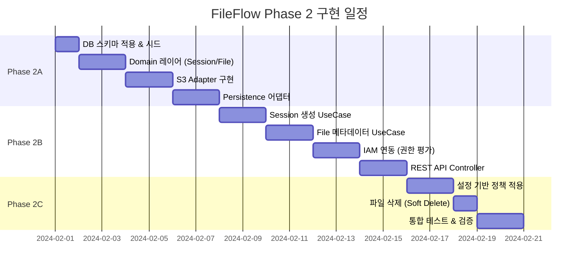

# FileFlow Phase 2 구현 워크플로우 - Upload Management

> **목적**: S3 기반 파일 업로드 시스템을 헥사고날 아키텍처로 체계적으로 구현하기 위한 실행 가능한 워크플로우

---

## 📋 목차

1. [전제 조건](#1-전제-조건)
2. [프로젝트 구조](#2-프로젝트-구조)
3. [구현 워크플로우](#3-구현-워크플로우)
4. [Phase별 상세 가이드](#4-phase별-상세-가이드)
5. [테스트 전략](#5-테스트-전략)
6. [배포 및 운영](#6-배포-및-운영)

---

## 1. 전제 조건

### 1.1 필수 문서 숙지

| 문서 | 역할 | 위치 |
|------|------|------|
| **01-upload-management.md** | Phase 2 기능 명세 | `docs/guide/02/` |
| **02-upload-management-develop-guide.md** | Phase 2 개발 가이드 | `docs/guide/02/` |
| **schema.sql** | Upload 관련 DDL | `docs/guide/02/` |
| **seed.sql** | 초기 시드 데이터 | `docs/guide/02/` |
| **Phase 1 완료** | IAM 시스템 (Tenant/Org/User/Permission) | `docs/guide/01/` |

### 1.2 기술 스택

- **Storage**: AWS S3 (Presigned URL 기반)
- **Metadata DB**: MySQL 8.x (No FK, Soft Delete)
- **ABAC Engine**: CEL (file.upload 권한 평가)
- **Cache**: Redis (Settings Cache, Session Cache)
- **File Processing**: Virtual Threads (Java 21) for parallel operations
- **Testing**: JUnit 5, TestContainers (S3 Mock), Spring Boot Test

### 1.3 코딩 규칙 (Zero-Tolerance)

```yaml
MUST:
  - Lombok 금지 (Pure Java getter/setter)
  - Law of Demeter 준수 (Getter 체이닝 금지)
  - Long FK 전략 (JPA 관계 어노테이션 금지)
  - Transaction 경계 엄격 관리 (S3 호출은 트랜잭션 밖에서)
  - Javadoc 필수 (모든 public 클래스/메서드)

NEVER:
  - @Transactional 내 S3 API 호출
  - 동기 처리에서 blocking I/O (Virtual Threads 활용)
  - 파일 크기 검증 없이 Presigned URL 생성
```

---

## 2. 프로젝트 구조

### 2.1 헥사고날 아키텍처 모듈 구조 (Ports & Adapters)

```
fileflow/
├── domain/                          # 핵심 비즈니스 로직
│   ├── upload/
│   │   ├── session/
│   │   │   ├── UploadSession.java       # Aggregate Root
│   │   │   ├── UploadSessionId.java     # Value Object
│   │   │   ├── SessionStatus.java       # Enum
│   │   │   └── PresignedUrlInfo.java    # Value Object
│   │   ├── file/
│   │   │   ├── FileMetadata.java        # Aggregate Root
│   │   │   ├── FileId.java              # Value Object
│   │   │   ├── FileSize.java            # Value Object
│   │   │   ├── MimeType.java            # Value Object
│   │   │   └── S3Location.java          # Value Object
│   │   └── policy/
│   │       ├── UploadPolicy.java        # Value Object
│   │       ├── SizeLimit.java           # Value Object
│   │       └── AllowedMimeTypes.java    # Value Object
│   └── common/
│       ├── DomainException.java
│       └── SoftDeletable.java
│
├── application/                     # Use Case Layer
│   ├── upload/
│   │   ├── session/
│   │   │   ├── CreateUploadSessionUseCase.java
│   │   │   ├── CompleteUploadSessionUseCase.java
│   │   │   ├── port/
│   │   │   │   ├── UploadSessionRepositoryPort.java
│   │   │   │   ├── S3StoragePort.java          # S3 Operations Port
│   │   │   │   └── PermissionEvaluatorPort.java # IAM 연동
│   │   │   └── dto/
│   │   │       ├── CreateSessionCommand.java
│   │   │       └── SessionResponse.java
│   │   ├── file/
│   │   │   ├── RegisterFileMetadataUseCase.java
│   │   │   ├── GetFileMetadataUseCase.java
│   │   │   ├── DeleteFileUseCase.java          # Soft Delete
│   │   │   └── port/
│   │   │       └── FileMetadataRepositoryPort.java
│   │   └── policy/
│   │       ├── GetEffectiveUploadPolicyUseCase.java
│   │       └── port/
│   │           └── UploadPolicyPort.java
│   └── config/
│       └── ApplicationConfig.java
│
├── adapter-in/                      # Primary Adapters
│   └── rest/
│       ├── upload/
│       │   ├── UploadSessionController.java
│       │   └── dto/
│       │       ├── CreateSessionRequest.java
│       │       └── SessionDto.java
│       └── common/
│           ├── GlobalExceptionHandler.java
│           └── FileUploadExceptionHandler.java
│
├── adapter-out/                     # Secondary Adapters
│   ├── persistence-jpa/
│   │   ├── upload/
│   │   │   ├── session/
│   │   │   │   ├── UploadSessionJpaEntity.java
│   │   │   │   ├── UploadSessionJpaRepository.java
│   │   │   │   └── UploadSessionRepositoryAdapter.java
│   │   │   └── file/
│   │   │       ├── FileMetadataJpaEntity.java
│   │   │       └── FileMetadataRepositoryAdapter.java
│   │   └── config/
│   │       └── JpaConfig.java
│   │
│   ├── storage-s3/                  # S3 Storage Adapter
│   │   ├── S3StorageAdapter.java    # S3StoragePort 구현
│   │   ├── PresignedUrlGenerator.java
│   │   ├── S3Client.java            # AWS SDK Wrapper
│   │   └── config/
│   │       ├── S3Config.java        # S3 Client 설정
│   │       └── S3Properties.java    # application.yml 바인딩
│   │
│   └── iam-client/                  # IAM Integration Adapter
│       ├── IamPermissionAdapter.java # PermissionEvaluatorPort 구현
│       └── config/
│           └── IamClientConfig.java
│
└── bootstrap/
    └── api/
        ├── ApiApplication.java
        └── resources/
            └── application.yml      # S3 설정 포함
```

### 2.2 아키텍처 원칙

| 레이어 | 의존성 방향 | 규칙 |
|--------|------------|------|
| **domain** | 외부 의존성 없음 | 순수 Java만 사용, S3/IAM 의존 금지 |
| **application** | domain만 의존 | Use Case 구현, Port 인터페이스 사용 |
| **adapter-in** | application + domain | Primary Adapter, 외부 → 내부 방향 |
| **adapter-out** | application + domain | Secondary Adapter, Port 구현 |
| **bootstrap** | 모든 레이어 의존 | 의존성 주입 + 애플리케이션 실행 |

**핵심 규칙**:
- **Domain**: 순수 비즈니스 로직만, 외부 의존성 없음 (S3/IAM API 금지)
- **Application**: Use Case 구현 + **Port 정의** (인터페이스)
- **Adapter**: Application의 Port를 **구현**하여 제공
- **의존성 방향**: Adapter → Application → Domain (단방향)
- **S3 Operations**: Adapter-out에서만 허용, Transaction 밖에서 호출

**Port 원칙**:
- Port는 **Application 레벨**에서 정의 (`application/upload/session/port/`)
- Adapter는 Port를 **구현** (`S3StorageAdapter implements S3StoragePort`)
- Use Case는 Port **인터페이스**만 의존 (구체 클래스 모름)

---

## 3. 구현 워크플로우

### 3.1 전체 타임라인 (3주 예상)



### 3.2 Phase별 목표

| Phase | 주요 목표 | DoD (Definition of Done) |
|-------|----------|--------------------------|
| **Phase 2A** | Upload Session + S3 연동 | ✅ Presigned URL 생성 성공, S3 Mock 테스트 통과 |
| **Phase 2B** | File Metadata + IAM 연동 | ✅ 권한 기반 업로드 차단, 파일 조회 API 정상 |
| **Phase 2C** | 설정 정책 + Soft Delete | ✅ Org별 업로드 제한 적용, 삭제 파일 조회 제외 |

---

## 4. Phase별 상세 가이드

### 📦 Phase 2A: Upload Session + S3 연동 (1주)

#### 🎯 목표
- Upload Session Aggregate 완성
- S3 Presigned URL 생성 메커니즘 구축
- S3 Adapter 구현 (AWS SDK 통합)

#### 📝 작업 순서

##### Step 1.1: DB 스키마 적용 (0.5일)

```bash
# 1. 로컬 MySQL 실행 확인
docker ps | grep mysql

# 2. 스키마 적용
mysql -h localhost -u root -p fileflow < docs/guide/02/schema.sql

# 3. 시드 데이터 적용
mysql -h localhost -u root -p fileflow < docs/guide/02/seed.sql

# 4. 검증
mysql -h localhost -u root -p fileflow -e "SELECT * FROM upload_sessions; SELECT * FROM file_metadata;"
```

##### Step 1.2: Domain 레이어 구현 (2일)

**1.2.1 UploadSession Aggregate 생성**

```bash
/code-gen-domain UploadSession
```

**예상 생성 파일**:

```java
// domain/src/main/java/com/company/fileflow/domain/upload/session/UploadSession.java
/**
 * 업로드 세션 Aggregate Root.
 * S3 Presigned URL 기반 업로드 프로세스를 관리.
 *
 * @author FileFlow Team
 * @since 2024-02-01
 */
public class UploadSession {
    private UploadSessionId id;
    private Long userContextId;      // No FK
    private String tenantId;          // No FK
    private Long organizationId;      // No FK
    private String originalFilename;
    private MimeType mimeType;
    private FileSize fileSize;
    private S3Location s3Location;
    private PresignedUrlInfo presignedUrlInfo;
    private SessionStatus status;
    private Instant createdAt;
    private Instant expiresAt;
    private Instant completedAt;

    // Constructors
    public UploadSession(UploadSessionId id, Long userContextId, String tenantId,
                        Long organizationId, String originalFilename,
                        MimeType mimeType, FileSize fileSize) {
        // 검증 로직
        if (id == null || userContextId == null || tenantId == null) {
            throw new IllegalArgumentException("UploadSession 필수 속성이 null입니다");
        }
        this.id = id;
        this.userContextId = userContextId;
        this.tenantId = tenantId;
        this.organizationId = organizationId;
        this.originalFilename = originalFilename;
        this.mimeType = mimeType;
        this.fileSize = fileSize;
        this.status = SessionStatus.PENDING;
        this.createdAt = Instant.now();
        this.expiresAt = Instant.now().plus(Duration.ofMinutes(15)); // 15분 유효
    }

    // Getters (Pure Java, No Lombok)
    public UploadSessionId getId() { return id; }
    public Long getUserContextId() { return userContextId; }
    public String getTenantId() { return tenantId; }
    public Long getOrganizationId() { return organizationId; }
    public String getOriginalFilename() { return originalFilename; }
    public MimeType getMimeType() { return mimeType; }
    public FileSize getFileSize() { return fileSize; }
    public S3Location getS3Location() { return s3Location; }
    public PresignedUrlInfo getPresignedUrlInfo() { return presignedUrlInfo; }
    public SessionStatus getStatus() { return status; }
    public Instant getCreatedAt() { return createdAt; }
    public Instant getExpiresAt() { return expiresAt; }
    public Instant getCompletedAt() { return completedAt; }

    // Business Methods (Tell, Don't Ask)
    public void assignS3Location(S3Location s3Location, PresignedUrlInfo presignedUrlInfo) {
        if (this.status != SessionStatus.PENDING) {
            throw new IllegalStateException("PENDING 상태에서만 S3 위치를 할당할 수 있습니다");
        }
        this.s3Location = s3Location;
        this.presignedUrlInfo = presignedUrlInfo;
        this.status = SessionStatus.UPLOADING;
    }

    public void complete() {
        if (this.status != SessionStatus.UPLOADING) {
            throw new IllegalStateException("UPLOADING 상태에서만 완료할 수 있습니다");
        }
        if (this.isExpired()) {
            throw new IllegalStateException("만료된 세션은 완료할 수 없습니다");
        }
        this.status = SessionStatus.COMPLETED;
        this.completedAt = Instant.now();
    }

    public void fail(String reason) {
        this.status = SessionStatus.FAILED;
    }

    public boolean isExpired() {
        return Instant.now().isAfter(this.expiresAt);
    }

    public boolean isCompleted() {
        return this.status == SessionStatus.COMPLETED;
    }

    public boolean canUpload() {
        return this.status == SessionStatus.UPLOADING && !this.isExpired();
    }
}

// domain/src/main/java/com/company/fileflow/domain/upload/session/SessionStatus.java
/**
 * 업로드 세션 상태.
 *
 * @author FileFlow Team
 * @since 2024-02-01
 */
public enum SessionStatus {
    PENDING,     // 생성됨, S3 위치 할당 전
    UPLOADING,   // S3 업로드 진행 중
    COMPLETED,   // 업로드 완료
    FAILED       // 업로드 실패
}

// domain/src/main/java/com/company/fileflow/domain/upload/session/PresignedUrlInfo.java
/**
 * Presigned URL 정보 Value Object.
 *
 * @author FileFlow Team
 * @since 2024-02-01
 */
public record PresignedUrlInfo(
    String url,
    Instant expiresAt,
    Map<String, String> requiredHeaders  // ex: Content-Type, Content-Length
) {
    public PresignedUrlInfo {
        if (url == null || url.isBlank()) {
            throw new IllegalArgumentException("Presigned URL은 비어있을 수 없습니다");
        }
        if (expiresAt == null) {
            throw new IllegalArgumentException("만료 시각은 필수입니다");
        }
    }

    public boolean isExpired() {
        return Instant.now().isAfter(expiresAt);
    }
}
```

**1.2.2 FileMetadata Aggregate 생성**

```bash
/code-gen-domain FileMetadata
```

**핵심 구현 사항**:
- `FileMetadata.java`: Aggregate Root
- `FileId.java`: UUID 타입 Value Object
- `FileSize.java`: 파일 크기 (bytes) Value Object
- `MimeType.java`: MIME 타입 Value Object
- `S3Location.java`: bucket + key Value Object
- **중요**: `private Long ownerUserContextId;` (No FK)
- **메서드**: `softDelete()`, `isDeleted()`, `isOwnedBy()`

##### Step 1.3: S3 Adapter 구현 (2일)

**1.3.1 S3StorageAdapter 생성**

```java
// adapter-out/storage-s3/src/main/java/com/company/fileflow/adapter/out/storage/S3StorageAdapter.java
/**
 * S3 Storage Adapter (Port Implementation).
 * AWS SDK를 사용하여 S3 Operations를 구현.
 *
 * @author FileFlow Team
 * @since 2024-02-01
 */
@Component
public class S3StorageAdapter implements S3StoragePort {
    private final S3Client s3Client;
    private final PresignedUrlGenerator presignedUrlGenerator;
    private final S3Properties s3Properties;

    public S3StorageAdapter(S3Client s3Client,
                           PresignedUrlGenerator presignedUrlGenerator,
                           S3Properties s3Properties) {
        this.s3Client = s3Client;
        this.presignedUrlGenerator = presignedUrlGenerator;
        this.s3Properties = s3Properties;
    }

    @Override
    public S3Location generateUploadLocation(String tenantId, Long organizationId, String filename) {
        // S3 Key 생성: tenants/{tenantId}/orgs/{orgId}/uploads/{uuid}/{filename}
        String key = String.format("tenants/%s/orgs/%d/uploads/%s/%s",
            tenantId,
            organizationId != null ? organizationId : 0L,
            UUID.randomUUID(),
            filename
        );

        return new S3Location(s3Properties.getBucketName(), key);
    }

    @Override
    public PresignedUrlInfo generatePresignedUploadUrl(S3Location s3Location,
                                                        MimeType mimeType,
                                                        FileSize fileSize,
                                                        Duration expiration) {
        // AWS SDK v2 Presigned URL 생성
        PresignedPutObjectRequest presignedRequest = presignedUrlGenerator.generate(
            s3Location.bucket(),
            s3Location.key(),
            mimeType.value(),
            fileSize.bytes(),
            expiration
        );

        Map<String, String> requiredHeaders = Map.of(
            "Content-Type", mimeType.value(),
            "Content-Length", String.valueOf(fileSize.bytes())
        );

        return new PresignedUrlInfo(
            presignedRequest.url().toString(),
            Instant.now().plus(expiration),
            requiredHeaders
        );
    }

    @Override
    public boolean verifyFileExists(S3Location s3Location) {
        try {
            HeadObjectRequest headRequest = HeadObjectRequest.builder()
                .bucket(s3Location.bucket())
                .key(s3Location.key())
                .build();

            s3Client.headObject(headRequest);
            return true;
        } catch (NoSuchKeyException e) {
            return false;
        }
    }

    @Override
    public void deleteFile(S3Location s3Location) {
        DeleteObjectRequest deleteRequest = DeleteObjectRequest.builder()
            .bucket(s3Location.bucket())
            .key(s3Location.key())
            .build();

        s3Client.deleteObject(deleteRequest);
    }
}

// adapter-out/storage-s3/src/main/java/com/company/fileflow/adapter/out/storage/PresignedUrlGenerator.java
/**
 * Presigned URL 생성기.
 *
 * @author FileFlow Team
 * @since 2024-02-01
 */
@Component
public class PresignedUrlGenerator {
    private final S3Presigner s3Presigner;

    public PresignedUrlGenerator(S3Presigner s3Presigner) {
        this.s3Presigner = s3Presigner;
    }

    public PresignedPutObjectRequest generate(String bucket, String key,
                                              String contentType, long contentLength,
                                              Duration expiration) {
        PutObjectRequest putRequest = PutObjectRequest.builder()
            .bucket(bucket)
            .key(key)
            .contentType(contentType)
            .contentLength(contentLength)
            .build();

        PutObjectPresignRequest presignRequest = PutObjectPresignRequest.builder()
            .signatureDuration(expiration)
            .putObjectRequest(putRequest)
            .build();

        return s3Presigner.presignPutObject(presignRequest);
    }
}
```

**1.3.2 S3Config 구현**

```java
// adapter-out/storage-s3/src/main/java/com/company/fileflow/adapter/out/storage/config/S3Config.java
/**
 * S3 Client 설정.
 *
 * @author FileFlow Team
 * @since 2024-02-01
 */
@Configuration
public class S3Config {

    @Bean
    public S3Client s3Client(S3Properties s3Properties) {
        return S3Client.builder()
            .region(Region.of(s3Properties.getRegion()))
            .credentialsProvider(DefaultCredentialsProvider.create())
            .build();
    }

    @Bean
    public S3Presigner s3Presigner(S3Properties s3Properties) {
        return S3Presigner.builder()
            .region(Region.of(s3Properties.getRegion()))
            .credentialsProvider(DefaultCredentialsProvider.create())
            .build();
    }
}

// adapter-out/storage-s3/src/main/java/com/company/fileflow/adapter/out/storage/config/S3Properties.java
/**
 * S3 설정 Properties.
 *
 * @author FileFlow Team
 * @since 2024-02-01
 */
@Component
@ConfigurationProperties(prefix = "fileflow.s3")
public class S3Properties {
    private String bucketName;
    private String region;
    private Duration presignedUrlExpiration = Duration.ofMinutes(15);

    // Getters & Setters (Pure Java)
    public String getBucketName() { return bucketName; }
    public void setBucketName(String bucketName) { this.bucketName = bucketName; }
    public String getRegion() { return region; }
    public void setRegion(String region) { this.region = region; }
    public Duration getPresignedUrlExpiration() { return presignedUrlExpiration; }
    public void setPresignedUrlExpiration(Duration presignedUrlExpiration) {
        this.presignedUrlExpiration = presignedUrlExpiration;
    }
}
```

##### Step 1.4: Persistence 어댑터 구현 (2일)

**1.4.1 UploadSession JPA Entity & Repository**

```java
// adapter-out/persistence-jpa/src/main/java/com/company/fileflow/adapter/out/persistence/upload/session/UploadSessionJpaEntity.java
/**
 * UploadSession JPA Entity.
 *
 * @author FileFlow Team
 * @since 2024-02-01
 */
@Entity
@Table(name = "upload_sessions")
public class UploadSessionJpaEntity {
    @Id
    @Column(name = "id", length = 50)
    private String id;

    @Column(name = "user_context_id", nullable = false)
    private Long userContextId;

    @Column(name = "tenant_id", nullable = false, length = 50)
    private String tenantId;

    @Column(name = "organization_id")
    private Long organizationId;

    @Column(name = "original_filename", nullable = false, length = 500)
    private String originalFilename;

    @Column(name = "mime_type", nullable = false, length = 100)
    private String mimeType;

    @Column(name = "file_size_bytes", nullable = false)
    private Long fileSizeBytes;

    @Column(name = "s3_bucket", length = 100)
    private String s3Bucket;

    @Column(name = "s3_key", length = 500)
    private String s3Key;

    @Column(name = "presigned_url", length = 2000)
    private String presignedUrl;

    @Enumerated(EnumType.STRING)
    @Column(name = "status", nullable = false)
    private SessionStatus status;

    @Column(name = "created_at", nullable = false, updatable = false)
    private LocalDateTime createdAt;

    @Column(name = "expires_at", nullable = false)
    private LocalDateTime expiresAt;

    @Column(name = "completed_at")
    private LocalDateTime completedAt;

    // Getters & Setters (Pure Java)
    // ... (생략)

    @PrePersist
    protected void onCreate() {
        this.createdAt = LocalDateTime.now();
    }
}

// adapter-out/persistence-jpa/src/main/java/com/company/fileflow/adapter/out/persistence/upload/session/UploadSessionRepositoryAdapter.java
/**
 * UploadSession Repository Adapter (Port Implementation).
 *
 * @author FileFlow Team
 * @since 2024-02-01
 */
@Component
public class UploadSessionRepositoryAdapter implements UploadSessionRepository {
    private final UploadSessionJpaRepository jpaRepository;
    private final UploadSessionMapper mapper;

    public UploadSessionRepositoryAdapter(UploadSessionJpaRepository jpaRepository,
                                         UploadSessionMapper mapper) {
        this.jpaRepository = jpaRepository;
        this.mapper = mapper;
    }

    @Override
    public UploadSession save(UploadSession session) {
        UploadSessionJpaEntity entity = mapper.toEntity(session);
        UploadSessionJpaEntity saved = jpaRepository.save(entity);
        return mapper.toDomain(saved);
    }

    @Override
    public Optional<UploadSession> findById(UploadSessionId id) {
        return jpaRepository.findById(id.value())
            .map(mapper::toDomain);
    }

    @Override
    public List<UploadSession> findExpiredSessions(Instant now) {
        return jpaRepository.findByExpiresAtBeforeAndStatus(now, SessionStatus.UPLOADING)
            .stream()
            .map(mapper::toDomain)
            .toList();
    }
}
```

#### ✅ Phase 2A DoD 체크리스트

- [ ] DB 스키마 적용 완료 (schema.sql, seed.sql)
- [ ] UploadSession Domain Aggregate 구현 (상태 관리 포함)
- [ ] FileMetadata Domain Aggregate 구현
- [ ] S3StorageAdapter 구현 (Presigned URL 생성)
- [ ] PresignedUrlGenerator 구현 (AWS SDK 통합)
- [ ] UploadSessionRepositoryAdapter 구현
- [ ] S3Config 설정 (S3Client, S3Presigner Bean 등록)
- [ ] TestContainers 기반 S3 Mock 테스트 통과
- [ ] ArchUnit 테스트 통과 (Transaction 내 S3 호출 금지 검증)

---

### 📦 Phase 2B: Use Case + IAM 연동 (1주)

#### 🎯 목표
- 업로드 세션 생성 Use Case 완성 (IAM 권한 평가 포함)
- 파일 메타데이터 관리 Use Case 완성
- REST API Controller 구현

#### 📝 작업 순서

##### Step 2.1: CreateUploadSessionUseCase 구현 (2일)

```bash
/code-gen-usecase CreateUploadSession
```

**구현 예시**:

```java
// application/src/main/java/com/company/fileflow/application/upload/session/CreateUploadSessionUseCase.java
/**
 * 업로드 세션 생성 Use Case.
 * 권한 평가 → 정책 조회 → S3 위치 생성 → Presigned URL 생성.
 *
 * Transaction Boundary: DB 작업만 (S3 호출은 밖에서).
 *
 * @author FileFlow Team
 * @since 2024-02-01
 */
@Service
public class CreateUploadSessionUseCase {
    private final UploadSessionRepository uploadSessionRepository;
    private final S3StoragePort s3StoragePort;
    private final PermissionEvaluatorPort permissionEvaluatorPort;
    private final UploadPolicyPort uploadPolicyPort;

    public CreateUploadSessionUseCase(UploadSessionRepository uploadSessionRepository,
                                     S3StoragePort s3StoragePort,
                                     PermissionEvaluatorPort permissionEvaluatorPort,
                                     UploadPolicyPort uploadPolicyPort) {
        this.uploadSessionRepository = uploadSessionRepository;
        this.s3StoragePort = s3StoragePort;
        this.permissionEvaluatorPort = permissionEvaluatorPort;
        this.uploadPolicyPort = uploadPolicyPort;
    }

    /**
     * 업로드 세션을 생성합니다.
     *
     * @param command 생성 명령
     * @return 생성된 세션 정보 (Presigned URL 포함)
     * @throws PermissionDeniedException 권한 없음
     * @throws UploadPolicyViolationException 업로드 정책 위반
     */
    @Transactional
    public SessionResponse execute(CreateSessionCommand command) {
        // 1. 권한 평가 (file.upload)
        EvaluatePermissionCommand permissionCommand = new EvaluatePermissionCommand(
            "file.upload",
            new EvaluationContext(
                command.userContextId(),
                command.tenantId(),
                command.organizationId(),
                command.membershipType(),
                command.requestIp(),
                command.userAgent(),
                Instant.now().getEpochSecond()
            ),
            new ResourceAttributes(
                null,  // 아직 소유자 없음
                command.tenantId(),
                command.organizationId(),
                command.mimeType(),
                command.fileSizeBytes() / (1024.0 * 1024.0)  // MB로 변환
            )
        );

        EvaluatePermissionResponse permissionResponse = permissionEvaluatorPort.evaluate(permissionCommand);
        if (!permissionResponse.allowed()) {
            throw new PermissionDeniedException("file.upload 권한이 없습니다");
        }

        // 2. 업로드 정책 조회 (Org > Tenant > Default)
        UploadPolicy policy = uploadPolicyPort.getEffectivePolicy(command.tenantId(), command.organizationId());

        // 3. 정책 검증
        policy.validate(MimeType.of(command.mimeType()), FileSize.of(command.fileSizeBytes()));

        // 4. Domain 객체 생성
        UploadSession session = new UploadSession(
            UploadSessionId.generate(),
            command.userContextId(),
            command.tenantId(),
            command.organizationId(),
            command.originalFilename(),
            MimeType.of(command.mimeType()),
            FileSize.of(command.fileSizeBytes())
        );

        // 5. S3 위치 생성 (Transaction 밖에서 호출)
        S3Location s3Location = s3StoragePort.generateUploadLocation(
            command.tenantId(),
            command.organizationId(),
            command.originalFilename()
        );

        // 6. Presigned URL 생성 (Transaction 밖에서 호출)
        PresignedUrlInfo presignedUrlInfo = s3StoragePort.generatePresignedUploadUrl(
            s3Location,
            MimeType.of(command.mimeType()),
            FileSize.of(command.fileSizeBytes()),
            Duration.ofMinutes(15)
        );

        // 7. Session에 S3 정보 할당
        session.assignS3Location(s3Location, presignedUrlInfo);

        // 8. 영속화 (Transaction 내)
        UploadSession saved = uploadSessionRepository.save(session);

        // 9. DTO 변환
        return SessionResponse.from(saved);
    }
}
```

##### Step 2.2: CompleteUploadSessionUseCase 구현 (1일)

```java
/**
 * 업로드 완료 Use Case.
 * S3 파일 존재 검증 → 세션 완료 → 파일 메타데이터 등록.
 *
 * @author FileFlow Team
 * @since 2024-02-01
 */
@Service
@Transactional
public class CompleteUploadSessionUseCase {
    private final UploadSessionRepository uploadSessionRepository;
    private final S3StoragePort s3StoragePort;
    private final RegisterFileMetadataUseCase registerFileMetadataUseCase;

    public void execute(CompleteSessionCommand command) {
        // 1. 세션 조회
        UploadSession session = uploadSessionRepository.findById(command.sessionId())
            .orElseThrow(() -> new SessionNotFoundException("세션을 찾을 수 없습니다"));

        // 2. S3 파일 존재 확인 (Transaction 밖)
        boolean fileExists = s3StoragePort.verifyFileExists(session.getS3Location());
        if (!fileExists) {
            session.fail("S3 파일이 존재하지 않습니다");
            uploadSessionRepository.save(session);
            throw new FileNotFoundInS3Exception("S3에 파일이 업로드되지 않았습니다");
        }

        // 3. 세션 완료
        session.complete();
        uploadSessionRepository.save(session);

        // 4. 파일 메타데이터 등록
        RegisterFileMetadataCommand metadataCommand = new RegisterFileMetadataCommand(
            session.getId(),
            session.getUserContextId(),
            session.getTenantId(),
            session.getOrganizationId(),
            session.getOriginalFilename(),
            session.getMimeType(),
            session.getFileSize(),
            session.getS3Location()
        );

        registerFileMetadataUseCase.execute(metadataCommand);
    }
}
```

##### Step 2.3: File Metadata Use Cases 구현 (2일)

```bash
/code-gen-usecase RegisterFileMetadata
/code-gen-usecase GetFileMetadata
/code-gen-usecase DeleteFile
```

**핵심 구현 사항**:
- `RegisterFileMetadataUseCase`: 업로드 완료 후 메타데이터 등록
- `GetFileMetadataUseCase`: 파일 조회 (권한 검증 포함)
- `DeleteFileUseCase`: Soft Delete (S3 물리 삭제는 배치로)

##### Step 2.4: REST API Controller 구현 (2일)

```bash
/code-gen-controller UploadSession
```

**구현 예시**:

```java
// adapter-in/rest/src/main/java/com/company/fileflow/adapter/in/rest/upload/UploadSessionController.java
/**
 * Upload Session REST API Controller.
 *
 * @author FileFlow Team
 * @since 2024-02-01
 */
@RestController
@RequestMapping("/api/upload/sessions")
public class UploadSessionController {
    private final CreateUploadSessionUseCase createUploadSessionUseCase;
    private final CompleteUploadSessionUseCase completeUploadSessionUseCase;

    public UploadSessionController(CreateUploadSessionUseCase createUploadSessionUseCase,
                                   CompleteUploadSessionUseCase completeUploadSessionUseCase) {
        this.createUploadSessionUseCase = createUploadSessionUseCase;
        this.completeUploadSessionUseCase = completeUploadSessionUseCase;
    }

    /**
     * 업로드 세션 생성 (Presigned URL 발급).
     *
     * @param request 생성 요청
     * @return 201 Created (Presigned URL 포함)
     */
    @PostMapping
    public ResponseEntity<SessionDto> createSession(@Valid @RequestBody CreateSessionRequest request) {
        CreateSessionCommand command = new CreateSessionCommand(
            request.userContextId(),
            request.tenantId(),
            request.organizationId(),
            request.originalFilename(),
            request.mimeType(),
            request.fileSizeBytes(),
            request.membershipType(),
            request.requestIp(),
            request.userAgent()
        );

        SessionResponse response = createUploadSessionUseCase.execute(command);
        SessionDto dto = SessionDto.from(response);

        return ResponseEntity.status(HttpStatus.CREATED).body(dto);
    }

    /**
     * 업로드 완료 통보.
     *
     * @param sessionId 세션 ID
     * @return 204 No Content
     */
    @PostMapping("/{sessionId}/complete")
    public ResponseEntity<Void> completeSession(@PathVariable String sessionId) {
        CompleteSessionCommand command = new CompleteSessionCommand(UploadSessionId.of(sessionId));
        completeUploadSessionUseCase.execute(command);

        return ResponseEntity.noContent().build();
    }
}
```

#### ✅ Phase 2B DoD 체크리스트

- [ ] CreateUploadSessionUseCase 구현 (IAM 권한 평가 포함)
- [ ] CompleteUploadSessionUseCase 구현 (S3 파일 검증)
- [ ] RegisterFileMetadataUseCase 구현
- [ ] GetFileMetadataUseCase 구현 (권한 검증 포함)
- [ ] DeleteFileUseCase 구현 (Soft Delete)
- [ ] UploadSessionController 2개 API 구현 (POST, POST /{id}/complete)
- [ ] FileMetadataController 3개 API 구현 (GET, DELETE)
- [ ] IAM 연동 테스트 통과 (권한 없으면 403)
- [ ] Integration Test 통과 (전체 업로드 플로우)

---

### 📦 Phase 2C: 설정 정책 + Soft Delete (1주)

#### 🎯 목표
- 조직별 업로드 정책 적용 (설정 기반)
- 파일 Soft Delete 완성
- 만료 세션 정리 배치 작업

#### 📝 작업 순서

##### Step 3.1: 업로드 정책 시스템 구현 (2일)

```java
// application/src/main/java/com/company/fileflow/application/upload/policy/GetEffectiveUploadPolicyUseCase.java
/**
 * 유효 업로드 정책 조회 Use Case.
 * 우선순위: Org > Tenant > Default
 *
 * @author FileFlow Team
 * @since 2024-02-01
 */
@Service
public class GetEffectiveUploadPolicyUseCase {
    private final GetMergedSettingsUseCase getMergedSettingsUseCase;

    public UploadPolicy execute(String tenantId, Long organizationId) {
        // 1. 병합된 설정 조회
        Map<String, String> settings = getMergedSettingsUseCase.execute(
            new GetMergedSettingsQuery(tenantId, organizationId)
        );

        // 2. 업로드 정책 추출
        long maxFileSizeBytes = Long.parseLong(settings.getOrDefault("upload.max_file_size_bytes", "52428800")); // 50MB
        String allowedMimesStr = settings.getOrDefault("upload.allowed_mimes", "image/jpeg,image/png,application/pdf");

        Set<String> allowedMimes = Set.of(allowedMimesStr.split(","));

        // 3. UploadPolicy Value Object 생성
        return new UploadPolicy(
            SizeLimit.of(maxFileSizeBytes),
            AllowedMimeTypes.of(allowedMimes)
        );
    }
}
```

##### Step 3.2: 만료 세션 정리 배치 (1일)

```java
// application/src/main/java/com/company/fileflow/application/upload/batch/CleanupExpiredSessionsUseCase.java
/**
 * 만료 세션 정리 배치.
 * 매시간 실행, UPLOADING 상태에서 만료된 세션을 FAILED로 전환.
 *
 * @author FileFlow Team
 * @since 2024-02-01
 */
@Service
public class CleanupExpiredSessionsUseCase {
    private final UploadSessionRepository uploadSessionRepository;

    @Scheduled(cron = "0 0 * * * *")  // 매시간
    @Transactional
    public void execute() {
        Instant now = Instant.now();

        List<UploadSession> expiredSessions = uploadSessionRepository.findExpiredSessions(now);

        for (UploadSession session : expiredSessions) {
            session.fail("세션 만료");
            uploadSessionRepository.save(session);
        }

        // 로깅
        if (!expiredSessions.isEmpty()) {
            logger.info("만료 세션 정리 완료: {} 건", expiredSessions.size());
        }
    }
}
```

##### Step 3.3: 통합 테스트 (2일)

```java
// adapter-rest-api/src/test/java/com/company/fileflow/E2EUploadTest.java
/**
 * End-to-End 업로드 시나리오 테스트.
 *
 * @author FileFlow Team
 * @since 2024-02-01
 */
@SpringBootTest
@AutoConfigureMockMvc
@Testcontainers
class E2EUploadTest {

    @Container
    static LocalStackContainer localstack = new LocalStackContainer(DockerImageName.parse("localstack/localstack"))
        .withServices(LocalStackContainer.Service.S3);

    @Autowired
    private MockMvc mockMvc;

    @Test
    void scenario_create_session_upload_complete() throws Exception {
        // Given: 업로드 세션 생성 요청
        String createRequestBody = """
            {
              "userContextId": 1,
              "tenantId": "tnt_demo",
              "organizationId": 1,
              "originalFilename": "test.jpg",
              "mimeType": "image/jpeg",
              "fileSizeBytes": 1048576
            }
            """;

        // When: 세션 생성
        MvcResult createResult = mockMvc.perform(post("/api/upload/sessions")
                .contentType(MediaType.APPLICATION_JSON)
                .content(createRequestBody))
            .andExpect(status().isCreated())
            .andExpect(jsonPath("$.sessionId").exists())
            .andExpect(jsonPath("$.presignedUrl").exists())
            .andReturn();

        String sessionId = JsonPath.read(createResult.getResponse().getContentAsString(), "$.sessionId");
        String presignedUrl = JsonPath.read(createResult.getResponse().getContentAsString(), "$.presignedUrl");

        // Then: Presigned URL로 S3 업로드 (실제 HTTP PUT)
        HttpClient httpClient = HttpClient.newHttpClient();
        HttpRequest uploadRequest = HttpRequest.newBuilder()
            .uri(URI.create(presignedUrl))
            .header("Content-Type", "image/jpeg")
            .PUT(HttpRequest.BodyPublishers.ofByteArray(new byte[1048576]))
            .build();

        HttpResponse<String> uploadResponse = httpClient.send(uploadRequest, HttpResponse.BodyHandlers.ofString());
        assertThat(uploadResponse.statusCode()).isEqualTo(200);

        // When: 업로드 완료 통보
        mockMvc.perform(post("/api/upload/sessions/{sessionId}/complete", sessionId))
            .andExpect(status().isNoContent());

        // Then: 파일 메타데이터 조회 가능
        mockMvc.perform(get("/api/files")
                .param("tenantId", "tnt_demo")
                .param("organizationId", "1"))
            .andExpect(status().isOk())
            .andExpect(jsonPath("$.items[0].originalFilename").value("test.jpg"));
    }

    @Test
    void scenario_denied_when_exceeds_policy() throws Exception {
        // Given: 51MB 파일 (정책 위반)
        String requestBody = """
            {
              "userContextId": 1,
              "tenantId": "tnt_demo",
              "organizationId": 1,
              "originalFilename": "large.jpg",
              "mimeType": "image/jpeg",
              "fileSizeBytes": 53477376
            }
            """;

        // When & Then: 403 Forbidden
        mockMvc.perform(post("/api/upload/sessions")
                .contentType(MediaType.APPLICATION_JSON)
                .content(requestBody))
            .andExpect(status().isForbidden())
            .andExpect(jsonPath("$.type").value("UPLOAD-403-001"))
            .andExpect(jsonPath("$.title").value("Upload Policy Violation"));
    }
}
```

#### ✅ Phase 2C DoD 체크리스트

- [ ] GetEffectiveUploadPolicyUseCase 구현 (Org > Tenant > Default)
- [ ] UploadPolicy 검증 로직 구현 (크기, MIME)
- [ ] CleanupExpiredSessionsUseCase 배치 작업 구현
- [ ] Soft Delete 구현 (파일 메타데이터)
- [ ] S3 물리 삭제 배치 작업 구현 (매일 03:00)
- [ ] End-to-End 통합 테스트 통과 (5개 시나리오)
- [ ] Testcontainers 기반 S3 Mock 테스트 통과
- [ ] 성능 테스트 통과 (세션 생성 P95 < 200ms)

---

## 5. 테스트 전략

### 5.1 테스트 피라미드

```
        /\
       /  \
      /E2E \          10% (업로드 플로우)
     /------\
    /        \
   /Integration\     30% (API + S3 + DB)
  /-------------\
 /               \
/   Unit Tests    \  60% (Domain + UseCase)
-------------------
```

### 5.2 필수 테스트 시나리오 (5개)

1. **정상 업로드 플로우**: 세션 생성 → S3 업로드 → 완료 통보 → 메타데이터 조회
2. **권한 거부**: file.upload 권한 없을 때 403
3. **정책 위반**: 파일 크기 초과 / 허용되지 않은 MIME 타입
4. **세션 만료**: 15분 경과 후 업로드 시도 시 실패
5. **Soft Delete**: 파일 삭제 후 조회 시 제외

---

## 6. 배포 및 운영

### 6.1 배포 체크리스트

- [ ] DB 마이그레이션 적용 (schema.sql, seed.sql)
- [ ] S3 Bucket 생성 및 권한 설정 (IAM Role)
- [ ] 환경 변수 설정 (S3 Bucket Name, Region 등)
- [ ] Presigned URL TTL 설정 (기본 15분)
- [ ] 만료 세션 정리 배치 스케줄링 (매시간)
- [ ] S3 물리 삭제 배치 스케줄링 (매일 03:00)

### 6.2 모니터링 대시보드

**핵심 메트릭**:
- **업로드 성공률**: (완료 세션 / 전체 세션) * 100
- **세션 생성 지연**: P50, P95, P99 (목표: P95 < 200ms)
- **S3 업로드 실패율**: S3 파일 검증 실패 비율
- **정책 위반 비율**: 업로드 시도 중 정책 위반 거부율
- **만료 세션 수**: 정리되지 않은 만료 세션 수

### 6.3 운영 배치 작업

**1. 만료 세션 정리 (매시간)**
```java
@Scheduled(cron = "0 0 * * * *")
public void cleanupExpiredSessions() {
    // UPLOADING 상태에서 만료된 세션을 FAILED로 전환
}
```

**2. S3 물리 삭제 (매일 03:00)**
```java
@Scheduled(cron = "0 0 3 * * *")
public void deleteOrphanedS3Files() {
    // deleted_at이 7일 이상 경과한 파일의 S3 객체 삭제
}
```

---

## 7. 다음 단계 (Phase 3)

Phase 2 완료 후 다음 고도화 작업을 고려하세요:

1. **멀티파트 업로드**: 대용량 파일 (>100MB) 지원
2. **업로드 진행률**: WebSocket 기반 실시간 진행률 전송
3. **이미지 최적화**: 썸네일 자동 생성 (Lambda or Batch)
4. **바이러스 검사**: ClamAV 통합
5. **CDN 연동**: CloudFront를 통한 파일 다운로드 가속
6. **파일 버전 관리**: 동일 파일의 여러 버전 지원

---

## 부록 A. 주요 에러 코드

| 코드 | HTTP | 설명 | 예시 메시지 |
|------|------|------|------------|
| UPLOAD-403-001 | 403 | 업로드 정책 위반 | "파일 크기 초과: 53MB > 50MB" |
| UPLOAD-403-002 | 403 | file.upload 권한 없음 | "업로드 권한이 없습니다" |
| UPLOAD-404-001 | 404 | 세션 없음 | "업로드 세션을 찾을 수 없습니다" |
| UPLOAD-409-001 | 409 | 세션 상태 충돌 | "이미 완료된 세션입니다" |
| UPLOAD-422-001 | 422 | S3 파일 없음 | "S3에 파일이 업로드되지 않았습니다" |

---

## 부록 B. 참고 자료

- **문서**: `docs/guide/02/01-upload-management.md` (Phase 2 명세)
- **문서**: `docs/guide/02/02-upload-management-develop-guide.md` (개발 가이드)
- **DDL**: `docs/guide/02/schema.sql` (Upload 관련 테이블)
- **Seed**: `docs/guide/02/seed.sql` (초기 시드 데이터)
- **Phase 1**: `docs/guide/01/` (IAM 시스템 참조)

---

**✅ 이 워크플로우를 따라 체계적으로 구현하면 3주 내 Phase 2를 완성할 수 있습니다!**
