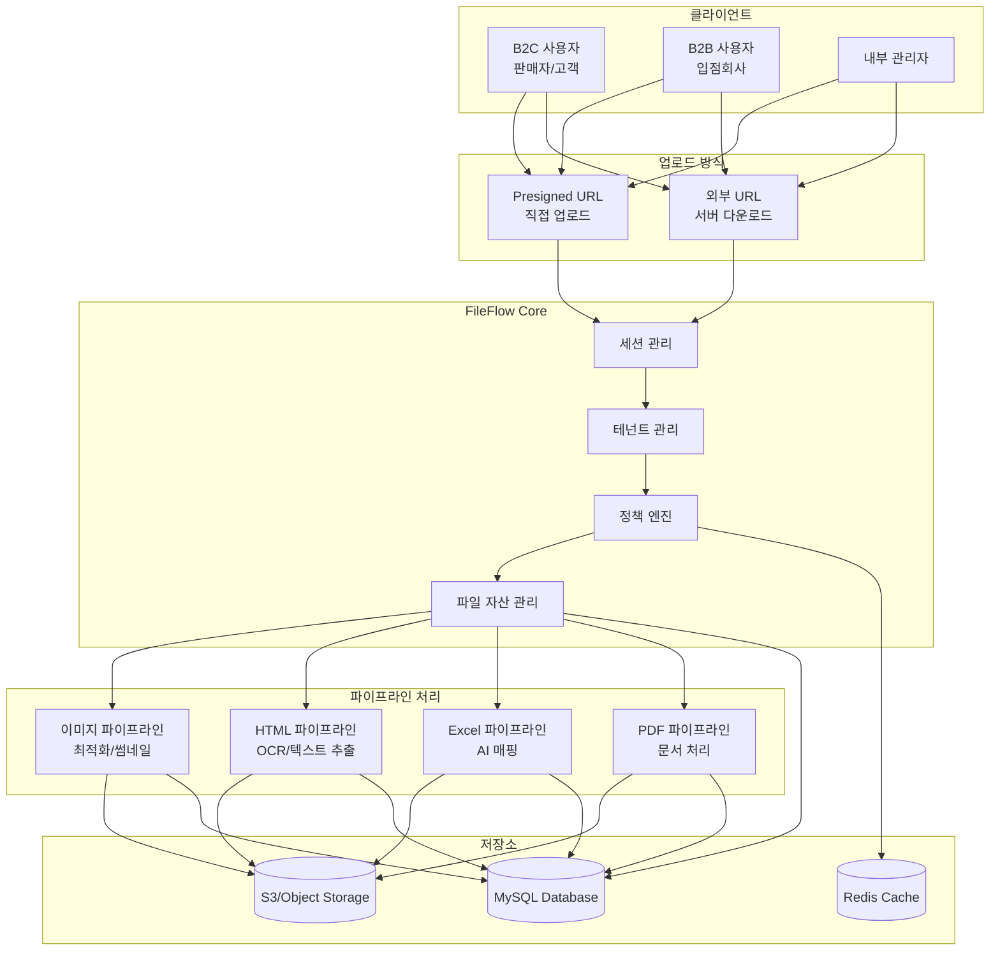
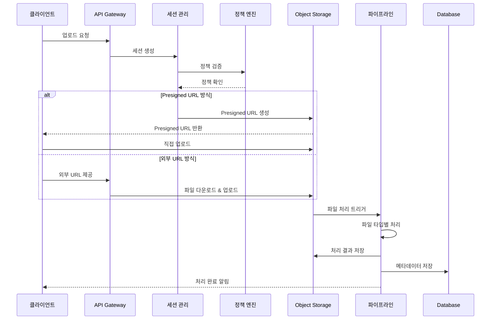
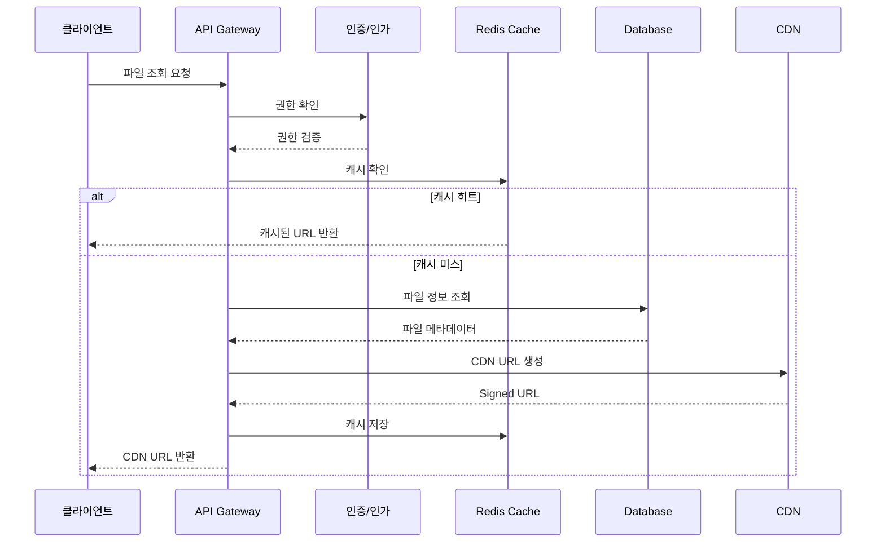
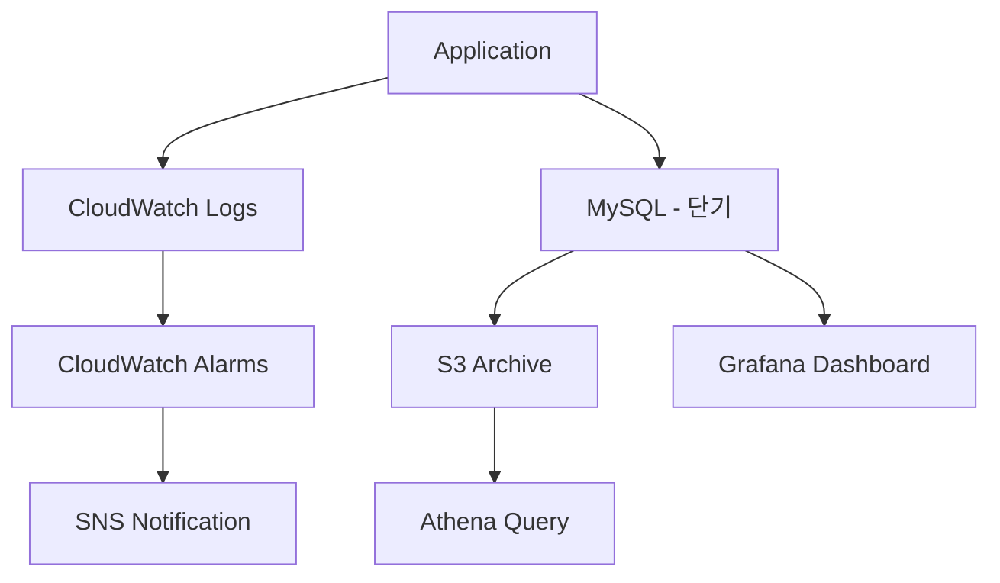

# 🏛️ FileFlow 시스템 아키텍처

## 1. 시스템 개요

FileFlow는 멀티테넌시 기반의 엔터프라이즈 파일 관리 시스템으로, 대규모 파일 업로드와 지능형 파일 처리를 담당합니다.



## 2. 핵심 컴포넌트

### 2.1 테넌트 관리 시스템

멀티테넌시를 통해 B2B와 B2C 환경을 완벽하게 격리하여 운영합니다.

**주요 특징:**
- 테넌트별 독립적인 정책 관리
- 데이터 격리 및 보안
- 테넌트별 사용량 추적
- 커스터마이징 가능한 설정

### 2.2 정책 엔진

업로드 및 처리 정책을 중앙에서 관리합니다.

**정책 종류:**
- **업로드 정책**: 파일 크기, 타입, 권한
- **처리 정책**: 파이프라인 설정, 우선순위
- **보관 정책**: 수명 주기, 아카이빙
- **접근 정책**: 권한, 공개 여부

### 2.3 파일 자산 관리

모든 파일의 생명주기를 관리합니다.

**관리 항목:**
- 원본 파일 및 변종 관리
- 메타데이터 추적
- 버전 관리
- 관계 매핑

### 2.4 파이프라인 처리 엔진

파일 타입별 특화된 처리 파이프라인을 제공합니다.

**파이프라인 종류:**

#### 이미지 파이프라인
- WebP/AVIF 변환
- 다중 해상도 썸네일 생성
- 품질 최적화
- EXIF 데이터 처리

#### HTML 파이프라인
- DOM 파싱 및 정제
- OCR 텍스트 추출
- 이미지 URL 변환
- SEO 메타데이터 추출

#### Excel 파이프라인
- 시트 데이터 파싱
- AI 기반 컬럼 매핑
- 데이터 검증
- 캐노니컬 포맷 변환

#### PDF 파이프라인
- 텍스트 추출
- 페이지 분할
- 썸네일 생성
- 메타데이터 추출

## 3. 데이터 흐름

### 3.1 업로드 프로세스



### 3.2 파일 조회 프로세스



## 4. 보안 아키텍처

### 4.1 접근 제어

```
┌─────────────────────────────────────┐
│           API Gateway               │
│         (Rate Limiting)             │
└────────────┬────────────────────────┘
             │
┌────────────▼────────────────────────┐
│      Authentication Layer           │
│        (JWT/OAuth2.0)               │
└────────────┬────────────────────────┘
             │
┌────────────▼────────────────────────┐
│      Authorization Layer            │
│         (RBAC/ABAC)                │
└────────────┬────────────────────────┘
             │
┌────────────▼────────────────────────┐
│       Tenant Isolation              │
│     (Row Level Security)           │
└─────────────────────────────────────┘
```

### 4.2 데이터 보안

- **전송 중 암호화**: TLS 1.3
- **저장 시 암호화**: AES-256
- **키 관리**: AWS KMS / HashiCorp Vault
- **접근 로깅**: 모든 파일 접근 감사

## 5. 확장성 & 성능 전략

### 5.1 수평 확장

- **애플리케이션**: Kubernetes 기반 자동 스케일링
- **데이터베이스**: 읽기 복제본, 샤딩
- **스토리지**: 객체 스토리지 무제한 확장
- **캐시**: Redis Cluster

### 5.2 성능 최적화 전략 (단계별 적용)

#### 5.2.1 초기 단계 (즉시 적용)
```sql
-- 기본 인덱스 전략
-- 1. 테넌트/조직 격리를 위한 복합 인덱스
CREATE INDEX idx_files_tenant_org_created
ON file_assets(tenant_id, organization_id, created_at DESC);

-- 2. 상태/타입 필터링 인덱스
CREATE INDEX idx_files_type_status
ON file_assets(file_type, status);

-- 3. 사용자 활동 조회 인덱스
CREATE INDEX idx_audit_tenant_org_created
ON audit_logs(tenant_id, organization_id, created_at DESC);

-- 4. Slow Query Log 활성화
SET GLOBAL slow_query_log = 'ON';
SET GLOBAL long_query_time = 2; -- 2초 이상 쿼리 기록
```

**주요 목표:**
- ✅ 기본 인덱스 설정으로 쿼리 성능 확보
- ✅ Slow Query Log로 향후 최적화 포인트 파악
- ✅ APM 도구(Pinpoint, Spring Cloud Sleuth) 적용

#### 5.2.2 성장 단계 (데이터 증가 후 적용)

**적용 시점:**
- access_logs > 1천만 건
- audit_logs > 5백만 건
- 일일 쿼리 처리량 > 1M

**파티셔닝 전략:**
```sql
-- 예시: access_logs 일별 파티셔닝 (실제 적용은 미룸)
/*
ALTER TABLE access_logs
PARTITION BY RANGE (TO_DAYS(created_at)) (
    PARTITION p_2025_01_01 VALUES LESS THAN (TO_DAYS('2025-01-02')),
    PARTITION p_2025_01_02 VALUES LESS THAN (TO_DAYS('2025-01-03')),
    ...
    PARTITION p_future VALUES LESS THAN MAXVALUE
);

-- 자동 파티션 관리 스크립트 필요
-- 매일 새벽 신규 파티션 생성, 90일 이전 파티션 삭제
*/
```

**Read Replica 구성:**
```yaml
Master (Write):
  - 업로드 세션 생성
  - 파일 메타데이터 저장
  - 감사 로그 기록

Replica 1 (Read):
  - 파일 조회 API
  - 대시보드 쿼리
  - 검색 기능

Replica 2 (Analytics):
  - 통계 및 리포트
  - 데이터 분석
  - 배치 작업
```

#### 5.2.3 대규모 단계 (엔터프라이즈급)

**Sharding 전략:**
```yaml
Shard Key: tenant_id
Shard 1: B2C Korea (tenant_id = 'b2c_kr')
Shard 2: B2B Global (tenant_id = 'b2b_global')
Shard 3: B2C Japan (tenant_id = 'b2c_jp')
...

Global Tables (모든 Shard에 복제):
  - tenants
  - pipeline_definitions
  - canonical_formats
```

### 5.3 캐싱 전략

#### 다층 캐시 구조
```
┌─────────────────────────────────────────┐
│        Application Cache (L1)           │
│  - Caffeine (In-Memory)                 │
│  - TTL: 5분                             │
│  - 크기: 1000 entries                   │
└────────────┬────────────────────────────┘
             │ Miss
┌────────────▼────────────────────────────┐
│         Redis Cache (L2)                │
│  - 분산 캐시                            │
│  - TTL: 30분                            │
│  - 테넌트 격리                          │
└────────────┬────────────────────────────┘
             │ Miss
┌────────────▼────────────────────────────┐
│          Database                       │
└─────────────────────────────────────────┘
```

#### 캐싱 대상
```yaml
Hot Data:
  - 테넌트 설정: Cache Key = "tenant:{tenant_id}:settings"
  - 조직 정보: Cache Key = "org:{org_id}"
  - 사용자 권한: Cache Key = "user:{user_id}:permissions"
  - 업로드 정책: Cache Key = "policy:{policy_id}"
  - CDN URL: Cache Key = "file:{file_id}:cdn_url"

Cold Data (캐싱 X):
  - 감사 로그
  - 접근 로그
  - 처리 오류 로그
```

### 5.4 비동기 처리

- **업로드 세션**: 비동기 상태 업데이트
- **파이프라인 실행**: Kafka/RabbitMQ 메시지 큐
- **알림 발송**: 비동기 웹훅 전송
- **통계 집계**: 배치 작업 (Spring Batch)

## 6. 모니터링 & 관찰성

### 6.1 모니터링 아키텍처

```
┌──────────────────────────────────────────────────────────────┐
│                     모니터링 스택                              │
└──────────────────────────────────────────────────────────────┘

┌─────────────────┐   ┌─────────────────┐   ┌─────────────────┐
│  Spring Boot    │   │  Node Exporter  │   │  MySQL Exporter │
│  Actuator +     │   │  (System        │   │  (Database      │
│  Micrometer     │   │  Metrics)       │   │  Metrics)       │
└────────┬────────┘   └────────┬────────┘   └────────┬────────┘
         │                     │                      │
         └─────────────────────┼──────────────────────┘
                               │
                    ┌──────────▼──────────┐
                    │    Prometheus       │
                    │  (메트릭 수집/저장)  │
                    │  - 데이터 보관: 90일 │
                    └──────────┬──────────┘
                               │
                    ┌──────────▼──────────┐
                    │      Grafana        │
                    │  (시각화 & 알람)     │
                    │  - 대시보드         │
                    │  - Alert Manager   │
                    └─────────────────────┘
```

### 6.2 메트릭 수집

#### 6.2.1 시스템 메트릭 (Node Exporter)
```yaml
Hardware:
  - node_cpu_seconds_total: CPU 사용 시간
  - node_memory_MemAvailable_bytes: 사용 가능 메모리
  - node_disk_io_time_seconds_total: 디스크 I/O 시간
  - node_network_receive_bytes_total: 네트워크 수신량
  - node_network_transmit_bytes_total: 네트워크 송신량

Process:
  - process_cpu_usage: 프로세스 CPU 사용률
  - process_open_fds: 열린 파일 디스크립터 수
```

#### 6.2.2 애플리케이션 메트릭 (Spring Boot Actuator)
```yaml
HTTP:
  - http_server_requests_seconds: HTTP 요청 처리 시간
  - http_server_requests_active: 활성 HTTP 연결 수

JVM:
  - jvm_memory_used_bytes: JVM 메모리 사용량
  - jvm_gc_pause_seconds: GC 일시정지 시간
  - jvm_threads_live: 실행 중 스레드 수

Database:
  - hikaricp_connections_active: 활성 DB 연결 수
  - hikaricp_connections_pending: 대기 중 DB 연결 수
```

#### 6.2.3 비즈니스 메트릭 (Custom Metrics)
```yaml
FileFlow Business Metrics:
  - fileflow_upload_requests_total{tenant, org, file_type}: 업로드 요청 수
  - fileflow_upload_duration_seconds{tenant, file_type}: 업로드 처리 시간
  - fileflow_pipeline_execution_duration_seconds{pipeline, stage}: 파이프라인 실행 시간
  - fileflow_file_size_bytes{file_type}: 파일 크기 분포
  - fileflow_active_sessions_total{tenant}: 활성 업로드 세션 수
  - fileflow_storage_usage_bytes{tenant, org}: 테넌트별 스토리지 사용량
  - fileflow_pipeline_errors_total{pipeline, error_type}: 파이프라인 에러 수
  - fileflow_cache_hits_total{cache_type}: 캐시 히트 수
  - fileflow_cache_misses_total{cache_type}: 캐시 미스 수
```

#### 6.2.4 데이터베이스 메트릭 (MySQL Exporter)
```yaml
MySQL:
  - mysql_global_status_connections: 총 연결 수
  - mysql_global_status_threads_running: 실행 중 스레드
  - mysql_global_status_slow_queries: 슬로우 쿼리 수
  - mysql_global_status_innodb_buffer_pool_read_requests: InnoDB 버퍼풀 읽기
  - mysql_global_status_table_locks_waited: 테이블 락 대기
```

### 6.3 Grafana 대시보드

#### 대시보드 구성
1. **System Overview**: 전체 시스템 상태 (CPU, Memory, Network)
2. **Application Health**: JVM, HTTP, Thread Pool 상태
3. **Business Metrics**: 업로드/처리 현황, 테넌트별 사용량
4. **Database Performance**: 쿼리 성능, 연결 풀 상태
5. **Pipeline Monitoring**: 파이프라인별 처리 시간 및 에러율
6. **Storage & CDN**: 스토리지 사용량, CDN 히트율

#### 알람 설정
```yaml
Critical Alerts:
  - CPU 사용률 > 90% (5분 지속)
  - 메모리 사용률 > 95%
  - 디스크 사용률 > 90%
  - 에러율 > 5% (1분)
  - 파이프라인 실패율 > 10%

Warning Alerts:
  - CPU 사용률 > 80% (10분)
  - 메모리 사용률 > 85%
  - 슬로우 쿼리 증가 (> 100/min)
  - 캐시 히트율 < 70%
```

### 6.4 로깅 전략 (하이브리드 접근)

```
┌──────────────────────────────────────────────────────────────┐
│                  로그 수집 및 저장 전략                         │
└──────────────────────────────────────────────────────────────┘

1. Application Logs (DEBUG, INFO, WARN, ERROR)
   ├─ CloudWatch Logs (장기 저장, 검색, 알람)
   └─ Stdout/Stderr → Docker → CloudWatch Logs Agent

2. 감사 로그 (audit_logs) ⭐ 규정 준수
   ├─ MySQL (7년 보관 - GDPR, CCPA, SOC2 준수)
   └─ CloudWatch Logs (백업 및 실시간 모니터링)

3. 접근 로그 (access_logs) ⭐ 대용량
   ├─ MySQL (7일 - 실시간 대시보드/분석용)
   ├─ S3 (Parquet 포맷, 장기 저장)
   └─ Athena (SQL 쿼리 분석)

4. 보안 이벤트 (security_events)
   ├─ MySQL (3년 보관)
   ├─ CloudWatch Logs (실시간 알람)
   └─ (옵션) AWS GuardDuty 연동

5. 성능 메트릭 (performance_metrics)
   ├─ Prometheus (90일 - 주력)
   └─ MySQL (7일 - 비즈니스 대시보드용)

6. API 사용 로그 (api_usage_logs)
   ├─ Redis (실시간 Rate Limiting)
   ├─ MySQL (30일 - 과금 정산)
   └─ S3 (장기 보관)
```

#### 로그 처리 플로우


#### 로그 보관 정책
| 로그 타입 | MySQL | CloudWatch | S3/Athena | Prometheus |
|-----------|-------|------------|-----------|------------|
| 감사 로그 | 7년 | ✅ 백업 | - | - |
| 접근 로그 | 7일 | - | ✅ 장기 | - |
| 보안 이벤트 | 3년 | ✅ 백업 | - | - |
| API 사용 | 30일 | - | ✅ 장기 | - |
| 성능 메트릭 | 7일 | - | - | ✅ 90일 |
| 애플리케이션 로그 | - | ✅ 주력 | - | - |

#### 로그 포맷
- **구조화된 로깅**: JSON 포맷 (Logback JSONEncoder)
- **추적 ID**: X-Request-ID, X-Trace-ID 전파
- **컨텍스트 정보**: tenant_id, organization_id, user_id 포함
- **민감 정보 마스킹**: PII 자동 마스킹

### 6.5 분산 추적 (Distributed Tracing)

```yaml
Tracing Stack:
  - OpenTelemetry: 계측 표준
  - Jaeger/Tempo: 추적 데이터 저장
  - Grafana: 시각화

추적 포인트:
  - API Gateway → Upload Service
  - Upload Service → S3 Upload
  - Upload Service → Pipeline Trigger
  - Pipeline → Stage Execution
  - Pipeline → Data Extraction
```

## 7. 재해 복구

### 7.1 백업 전략

- **데이터베이스**: 일일 자동 백업, PITR
- **객체 스토리지**: Cross-region 복제
- **설정 데이터**: Git 버전 관리

### 7.2 복구 목표

- **RPO** (Recovery Point Objective): 1시간
- **RTO** (Recovery Time Objective): 4시간
- **가용성 목표**: 99.95%

## 8. 기술 스택

### 8.1 백엔드
- **Language**: Java 17+ (Spring Boot 3.x)
- **Framework**: Spring Cloud, Spring Batch
- **Message Queue**: Kafka / RabbitMQ
- **Cache**: Redis Cluster

### 8.2 데이터베이스
- **Primary**: MySQL 8.0+ (InnoDB)
- **Search**: Elasticsearch
- **Time Series**: InfluxDB

### 8.3 스토리지
- **Object Storage**: AWS S3 / MinIO
- **CDN**: CloudFront / Cloudflare

### 8.4 인프라
- **Container**: Docker, Kubernetes
- **CI/CD**: GitLab CI / Jenkins
- **Monitoring**: Prometheus + Grafana
- **Tracing**: Jaeger

## 9. 마이크로서비스 분해 (향후)

현재 모놀리틱 구조에서 향후 마이크로서비스로 전환 계획:

```
fileflow-api-gateway
├── fileflow-tenant-service
├── fileflow-upload-service
├── fileflow-storage-service
├── fileflow-pipeline-service
├── fileflow-extraction-service
├── fileflow-notification-service
└── fileflow-analytics-service
```

각 서비스는 독립적으로 배포 및 확장 가능하도록 설계될 예정입니다.
