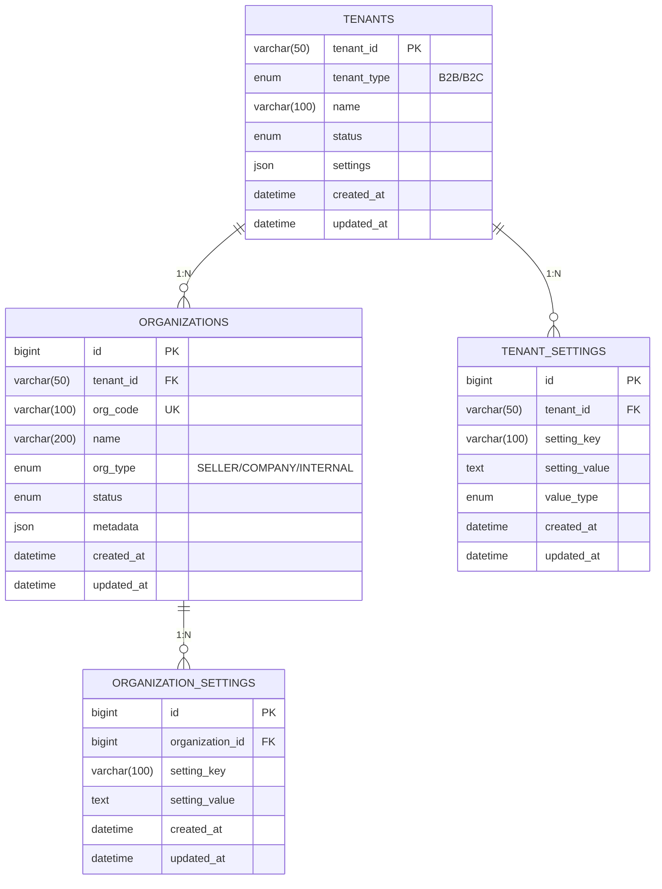
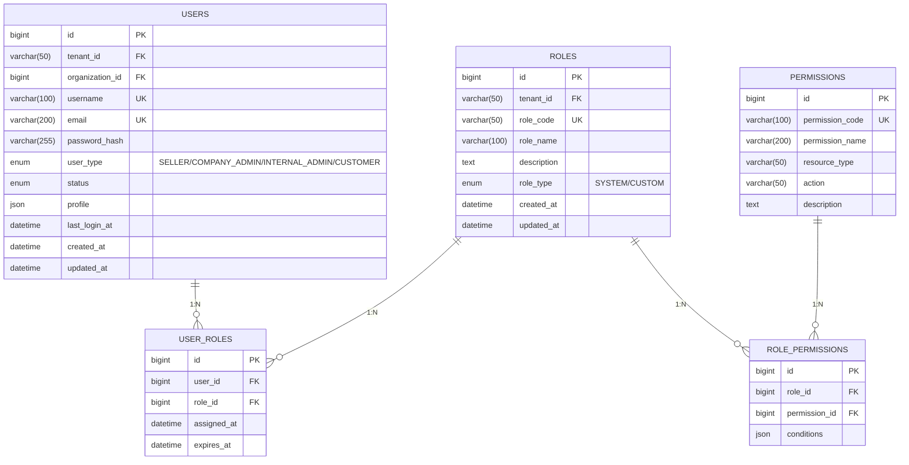
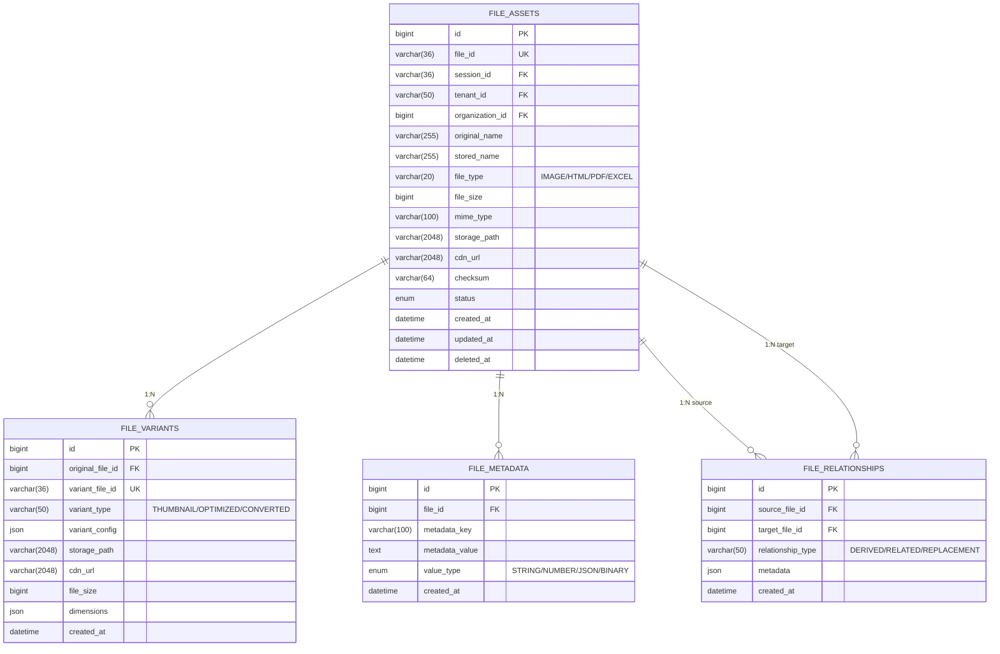
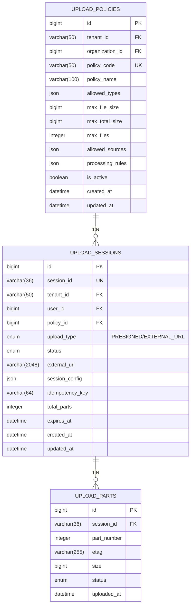
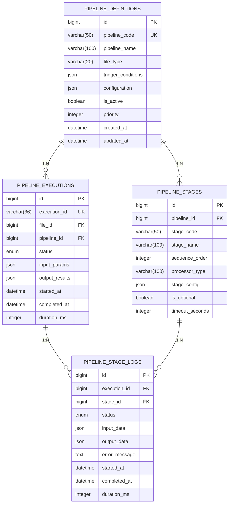
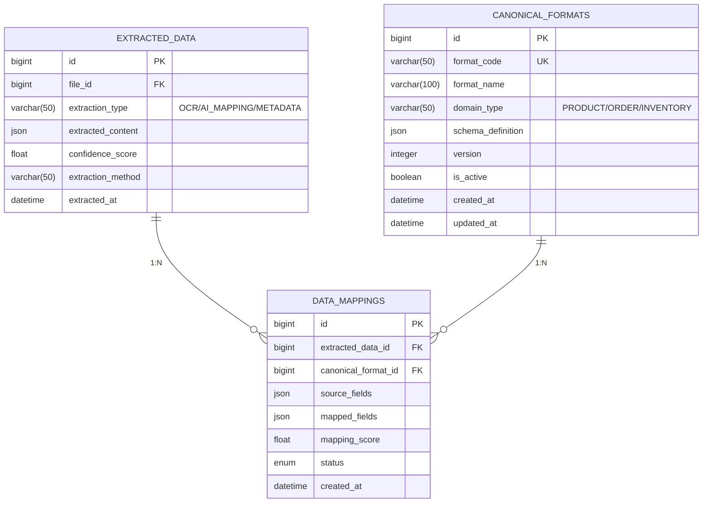

# 📊 FileFlow ER 다이어그램

## 1. 전체 ER 다이어그램



## 2. 도메인별 상세 관계도

### 2.1 테넌트 & 조직 관계



### 2.2 사용자 & 권한 관계



### 2.3 파일 관리 관계



### 2.4 업로드 관리 관계



### 2.5 파이프라인 처리 관계



### 2.6 데이터 추출 관계



## 3. 인덱스 전략

### 3.1 Primary Keys
- 모든 테이블은 `id` (BIGINT AUTO_INCREMENT) 사용
- 비즈니스 키는 별도 Unique Index 설정

### 3.2 Foreign Keys
- 모든 FK에 인덱스 자동 생성
- CASCADE 옵션은 신중히 사용 (대부분 RESTRICT)

### 3.3 조회 성능 인덱스

```sql
-- 자주 사용되는 복합 인덱스
CREATE INDEX idx_files_tenant_org ON file_assets(tenant_id, organization_id, created_at DESC);
CREATE INDEX idx_files_type_status ON file_assets(file_type, status, created_at DESC);
CREATE INDEX idx_sessions_user_status ON upload_sessions(user_id, status, created_at DESC);
CREATE INDEX idx_executions_file_pipeline ON pipeline_executions(file_id, pipeline_id, status);

-- 검색용 인덱스
CREATE FULLTEXT INDEX idx_files_search ON file_assets(original_name);
CREATE INDEX idx_metadata_key_value ON file_metadata(metadata_key, metadata_value(100));
```

### 3.4 파티셔닝 전략

대용량 테이블의 경우 파티셔닝 적용:

```sql
-- 날짜 기반 파티셔닝 (월별)
ALTER TABLE file_assets
PARTITION BY RANGE (YEAR(created_at) * 100 + MONTH(created_at)) (
    PARTITION p202501 VALUES LESS THAN (202502),
    PARTITION p202502 VALUES LESS THAN (202503),
    ...
);

-- 테넌트 기반 파티셔닝
ALTER TABLE audit_logs
PARTITION BY KEY(tenant_id)
PARTITIONS 10;
```

## 4. 제약조건 & 비즈니스 규칙

### 4.1 데이터 무결성
- 모든 FK는 유효한 참조 보장
- Soft Delete 시 관련 데이터 처리 규칙
- 순환 참조 방지

### 4.2 비즈니스 규칙
- 테넌트 간 데이터 격리 (Row Level Security)
- 파일 크기 제한 체크
- 동시성 제어 (Optimistic Locking)

### 4.3 감사 규칙
- 모든 CUD 작업 로깅
- 민감 데이터 접근 추적
- 변경 이력 관리
