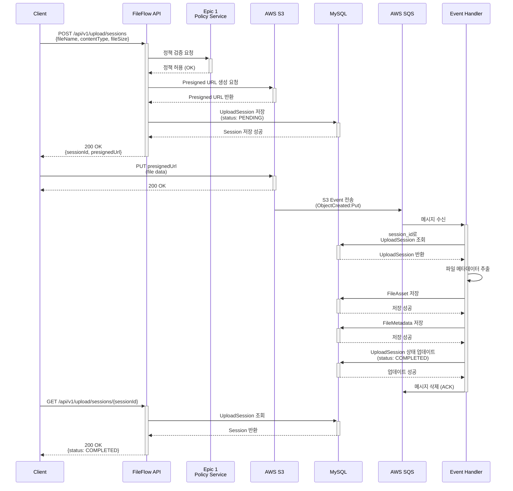
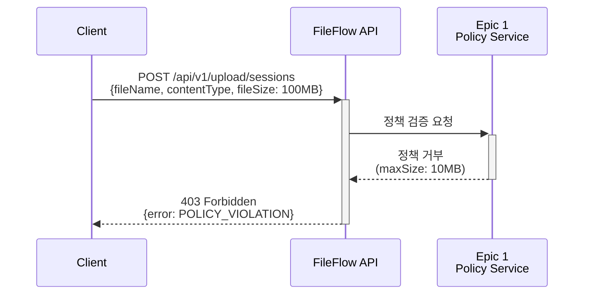
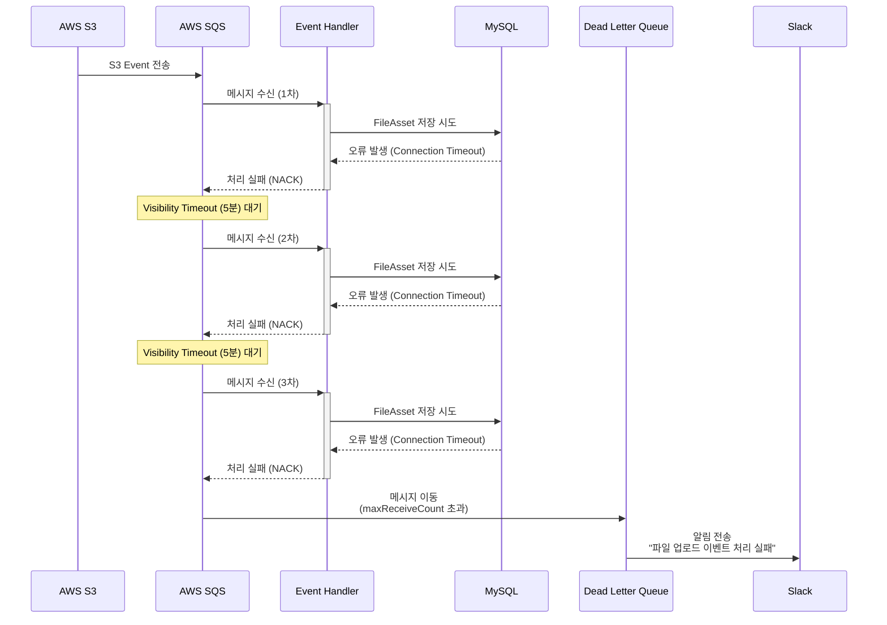

# Epic 2: 파일 업로드 & 저장

## 🎯 목표

실제 파일 업로드 기능 구현 및 S3 저장소 연동

## 📊 Epic 정보

- **Jira Epic**: [KAN-10](https://ryuqqq.atlassian.net/browse/KAN-10)
- **상태**: ⏳ 대기 중
- **예상 시간**: 69시간 (약 9일)
- **우선순위**: P1
- **의존성**: Epic 1 완료 필요 (정책 검증 로직 사용)

---

## 🏗️ 아키텍처 개요

### 전체 흐름

```
1. 클라이언트 → API: Presigned URL 요청
2. API → 정책 검증 (Epic 1)
3. API → S3: Presigned URL 생성
4. API → DB: 업로드 세션 생성
5. API → 클라이언트: Presigned URL 반환
6. 클라이언트 → S3: 파일 직접 업로드
7. S3 → SQS: 업로드 완료 이벤트
8. SQS → API: 이벤트 수신
9. API → 파일 메타데이터 추출 및 저장
10. API → DB: FileAsset, FileMetadata 저장
```

### 핵심 컴포넌트

- **Presigned URL Generator**: S3 업로드 URL 발급
- **Upload Session Manager**: 업로드 세션 관리
- **S3 Event Handler**: S3 이벤트 처리
- **Metadata Extractor**: 파일 메타데이터 추출

---

## 📦 주요 기능

### 1. Presigned URL 발급 시스템

**목적**: 클라이언트가 S3에 직접 파일을 업로드할 수 있도록 서명된 URL 제공

**구현 내용**:

- Epic 1의 정책 검증 통합
- S3 PutObject 권한으로 Presigned URL 생성
- 업로드 세션 생성 및 관리
- 만료 시간 설정 (기본 15분)

**API 엔드포인트**:

```
POST /api/v1/upload/sessions
Request:
{
  "fileName": "product-image.jpg",
  "contentType": "image/jpeg",
  "fileSize": 2048576,
  "tenantId": 1,
  "metadata": {
    "category": "product",
    "productId": "12345"
  }
}

Response:
{
  "sessionId": "550e8400-e29b-41d4-a716-446655440000",
  "presignedUrl": "[https://s3.amazonaws.com/](https://s3.amazonaws.com/)...",
  "expiresAt": "2024-12-25T10:30:00Z",
  "uploadUrl": "[https://s3.amazonaws.com/](https://s3.amazonaws.com/)..."
}
```

### 2. 데이터베이스 스키마

### upload_session 테이블

파일 업로드 세션 정보 저장

**컬럼**:

- `id`: Primary Key
- `session_id`: UUID (고유 식별자)
- `tenant_id`: 테넌트 ID
- `policy_id`: 적용된 정책 ID
- `file_name`: 원본 파일명
- `content_type`: MIME 타입
- `file_size`: 파일 크기 (bytes)
- `status`: 상태 (PENDING, UPLOADING, COMPLETED, FAILED, CANCELLED)
- `presigned_url`: 발급된 Presigned URL
- `s3_key`: S3 저장 경로
- `expires_at`: URL 만료 시간
- `created_at`, `updated_at`: 타임스탬프

### file_asset 테이블

업로드된 파일의 기본 정보 저장

**컬럼**:

- `id`: Primary Key
- `file_id`: UUID (고유 식별자)
- `session_id`: 업로드 세션 ID (FK)
- `tenant_id`: 테넌트 ID
- `original_file_name`: 원본 파일명
- `stored_file_name`: 저장된 파일명
- `s3_bucket`: S3 버킷명
- `s3_key`: S3 키
- `s3_region`: AWS 리전
- `cdn_url`: CDN URL (Epic 3에서 설정)
- `file_size`: 파일 크기
- `content_type`: MIME 타입
- `file_extension`: 파일 확장자
- `checksum`: SHA-256 체크섬
- `is_public`: 공개 여부
- `created_at`, `updated_at`, `deleted_at`: 타임스탬프

### file_metadata 테이블

파일의 상세 메타데이터 저장 (키-값 구조)

**컬럼**:

- `id`: Primary Key
- `file_id`: 파일 ID (FK)
- `metadata_key`: 메타데이터 키
- `metadata_value`: 메타데이터 값 (TEXT)
- `value_type`: 값 타입 (STRING, NUMBER, JSON, BOOLEAN)
- `created_at`, `updated_at`: 타임스탬프

**메타데이터 예시**:

- 이미지: `width`, `height`, `format`, `color_space`
- 비디오: `duration`, `resolution`, `codec`, `bitrate`
- 문서: `page_count`, `author`, `title`

### file_relationship 테이블

파일 간 관계 저장 (원본-썸네일, 원본-변환본 등)

**컬럼**:

- `id`: Primary Key
- `source_file_id`: 원본 파일 ID (FK)
- `target_file_id`: 대상 파일 ID (FK)
- `relationship_type`: 관계 타입

### 제공하는 것 ✅

- ✅ Presigned URL 기반 안전한 파일 업로드
- ✅ S3 직접 업로드로 서버 부하 최소화
- ✅ 파일 메타데이터 자동 추출 및 저장
- ✅ 업로드 세션 상태 추적 및 모니터링
- ✅ Epic 1 정책 검증 통합
- ✅ 이미지, 비디오, 문서 메타데이터 지원
- ✅ 파일 간 관계 관리 (원본-썸네일 등)
- ✅ 재시도 및 Circuit Breaker
- ✅ S3 이벤트 기반 비동기 처리

### 제공하지 않는 것 ❌

- ❌ 이미지 최적화 (Epic 3에서 구현)
- ❌ 썸네일 생성 (Epic 3에서 구현)
- ❌ OCR 처리 (Epic 3에서 구현)
- ❌ HTML 파일 처리 (Epic 4에서 구현)
- ❌ Excel/PDF AI 표준화 (Epic 5에서 구현)
- ❌ 파일 바이러스 스캔 (Epic 6에서 구현)
- ❌ 멀티파트 업로드 UI (클라이언트 구현 필요)
- ❌ 업로드 진행률 실시간 WebSocket (HTTP 폴링만 제공)
- `relationship_metadata`: 관계 메타데이터 (JSON)
- `created_at`: 생성 시간

**관계 타입**:

- `THUMBNAIL`: 썸네일 관계
- `OPTIMIZED`: 최적화된 파일
- `CONVERTED`: 변환된 파일
- `DERIVATIVE`: 파생 파일
- `VERSION`: 버전 관계

### 3. S3 Event 처리

**인프라 설정**:

- S3 Bucket Event Notification 설정
- SQS Queue: `fileflow-upload-events`
- Event Type: `ObjectCreated:Put`, `ObjectCreated:CompleteMultipartUpload`

**처리 흐름**:

1. S3에 파일 업로드 완료
2. S3 → SQS 이벤트 전송
3. SQS Listener가 메시지 수신
4. 세션 ID로 업로드 세션 조회
5. 파일 메타데이터 추출
6. FileAsset, FileMetadata 저장
7. 업로드 세션 상태 업데이트 (COMPLETED)

**이벤트 메시지 구조**:

```json
{
  "Records": [
    {
      "eventName": "ObjectCreated:Put",
      "s3": {
        "bucket": {
          "name": "fileflow-storage"
        },
        "object": {
          "key": "uploads/550e8400-e29b-41d4-a716-446655440000/product-image.jpg",
          "size": 2048576
        }
      }
    }
  ]
}
```

### 4. 파일 메타데이터 추출

**지원 파일 타입**:

- **이미지**: JPEG, PNG, GIF, WebP, BMP, TIFF
- **비디오**: MP4, MOV, AVI, WebM
- **문서**: PDF, DOCX, XLSX

**추출 정보**:

- **이미지**: 크기, 포맷, 색상 공간, EXIF 데이터
- **비디오**: 해상도, 길이, 코덱, 비트레이트
- **문서**: 페이지 수, 작성자, 제목

**전략 패턴 적용**:

```java
interface MetadataExtractionStrategy {
    FileMetadata extract(File file);
}

class ImageMetadataExtractor implements MetadataExtractionStrategy { }
class VideoMetadataExtractor implements MetadataExtractionStrategy { }
class DocumentMetadataExtractor implements MetadataExtractionStrategy { }
```

### 5. 업로드 상태 관리

**상태 전이**:

```
PENDING → UPLOADING → COMPLETED
                    → FAILED
        → CANCELLED
```

**상태별 의미**:

- **PENDING**: 세션 생성됨, 업로드 대기 중
- **UPLOADING**: 클라이언트가 S3에 업로드 중
- **COMPLETED**: 업로드 완료, 메타데이터 저장 완료
- **FAILED**: 업로드 실패 또는 처리 실패
- **CANCELLED**: 사용자가 취소

**API 엔드포인트**:

```
GET /api/v1/upload/sessions/{sessionId}
Response:
{
  "sessionId": "550e8400-e29b-41d4-a716-446655440000",
  "status": "UPLOADING",
  "progress": 75,
  "uploadedBytes": 1536432,
  "totalBytes": 2048576,
  "createdAt": "2024-12-25T10:00:00Z",
  "expiresAt": "2024-12-25T10:15:00Z"
}
```

### 6. 재시도 메커니즘

**재시도 대상**:

- S3 일시적 오류 (5xx)
- 네트워크 타임아웃
- SQS 메시지 처리 실패

**재시도 전략**:

- Exponential Backoff
- 최대 재시도: 3회
- 초기 대기: 1초
- 최대 대기: 10초

**Circuit Breaker**:

- Resilience4j 사용
- 실패율 임계값: 50%
- 대기 시간: 30초

---

## 📁 프로젝트 구조

```
src/main/java/com/fileflow/
├── domain/
│   └── upload/
│       ├── model/
│       │   ├── [UploadSession.java](http://UploadSession.java)
│       │   ├── [UploadRequest.java](http://UploadRequest.java)
│       │   └── [PresignedUrlInfo.java](http://PresignedUrlInfo.java)
│       ├── command/
│       │   └── [FileUploadCommand.java](http://FileUploadCommand.java)
│       └── event/
│           ├── [PresignedUrlRequested.java](http://PresignedUrlRequested.java)
│           └── [UploadSessionCreated.java](http://UploadSessionCreated.java)
├── application/
│   ├── port/
│   │   ├── in/
│   │   │   ├── [CreateUploadSessionUseCase.java](http://CreateUploadSessionUseCase.java)
│   │   │   ├── [GetUploadSessionUseCase.java](http://GetUploadSessionUseCase.java)
│   │   │   └── [CompleteUploadSessionUseCase.java](http://CompleteUploadSessionUseCase.java)
│   │   └── out/
│   │       ├── [PolicyValidationPort.java](http://PolicyValidationPort.java)
│   │       ├── [PresignedUrlPort.java](http://PresignedUrlPort.java)
│   │       └── [UploadSessionPort.java](http://UploadSessionPort.java)
│   └── service/
│       ├── [UploadSessionService.java](http://UploadSessionService.java)
│       ├── [MetadataExtractionService.java](http://MetadataExtractionService.java)
│       └── [UploadPolicyValidationService.java](http://UploadPolicyValidationService.java)
├── adapter/
│   ├── in/
│   │   ├── web/
│   │   │   ├── [UploadController.java](http://UploadController.java)
│   │   │   └── dto/
│   │   │       ├── [UploadSessionRequest.java](http://UploadSessionRequest.java)
│   │   │       └── [UploadSessionResponse.java](http://UploadSessionResponse.java)
│   │   └── event/
│   │       ├── [S3EventListener.java](http://S3EventListener.java)
│   │       └── handler/
│   │           └── [S3UploadEventHandler.java](http://S3UploadEventHandler.java)
│   └── out/
│       ├── storage/
│       │   ├── [S3PresignedUrlAdapter.java](http://S3PresignedUrlAdapter.java)
│       │   └── config/
│       │       └── [S3Config.java](http://S3Config.java)
│       └── persistence/
│           ├── entity/
│           │   ├── [UploadSessionEntity.java](http://UploadSessionEntity.java)
│           │   ├── [FileAssetEntity.java](http://FileAssetEntity.java)
│           │   ├── [FileMetadataEntity.java](http://FileMetadataEntity.java)
│           │   └── [FileRelationshipEntity.java](http://FileRelationshipEntity.java)
│           ├── repository/
│           │   ├── [UploadSessionRepository.java](http://UploadSessionRepository.java)
│           │   ├── [FileAssetRepository.java](http://FileAssetRepository.java)
│           │   └── [FileMetadataRepository.java](http://FileMetadataRepository.java)
│           └── adapter/
│               ├── [UploadSessionAdapter.java](http://UploadSessionAdapter.java)
│               └── [FileAssetAdapter.java](http://FileAssetAdapter.java)
```

---

## 🔧 기술 스택

### Backend

- **Language**: Java 17
- **Framework**: Spring Boot 3.x
- **Architecture**: Hexagonal Architecture

### AWS Services

- **S3**: 파일 저장소
- **SQS**: 이벤트 큐
- **IAM**: 권한 관리

### Database

- **MySQL 8.0**: 메인 데이터베이스
- **Redis**: 세션 캐싱
- **Flyway**: 마이그레이션

### Libraries

- **AWS SDK for Java v2**: AWS 서비스 연동
- **Apache Commons Imaging**: 이미지 메타데이터
- **Metadata Extractor**: EXIF 데이터
- **Spring Retry**: 재시도 로직
- **Resilience4j**: Circuit Breaker

---

## 📊 시퀀스 다이어그램

### 1. 정상 플로우: Presigned URL 발급 ~ 업로드 완료



### 2. 에러 플로우: 정책 위반



### 3. 에러 플로우: S3 이벤트 처리 실패 및 재시도



---

## 📋 Task 목록

### Phase 1: 기본 구조 (19시간)

- [KAN-11](https://ryuqqq.atlassian.net/browse/KAN-11) - Presigned URL 발급 요청 엔드포인트 구현 (Domain 모델) - 4h
- [KAN-12](https://ryuqqq.atlassian.net/browse/KAN-12) - Epic 1 정책 검증 통합 (Port 구현) - 6h
- [KAN-13](https://ryuqqq.atlassian.net/browse/KAN-13) - S3 Presigned URL 생성 로직 (Adapter) - 5h
- [KAN-14](https://ryuqqq.atlassian.net/browse/KAN-14) - 업로드 세션 생성 및 관리 (UseCase) - 5h
- [KAN-15](https://ryuqqq.atlassian.net/browse/KAN-15) - upload_session 테이블 설계 및 생성 - 3h
- [KAN-16](https://ryuqqq.atlassian.net/browse/KAN-16) - file_asset 테이블 설계 및 생성 - 3h
- [KAN-17](https://ryuqqq.atlassian.net/browse/KAN-17) - file_metadata 테이블 설계 및 생성 - 3h
- [KAN-18](https://ryuqqq.atlassian.net/browse/KAN-18) - file_relationship 테이블 설계 및 생성 - 3h

### Phase 2: S3 이벤트 처리 (15시간)

- [KAN-19](https://ryuqqq.atlassian.net/browse/KAN-19) - S3 Event Notification 설정 (인프라) - 4h
- [KAN-20](https://ryuqqq.atlassian.net/browse/KAN-20) - S3 Event 수신 핸들러 구현 - 5h
- [KAN-21](https://ryuqqq.atlassian.net/browse/KAN-21) - 파일 메타데이터 추출 및 저장 - 6h

### Phase 3: 상태 관리 & 복원력 (13시간)

- [KAN-22](https://ryuqqq.atlassian.net/browse/KAN-22) - 업로드 진행률 추적 API - 4h
- [KAN-23](https://ryuqqq.atlassian.net/browse/KAN-23) - 업로드 성공/실패 처리 로직 - 5h
- [KAN-24](https://ryuqqq.atlassian.net/browse/KAN-24) - 재시도 메커니즘 구현 - 4h

### Phase 4: 품질 보증 (9시간)

- [KAN-25](https://ryuqqq.atlassian.net/browse/KAN-25) - 통합 테스트 작성 - 6h
- [KAN-26](https://ryuqqq.atlassian.net/browse/KAN-26) - API 문서화 (Swagger/OpenAPI) - 3h

---

## 🧪 테스트 전략

### 단위 테스트

- Domain 모델 로직 검증
- UseCase 비즈니스 로직 테스트
- Adapter 구현 테스트
- 목표 커버리지: 80% 이상

### 통합 테스트

- End-to-End 업로드 흐름 테스트
- S3 이벤트 처리 테스트 (LocalStack)
- 정책 검증 통합 테스트
- 재시도 로직 테스트

### 성능 테스트

- 동시 업로드 처리 테스트
- 대용량 파일 업로드 테스트
- 메타데이터 추출 성능 측정

---

## 🚀 배포 전략

### 환경별 설정

- **개발(dev)**: LocalStack 사용
- **스테이징(staging)**: 실제 AWS 서비스
- **프로덕션(prod)**: 실제 AWS 서비스 + 모니터링

### 인프라 코드

- Terraform으로 관리
- S3 Bucket, SQS Queue, IAM Policy
- 환경별 변수 분리

---

## 📊 모니터링 & 알림

### 주요 메트릭

- 업로드 성공률
- 평균 업로드 시간
- S3 이벤트 처리 지연시간
- 실패한 세션 수

### CloudWatch Alarms

- SQS Queue 깊이 > 100
- 업로드 실패율 > 5%
- DLQ 메시지 수 > 0

### Slack 알림

- 업로드 실패 알림
- 시스템 에러 알림
- DLQ 메시지 알림

---

## 🔐 보안 고려사항

### Presigned URL

- 만료 시간 제한 (15분)
- HTTPS 강제
- Content-Type 검증

### S3 Bucket Policy

- 최소 권한 원칙
- Public Access 차단
- Encryption at Rest (AES-256)

### 파일 검증

- 파일 크기 제한
- MIME 타입 검증
- 악성 파일 스캔 (Epic 6에서 구현)

---

## 📈 성능 최적화

### 캐싱 전략

- Redis에 업로드 세션 캐싱
- 정책 조회 결과 캐싱 (Epic 1)
- TTL: 15분

### 데이터베이스 최적화

- 적절한 인덱스 설정
- Connection Pool 튜닝
- 읽기 복제본 활용 (프로덕션)

### 비동기 처리

- S3 이벤트 비동기 처리
- 메타데이터 추출 비동기 처리
- SQS Batch 처리

---

## 🚨 에러 처리 시나리오

### 1. Presigned URL 발급 실패 시나리오

### 1.1 정책 검증 실패

**상황**: Epic 1 정책에서 파일 타입/크기 거부

**에러 코드**: `POLICY_VIOLATION`

**HTTP 상태**: 403 Forbidden

**응답**:

```json
{
  "error": "POLICY_VIOLATION",
  "message": "파일 크기가 정책 허용 범위를 초과했습니다",
  "details": {
    "maxFileSize": 10485760,
    "requestedSize": 20971520,
    "allowedTypes": ["image/jpeg", "image/png"]
  }
}
```

**클라이언트 대응**: 사용자에게 에러 메시지 표시

### 1.2 S3 서비스 일시적 오류 (5xx)

**상황**: AWS S3 API 호출 실패

**에러 코드**: `S3_SERVICE_UNAVAILABLE`

**HTTP 상태**: 503 Service Unavailable

**재시도 전략**:

- 1차: 1초 대기 후 재시도
- 2차: 2초 대기 후 재시도
- 3차: 4초 대기 후 재시도
- 3회 실패 시 최종 실패 반환

**응답**:

```json
{
  "error": "S3_SERVICE_UNAVAILABLE",
  "message": "S3 서비스가 일시적으로 사용 불가합니다. 잠시 후 다시 시도해주세요.",
  "retryAfter": 5
}
}
```

### 1.3 데이터베이스 연결 실패

**상황**: MySQL 연결 풀 고갈 또는 네트워크 문제

**에러 코드**: `DATABASE_CONNECTION_ERROR`

**HTTP 상태**: 503 Service Unavailable

**Circuit Breaker 동작**: 실패율 50% 초과 시 30초간 차단

### 2. 파일 업로드 실패 시나리오

### 2.1 Presigned URL 만료

**상황**: 15분 내에 업로드 시작하지 않음

**S3 응답**: 403 Forbidden (AccessDenied)

**클라이언트 대응**:

1. 세션 상태 조회 API 호출
2. 세션이 PENDING 상태면 새로운 Presigned URL 요청
3. 세션이 EXPIRED면 새 세션 생성

### 2.2 네트워크 단절

**상황**: 업로드 중 네트워크 단절

**해결 방법**: S3 Multipart Upload 사용

- 클라이언트는 단절된 부분부터 재개
- 세션은 만료 시간까지 유효
- 기존 세션 ID로 업로드 재개 가능

### 2.3 파일 크기 불일치

**상황**: 실제 업로드된 파일 크기 ≠ 요청 시 명시한 크기

**검증**: S3 Event 처리 시 크기 비교

**에러 코드**: `FILE_SIZE_MISMATCH`

**처리**:

1. 세션 상태를 FAILED로 변경
2. S3에서 파일 삭제
3. 클라이언트에게 에러 통지 (Webhook or Polling)

### 2.4 Content-Type 불일치

**상황**: 요청한 Content-Type과 실제 파일의 MIME 타입 불일치

**검증**: 메타데이터 추출 시 Apache Tika로 실제 MIME 타입 확인

**에러 코드**: `CONTENT_TYPE_MISMATCH`

**처리 옵션**:

1. **엄격 모드**: 업로드 거부 (B2B 테난트)
2. **관대 모드**: 경고 로그 기록 후 허용 (B2C 테난트)

### 3. S3 이벤트 처리 실패 시나리오

### 3.1 SQS 메시지 처리 실패

**상황**: 이벤트 핸들러에서 예외 발생

**재시도 전략**:

- SQS Visibility Timeout: 5분
- 최대 수신 횟수: 3회
- 3회 실패 후 DLQ(Dead Letter Queue)로 이동

**DLQ 처리**:

1. CloudWatch Alarm 발동
2. Slack으로 알림 전송
3. 수동 조사 및 재처리

### 3.2 메타데이터 추출 실패

**상황**: 지원하지 않는 파일 형식 또는 손상된 파일

**에러 코드**: `METADATA_EXTRACTION_FAILED`

**처리**:

1. FileAsset는 저장 (기본 정보만)
2. FileMetadata 저장 스킵
3. 세션 상태를 COMPLETED_WITH_WARNINGS로 변경
4. 로그에 경고 기록

### 3.3 데이터베이스 트랜잭션 실패

**상황**: FileAsset 저장 중 오류 발생

**롤백 전략**:

1. 트랜잭션 롤백
2. SQS 메시지 재시도 (가시성 타임아웃 후)
3. 세션 상태는 UPLOADING 유지

### 4. 동시성 문제 시나리오

### 4.1 동일 세션 ID로 중복 이벤트 수신

**상황**: S3가 동일 이벤트를 여러 번 전송 (드물게 발생)

**해결 방법**: 멱등성 보장 (Idempotency)

- 세션 상태가 이미 COMPLETED면 스킵
- DB Unique Constraint: `upload_session.session_id`
- 중복 처리 시 로그만 기록

### 4.2 Race Condition

**상황**: 여러 이벤트 핸들러가 동시에 동일 세션 업데이트

**해결 방법**: 낙관적 락 (Optimistic Locking)

- `upload_session.version` 컬럼 추가
- 업데이트 시 version 체크
- 충돌 발생 시 재시도

### 5. 에러 코드 정의

| 에러 코드 | HTTP 상태 | 설명 | 재시도 가능 |
| --- | --- | --- | --- |
| `POLICY_VIOLATION` | 403 | 정책 위반 | ❌ |
| `INVALID_FILE_TYPE` | 400 | 허용되지 않는 파일 타입 | ❌ |
| `FILE_TOO_LARGE` | 413 | 파일 크기 초과 | ❌ |
| `S3_SERVICE_UNAVAILABLE` | 503 | S3 일시적 오류 | ✅ |
| `DATABASE_CONNECTION_ERROR` | 503 | DB 연결 실패 | ✅ |
| `SESSION_NOT_FOUND` | 404 | 세션을 찾을 수 없음 | ❌ |
| `SESSION_EXPIRED` | 410 | 세션 만료 | ❌ |
| `FILE_SIZE_MISMATCH` | 400 | 파일 크기 불일치 | ❌ |
| `CONTENT_TYPE_MISMATCH` | 400 | Content-Type 불일치 | ❌ |
| `METADATA_EXTRACTION_FAILED` | 500 | 메타데이터 추출 실패 | ✅ |
| `CHECKSUM_MISMATCH` | 400 | 체크섬 불일치 | ❌ |
| `CONCURRENT_MODIFICATION` | 409 | 동시 수정 충돌 | ✅ |
| `INTERNAL_SERVER_ERROR` | 500 | 예상치 못한 오류 | ✅ |

### 6. 에러 모니터링 지표

**CloudWatch 메트릭**:

- `UploadFailureRate`: 업로드 실패율
- `PolicyViolationCount`: 정책 위반 횟수
- `S3ErrorRate`: S3 API 오류율
- `MetadataExtractionFailureRate`: 메타데이터 추출 실패율
- `DLQMessageCount`: DLQ 메시지 수

**알람 임계값**:

- 업로드 실패율 > 5%
- DLQ 메시지 수 > 0
- 메타데이터 추출 실패율 > 10%

---

## ❓ FAQ

### Q1: 업로드 중 네트워크가 끊기면?

A: 클라이언트는 S3 Multipart Upload를 사용하여 재개 가능. 세션은 만료 시간까지 유효.

### Q2: 동일한 파일을 여러 번 업로드하면?

A: 각 업로드마다 새로운 세션과 파일 ID 생성. 중복 제거는 애플리케이션 레벨에서 처리.

### Q3: 대용량 파일 (> 5GB) 지원?

A: S3 Multipart Upload 사용. 최대 5TB까지 지원 가능.

### Q4: 업로드 완료 후 원본 파일 삭제 가능?

A: Soft Delete 지원. `deleted_at` 필드 업데이트. 실제 삭제는 배치 작업으로 처리.

---

## 🔗 관련 링크

- **Jira Epic**: [KAN-10](https://ryuqqq.atlassian.net/browse/KAN-10)
- **GitHub**: [FileFlow Repository](https://github.com/ryu-qqq/FileFlow)
- **AWS S3 문서**: [S3 Developer Guide](https://docs.aws.amazon.com/s3/)
- **상위 프로젝트**: 🏗️ Setof 고도화 프로젝트
- **이전 Epic**: Epic 1: 테넌트 정책 관리 시스템
- **다음 Epic**: Epic 3: 이미지 처리 파이프라인

---

## 📖 참고 문서

### AWS 문서

- [S3 Presigned URL](https://docs.aws.amazon.com/AmazonS3/latest/userguide/PresignedUrlUploadObject.html)
- [S3 Event Notifications](https://docs.aws.amazon.com/AmazonS3/latest/userguide/NotificationHowTo.html)
- [SQS Developer Guide](https://docs.aws.amazon.com/sqs/)

### 라이브러리 문서

- [AWS SDK for Java v2](https://docs.aws.amazon.com/sdk-for-java/latest/developer-guide/home.html)
- [Apache Commons Imaging](https://commons.apache.org/proper/commons-imaging/)
- [Metadata Extractor](https://github.com/drewnoakes/metadata-extractor)

### 블로그 및 아티클

- [AWS re:Invent - S3 Best Practices](https://www.youtube.com/watch?v=rHeTn9pHNKo)
- [Hexagonal Architecture in Java](https://www.baeldung.com/hexagonal-architecture-ddd-spring)