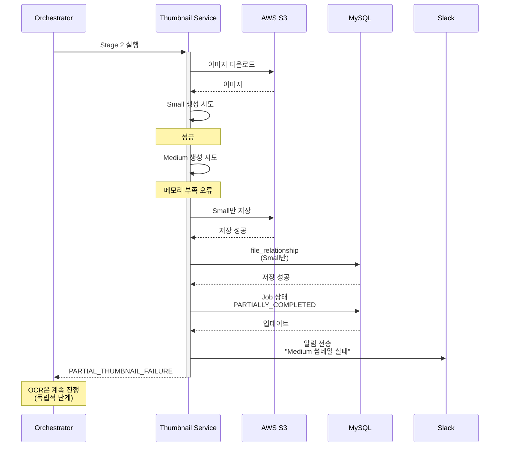
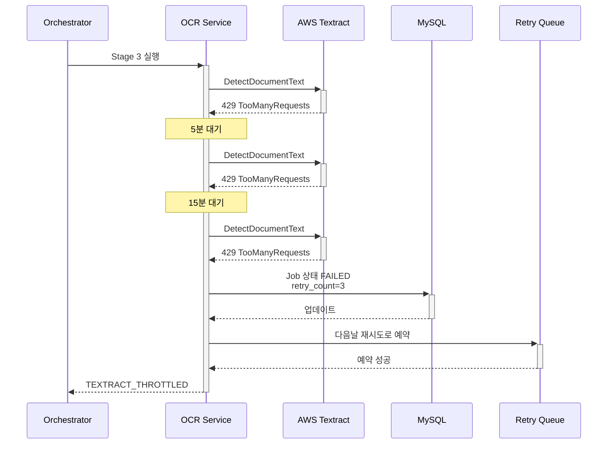

# Epic 3: 이미지 처리 파이프라인

## 🎯 목표

이미지 최적화 및 메타데이터 추출 자동화

## 📊 Epic 정보

- **Jira Epic**: [KAN-27](https://ryuqqq.atlassian.net/browse/KAN-27)
- **상태**: ⏳ 대기 중
- **예상 시간**: 104시간 (약 13일)
- **우선순위**: P2
- **의존성**: Epic 2 완료 필요 (파일 업로드 기반)

---

## 🏗️ 아키텍처 개요

### 파이프라인 흐름

```
[이미지 업로드 완료] (Epic 2)
        ↓
[파이프라인 트리거]
        ↓
    [비동기 처리]
        ↓
   ┌────┼────┐
   │         │         │
[Stage 1] [Stage 2] [Stage 3]
   │         │         │
[최적화]  [썸네일]  [OCR]
   │         │         │
   └────┬────┘
        │
   [Stage 4]
        │
   [CDN 배포]
        ↓
    [완료]
```

### 4단계 처리 파이프라인

1. **Stage 1**: 이미지 최적화 (WebP 변환, 압축)
2. **Stage 2**: 썸네일 생성 (Small 300x300, Medium 800x800)
3. **Stage 3**: OCR 텍스트 추출 (상품 정보 파싱)
4. **Stage 4**: CDN 배포 (CloudFront)

---

## 📦 주요 기능

### 1. 이미지 최적화

### 제공하는 것 ✅

- ✅ WebP 포맷 변환 (JPEG, PNG, GIF)
- ✅ 이미지 압축 (품질 90% 유지)
- ✅ 다중 크기 썸네일 생성 (Small 300x300, Medium 800x800)
- ✅ EXIF 메타데이터 처리 (회전 보정, 개인정보 제거)
- ✅ AWS Textract 기반 OCR
- ✅ 상품 정보 자동 파싱 (재질, 원산지, 세탁방법, 사이즈)
- ✅ CloudFront CDN 자동 배포
- ✅ 캐시 무효화 API
- ✅ 4단계 파이프라인 오케스트레이션
- ✅ 작업 상태 추적 및 재시도
- ✅ 병렬 처리 (썸네일 생성)
- ✅ Epic 2 파일 관계 자동 연결

### 제공하지 않는 것 ❌

- ❌ 비이미지 파일 처리 (Epic 4에서 HTML, Epic 5에서 Excel/PDF)
- ❌ 실시간 이미지 변환 (온디맨드 리사이징)
- ❌ AI 기반 이미지 태깅/분류 (향후 확장)
- ❌ 얼굴 인식/객체 탐지 (향후 확장)
- ❌ 워터마크 자동 삽입 (향후 확장)
- ❌ 동영상 썸네일 추출 (향후 확장)
- ❌ 이미지 배경 제거
- ❌ 이미지 품질 자동 평가
- ❌ 중복 이미지 탐지

### WebP 변환

**목적**: 파일 크기 축소 및 품질 유지

**변환 대상**:

- JPEG → WebP
- PNG → WebP (Alpha 채널 유지)
- GIF → WebP (애니메이션 지원)

**기술 스택**:

- **Thumbnailator**: Java 이미지 처리 라이브러리
- **WebP Plugin**: WebP 포맷 지원

**변환 옵션**:

```java
WebPOptions options = new WebPOptions();
options.setQuality(90);  // 품질 90%
options.setLossless(false);  // 손실 압축
options.setPreserveMetadata(false);  // EXIF 제거
```

**기대 효과**:

- JPEG 대비 25-35% 파일 크기 감소
- PNG 대비 50-70% 파일 크기 감소
- 품질 저하 최소화

### 이미지 압축

**품질 기준**: 90%

**포맷별 압축 전략**:

- **JPEG**: MozJPEG 알고리즘
- **PNG**: OptiPNG + PNGQuant
- **WebP**: Google libwebp

**압축 알고리즘**:

```java
interface CompressionStrategy {
    byte[] compress(byte[] imageData, int quality);
}

class JpegCompressionStrategy implements CompressionStrategy {
    // MozJPEG 기반 압축
}

class PngCompressionStrategy implements CompressionStrategy {
    // OptiPNG + PNGQuant 사용
}
```

### EXIF 메타데이터 처리

**제거 대상**:

- GPS 위치 정보
- 카메라 기기 정보
- 촬영 일시

**유지 대상**:

- 저작권 정보
- Orientation 태그 (자동 회전 후 제거)

**처리 로직**:

1. EXIF 데이터 읽기
2. Orientation 기반 이미지 회전
3. 개인정보 제거
4. 필요한 정보만 file_metadata에 저장

### 2. 썸네일 생성

### 썸네일 크기 정의

**SMALL**: 300x300

- 사용처: 목록 뷰, 미리보기
- 리사이징: Center Crop (정사각형)
- 포맷: WebP

**MEDIUM**: 800x800

- 사용처: 상세 뷰, 모바일
- 리사이징: Aspect Ratio 유지 Fit
- 포맷: WebP

### 리사이징 알고리즘

**Lanczos3 리샘플링**:

- 최고 품질의 리사이징 알고리즘
- 선명도 유지
- 에일리어싱 방지

**선명화 처리**:

- Unsharp Mask 적용
- 리사이징 후 선명도 손실 보정
- 과도한 샤프닝 방지

### 파일명 규칙

```
원본: product-12345.jpg
Small: product-12345_small.webp
Medium: product-12345_medium.webp
```

### S3 저장 구조

```
s3://fileflow-storage/
├── originals/
│   └── {tenant-id}/{file-id}.{ext}
└── thumbnails/
    ├── small/
    │   └── {tenant-id}/{file-id}.webp
    └── medium/
        └── {tenant-id}/{file-id}.webp
```

### 3. OCR (텍스트 추출)

### AWS Textract 통합

**API 사용**:

- **DetectDocumentText**: 텍스트 감지 및 추출
- **AnalyzeDocument**: 문서 구조 분석 (선택)

**비용 최적화**:

- 동일 이미지 재처리 방지 (캐싱)
- 배치 처리
- 신뢰도 90% 이상만 처리

**처리 흐름**:

```
1. S3에서 이미지 참조
2. Textract DetectDocumentText 호출
3. 텍스트 블록 추출
4. 신뢰도 필터링 (>= 90%)
5. 텍스트 정제 및 파싱
6. file_metadata에 저장
```

### 상품 정보 파싱

**파싱 대상**:

1. **재질 (Material)**
    - 패턴: "Cotton 100%", "폴리에스테르 80%"
    - 정규식: `/(\w+)\s*(\d+)%/`
2. **원산지 (Origin)**
    - 패턴: "Made in Korea", "중국산", "Vietnam"
    - 정규식: `/Made in ([A-Za-z가-힣]+)/`
3. **세탁방법 (Washing)**
    - 패턴: "손세탁", "드라이클리닝", "물세탁 가능"
    - 키워드: "세탁", "wash", "clean"
4. **사이즈 (Size)**
    - 패턴: "S", "M", "L", "XL", "Free Size"
    - 정규식: `/\b(XS|S|M|L|XL|XXL|Free)\b/i`

**파싱 로직**:

```java
class ProductInfoParser {
    MaterialPattern materialPattern;
    OriginPattern originPattern;
    WashingPattern washingPattern;
    SizePattern sizePattern;
    
    ProductInformation parse(String extractedText) {
        // 패턴 매칭 및 파싱
    }
}
```

**저장 형식** (file_metadata):

```json
{
  "ocr_extracted_text": "원본 텍스트...",
  "product_material": "Cotton 100%",
  "product_origin": "Korea",
  "washing_instruction": "손세탁",
  "product_size": "Free Size",
  "ocr_confidence": 0.95
}
```

### 4. CDN 배포

### CloudFront 구성

**Distribution 설정**:

- **Origin**: S3 Bucket
- **Origin Access**: OAC (Origin Access Control)
- **Viewer Protocol**: HTTPS Only
- **Compress**: Gzip, Brotli 활성화

**Cache 정책**:

- **이미지 파일**: 장기 캐싱 (1년)
- **Cache-Control**: `public, max-age=31536000, immutable`
- **Query String**: 무시

**에지 로케이션**:

- Price Class: All (100+ 에지 로케이션)
- 또는 Price Class 100 (비용 최적화)

### CDN URL 구조

```
[https://d123456789.cloudfront.net/originals/{tenant-id}/{file-id}.webp](https://d123456789.cloudfront.net/originals/{tenant-id}/{file-id}.webp)
[https://d123456789.cloudfront.net/thumbnails/small/{tenant-id}/{file-id}.webp](https://d123456789.cloudfront.net/thumbnails/small/{tenant-id}/{file-id}.webp)
[https://d123456789.cloudfront.net/thumbnails/medium/{tenant-id}/{file-id}.webp](https://d123456789.cloudfront.net/thumbnails/medium/{tenant-id}/{file-id}.webp)
```

### 캐시 무효화

**무효화 시나리오**:

- 파일 재업로드
- 파일 삭제
- 이미지 재처리

**무효화 API**:

```
POST /api/v1/cdn/invalidate
Request:
{
  "paths": [
    "/originals/1/file-123.webp",
    "/thumbnails/*/file-123.webp"
  ]
}

Response:
{
  "invalidationId": "I2J3K4L5M6N7O8P9",
  "status": "InProgress",
  "createTime": "2024-12-25T10:00:00Z"
}
```

**비용 최적화**:

- 무효화 경로 그룹핑
- 와일드카드 활용
- 불필요한 무효화 방지

### 5. 후처리 작업 관리

### processing_job 테이블

**스키마**:

```sql
CREATE TABLE processing_job (
    id BIGINT PRIMARY KEY,
    job_id VARCHAR(36) UNIQUE,
    file_id VARCHAR(36),
    job_type VARCHAR(50),
    job_status VARCHAR(20),
    priority INT DEFAULT 0,
    retry_count INT DEFAULT 0,
    max_retries INT DEFAULT 3,
    error_message TEXT,
    metadata JSON,
    started_at DATETIME,
    completed_at DATETIME,
    created_at DATETIME,
    updated_at DATETIME
);
```

**Job 타입**:

- `IMAGE_OPTIMIZATION`: 이미지 최적화
- `WEBP_CONVERSION`: WebP 변환
- `THUMBNAIL_GENERATION`: 썸네일 생성
- `OCR_EXTRACTION`: OCR 텍스트 추출
- `CDN_DEPLOYMENT`: CDN 배포

**Job 상태**:

```
PENDING → PROCESSING → COMPLETED
                     → FAILED → PENDING (재시도)
        → CANCELLED
```

### 파이프라인 오케스트레이터

**실행 전략**:

```java
class ImageProcessingOrchestrator {
    
    void startPipeline(String fileId) {
        // Stage 1: 이미지 최적화
        ProcessingJob optimizationJob = createJob(fileId, IMAGE_OPTIMIZATION);
        
        // Stage 2: 썸네일 생성 (병렬)
        ProcessingJob thumbnailJob = createJob(fileId, THUMBNAIL_GENERATION);
        
        // Stage 3: OCR 추출
        ProcessingJob ocrJob = createJob(fileId, OCR_EXTRACTION);
        
        // Stage 4: CDN 배포
        ProcessingJob cdnJob = createJob(fileId, CDN_DEPLOYMENT);
        
        // 단계별 실행
        executeSequentially(optimizationJob, thumbnailJob, ocrJob, cdnJob);
    }
}
```

**병렬 처리**:

- 썸네일 생성 (Small, Medium 동시)
- 최적화 및 OCR (독립적)

**의존성 관리**:

- Stage 2, 3은 Stage 1 완료 후
- Stage 4는 모든 Stage 완료 후

---

## 🔧 기술 스택

### Backend

- **Language**: Java 17
- **Framework**: Spring Boot 3.x
- **Architecture**: Hexagonal Architecture

### 이미지 처리

- **Thumbnailator**: Java 이미지 처리
- **ImageMagick**: 대안 (명령줄 도구)
- **Apache Commons Imaging**: 메타데이터
- **Metadata Extractor**: EXIF 데이터

### AWS Services

- **S3**: 파일 저장
- **Textract**: OCR 서비스
- **CloudFront**: CDN
- **SQS/SNS**: 메시지 큐

### Database

- **MySQL 8.0**: 메인 DB
- **Redis**: 결과 캐싱

### Libraries

- **AWS SDK for Java v2**: AWS 서비스
- **Spring Retry**: 재시도
- **Resilience4j**: Circuit Breaker

---

## 📋 Task 목록

### Phase 1: 이미지 최적화 (16시간)

- [KAN-28](https://ryuqqq.atlassian.net/browse/KAN-28) - 이미지 최적화 Domain 모델 설계 - 4h
- [KAN-29](https://ryuqqq.atlassian.net/browse/KAN-29) - WebP 변환 서비스 구현 - 5h
- [KAN-30](https://ryuqqq.atlassian.net/browse/KAN-30) - 이미지 압축 로직 구현 (품질 90%) - 4h
- [KAN-31](https://ryuqqq.atlassian.net/browse/KAN-31) - 이미지 메타데이터 처리 (EXIF 제거/유지) - 3h

### Phase 2: 썸네일 생성 (13시간)

- [KAN-32](https://ryuqqq.atlassian.net/browse/KAN-32) - 썸네일 생성 전략 설계 및 구현 - 3h
- [KAN-33](https://ryuqqq.atlassian.net/browse/KAN-33) - 다중 크기 썸네일 생성 (Small: 300x300, Medium: 800x800) - 4h
- [KAN-34](https://ryuqqq.atlassian.net/browse/KAN-34) - 리사이징 알고리즘 최적화 - 3h
- [KAN-35](https://ryuqqq.atlassian.net/browse/KAN-35) - 썸네일 파일 관계 저장 (file_relationship) - 3h

### Phase 3: OCR (18시간)

- [KAN-36](https://ryuqqq.atlassian.net/browse/KAN-36) - AWS Textract 통합 설정 - 3h
- [KAN-37](https://ryuqqq.atlassian.net/browse/KAN-37) - 이미지 텍스트 추출 서비스 구현 - 5h
- [KAN-38](https://ryuqqq.atlassian.net/browse/KAN-38) - 상품 정보 파싱 로직 (재질, 원산지, 세탁방법, 사이즈) - 6h
- [KAN-39](https://ryuqqq.atlassian.net/browse/KAN-39) - OCR 결과 저장 및 메타데이터 연동 - 4h

### Phase 4: CDN 배포 (10시간)

- [KAN-40](https://ryuqqq.atlassian.net/browse/KAN-40) - CloudFront 배포 설정 (인프라) - 4h
- [KAN-41](https://ryuqqq.atlassian.net/browse/KAN-41) - CDN 자동 배포 로직 구현 - 3h
- [KAN-42](https://ryuqqq.atlassian.net/browse/KAN-42) - 캐시 무효화 서비스 구현 - 3h

### Phase 5: 파이프라인 관리 (16시간)

- [KAN-43](https://ryuqqq.atlassian.net/browse/KAN-43) - processing_job 테이블 설계 및 생성 - 3h
- [KAN-44](https://ryuqqq.atlassian.net/browse/KAN-44) - 파이프라인 오케스트레이션 구현 - 5h
- [KAN-45](https://ryuqqq.atlassian.net/browse/KAN-45) - 작업 상태 추적 및 관리 - 4h
- [KAN-46](https://ryuqqq.atlassian.net/browse/KAN-46) - 재시도 및 에러 핸들링 - 4h

### Phase 6: 비동기 처리 인프라 (9시간)

- [KAN-47](https://ryuqqq.atlassian.net/browse/KAN-47) - SQS/SNS 파이프라인 설정 - 4h
- [KAN-48](https://ryuqqq.atlassian.net/browse/KAN-48) - 비동기 메시지 핸들러 구현 - 5h

### Phase 7: 품질 보증 (11시간)

- [KAN-49](https://ryuqqq.atlassian.net/browse/KAN-49) - 통합 테스트 작성 - 6h
- [KAN-50](https://ryuqqq.atlassian.net/browse/KAN-50) - 성능 테스트 및 최적화 - 5h

### Phase 8: 에러 처리 및 모니터링 (11시간)

- [KAN-82](https://ryuqqq.atlassian.net/browse/KAN-82) - 에러 처리 시나리오 구현 - 6h
- [KAN-83](https://ryuqqq.atlassian.net/browse/KAN-83) - 에러 모니터링 설정 - 5h

**총 예상 시간**: 104시간 (약 13일)

- [KAN-49](https://ryuqqq.atlassian.net/browse/KAN-49) - 통합 테스트 작성 - 6h
- [KAN-50](https://ryuqqq.atlassian.net/browse/KAN-50) - 성능 테스트 및 최적화 - 5h

---

## 📖 참고 문서

### AWS 문서

- [AWS Textract](https://docs.aws.amazon.com/textract/)
- [CloudFront Developer Guide](https://docs.aws.amazon.com/cloudfront/)
- [SNS/SQS](https://docs.aws.amazon.com/sns/)

### 라이브러리

---

## 🚨 에러 처리 시나리오

### 1. 이미지 최적화 실패

**1.1 지원하지 않는 형식**

- 상황: TIFF, RAW 등 비지원 포맷
- 에러 코드: `UNSUPPORTED_IMAGE_FORMAT` (400)
- 처리: processing_job FAILED, 원본만 유지

**1.2 손상된 이미지**

- 상황: 디코딩 불가
- 에러 코드: `CORRUPTED_IMAGE_FILE` (400)
- 처리: quarantine 버킷 격리, Slack 알림

**1.3 메모리 부족**

- 상황: 대용량 이미지 OOM
- 에러 코드: `IMAGE_PROCESSING_OOM` (500)
- 재시도: 3회 (스트리밍 처리)

### 2. WebP 변환 실패

**2.1 변환 품질 저하**

- 상황: SSIM < 0.9
- 에러 코드: `WEBP_QUALITY_DEGRADATION` (500)
- 처리: 품질 95%로 재시도, 실패 시 원본 유지

**2.2 투명도 손실**

- 상황: PNG Alpha 손실
- 에러 코드: `WEBP_ALPHA_LOSS` (500)
- 처리: 무손실 압축, 실패 시 PNG 유지

### 3. 썸네일 생성 실패

**3.1 일부 썸네일 실패**

- 상황: Small 성공, Medium 실패
- 에러 코드: `PARTIAL_THUMBNAIL_FAILURE` (500)
- 처리: 성공한 것만 저장, PARTIALLY_COMPLETED

### 4. OCR 처리 실패

**4.1 Textract API 제한**

- 상황: 일일 할당량 초과
- 에러 코드: `TEXTRACT_THROTTLED` (429)
- 재시도: 5분 → 15분 → 1시간, 3회 실패 시 다음날

**4.2 텍스트 미감지**

- 상황: 이미지에 텍스트 없음
- 에러 코드: `OCR_NO_TEXT_DETECTED` (200)
- 처리: 정상 동작, ocr_text="" 저장

**4.3 파싱 실패**

- 상황: 상품 정보 파싱 실패
- 에러 코드: `PRODUCT_INFO_PARSING_FAILED` (500)
- 처리: 원본 텍스트만 저장, 수동 파싱 필요 시 Slack

### 5. CDN 배포 실패

**5.1 무효화 실패**

- 상황: CloudFront 무효화 거부
- 에러 코드: `CDN_INVALIDATION_FAILED` (500)
- 재시도: 3회, 실패 시 TTL 만료 대기

### 6. 파이프라인 오케스트레이션 실패

**6.1 중간 단계 실패**

- 독립적 단계 (OCR): 계속 진행
- 의존적 단계 (CDN): 중단
- 부분 성공: PARTIALLY_COMPLETED

**6.2 병렬 작업 충돌**

- 상황: 동일 파일 동시 처리
- 에러 코드: `PIPELINE_CONCURRENT_EXECUTION` (409)
- 해결: Redis 분산 락, 5초 대기 후 재시도

### 에러 코드 요약

| 코드 | HTTP | 재시도 |
| --- | --- | --- |
| UNSUPPORTED_IMAGE_FORMAT | 400 | ❌ |
| CORRUPTED_IMAGE_FILE | 400 | ❌ |
| IMAGE_PROCESSING_OOM | 500 | ✅ |
| WEBP_CONVERSION_FAILED | 500 | ✅ |
| TEXTRACT_THROTTLED | 429 | ✅ |
| OCR_NO_TEXT_DETECTED | 200 | ❌ |
| CDN_INVALIDATION_FAILED | 500 | ✅ |
| PIPELINE_CONCURRENT_EXECUTION | 409 | ✅ |

### 모니터링 지표

**CloudWatch 메트릭**:

- ImageProcessingSuccessRate
- WebPConversionFailureRate
- ThumbnailGenerationFailureRate
- OCRSuccessRate
- TextractAPIQuotaUsage
- CDNInvalidationFailureCount
- PipelineAverageDuration
- ProcessingJobQueueDepth

**알람 임계값**:

- 이미지 처리 실패율 > 10%
- WebP 변환 실패율 > 5%
- OCR 실패율 > 15%
- 파이프라인 평균 소요 시간 > 5분
- 대기열 깊이 > 100

---

## 📊 시퀀스 다이어그램

### 1. 정상 플로우: 이미지 업로드 → 파이프라인 완료

```mermaid
sequenceDiagram
    participant E2 as Epic 2<br/>File Upload
    participant Orch as Pipeline<br/>Orchestrator
    participant Opt as Optimization<br/>Service
    participant Thumb as Thumbnail<br/>Service
    participant OCR as OCR<br/>Service
    participant CDN as CDN<br/>Service
    participant S3 as AWS S3
    participant Textract as AWS Textract
    participant CF as CloudFront
    participant DB as MySQL

    %% 업로드 완료 이벤트
    E2->>+Orch: 이미지 업로드 완료<br/>(file_id, S3 key)
    Orch->>+DB: processing_job 생성<br/>(4개 단계)
    DB-->>-Orch: Job 저장 성공

    %% Stage 1: 최적화
    Orch->>+Opt: Stage 1 실행
    Opt->>+S3: 원본 이미지 다운로드
    S3-->>-Opt: 이미지 데이터
    
    Opt->>Opt: WebP 변환
    Opt->>Opt: 이미지 압축 (90%)
    Opt->>Opt: EXIF 처리
    
    Opt->>+S3: 최적화된 이미지 저장
    S3-->>-Opt: 저장 성공
    
    Opt->>+DB: Job 상태 COMPLETED
    DB-->>-Opt: 업데이트 성공
    Opt-->>-Orch: Stage 1 완료

    %% Stage 2: 썸네일 (병렬)
    par 병렬 처리
        Orch->>+Thumb: Stage 2 실행
        Thumb->>S3: 최적화된 이미지 다운로드
        S3-->>Thumb: 이미지
        
        Thumb->>Thumb: Small (300x300) 생성
        Thumb->>Thumb: Medium (800x800) 생성
        
        Thumb->>S3: 썸네일 저장
        S3-->>Thumb: 저장 성공
        
        Thumb->>DB: file_relationship 저장
        DB-->>Thumb: 저장 성공
        
        Thumb->>DB: Job 상태 COMPLETED
        DB-->>Thumb: 업데이트
        Thumb-->>-Orch: Stage 2 완료
    and Stage 3: OCR
        Orch->>+OCR: Stage 3 실행
        OCR->>+Textract: DetectDocumentText
        Textract-->>-OCR: 텍스트 추출 결과
        
        OCR->>OCR: 상품 정보 파싱<br/>(재질, 원산지, 세탁, 사이즈)
        
        OCR->>+DB: file_metadata 저장
        DB-->>-OCR: 저장 성공
        
        OCR->>DB: Job 상태 COMPLETED
        DB-->>OCR: 업데이트
        OCR-->>-Orch: Stage 3 완료
    end

    %% Stage 4: CDN
    Orch->>+CDN: Stage 4 실행
    CDN->>+CF: 캐시 무효화 요청
    CF-->>-CDN: 무효화 성공
    
    CDN->>+DB: file_asset.cdn_url 업데이트
    DB-->>-CDN: 업데이트 성공
    
    CDN->>DB: Job 상태 COMPLETED
    DB-->>CDN: 업데이트
    CDN-->>-Orch: Stage 4 완료
    
    Orch-->>-E2: 파이프라인 완료
```

### 2. 에러 플로우: 썸네일 생성 실패



### 3. 에러 플로우: Textract 제한 초과 및 재시도



- [Thumbnailator](https://github.com/coobird/thumbnailator)
- [Metadata Extractor](https://github.com/drewnoakes/metadata-extractor)

---

## 🔗 관련 링크

- **Jira Epic**: [KAN-27](https://ryuqqq.atlassian.net/browse/KAN-27)
- **GitHub**: [FileFlow Repository](https://github.com/ryu-qqq/FileFlow)
- **상위 프로젝트**: 🏗️ Setof 고도화 프로젝트
- **이전 Epic**: Epic 2: 파일 업로드 & 저장