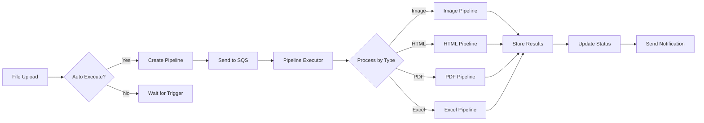

# 파이프라인 처리 엔진 개발 가이드 (KAN-145)

## 📋 Epic 개요

### 목표
FileFlow 플랫폼에 **다양한 파일 타입(이미지, HTML, PDF, Excel)에 대한 자동 처리 파이프라인**을 구축합니다.

### 핵심 요구사항
- **비동기 처리**: SQS/Kafka를 통한 메시지 기반 파이프라인
- **자동 재시도**: 실패 시 최대 3회 재시도 (Exponential Backoff)
- **실시간 모니터링**: 처리 상태 및 진행률 추적
- **SLA 준수**: 파일 타입별 처리 시간 보장

### 기술 스택
- **Message Queue**: AWS SQS (우선순위별 큐 분리)
- **Orchestration**: Spring Async + CompletableFuture
- **Monitoring**: Prometheus + Grafana
- **OCR/AI**: AWS Textract, OpenAI API

---

## 🏗️ 아키텍처 개요

### 헥사고날 아키텍처 적용
```
┌─────────────────────────────────────────────────────────────┐
│                    Adapter Layer (In)                        │
│  - PipelineController (REST API)                            │
│  - ProcessingPolicyController                               │
└─────────────────────────────────────────────────────────────┘
                              ↓
┌─────────────────────────────────────────────────────────────┐
│                   Application Layer                          │
│  - CreatePipelineUseCase                                    │
│  - ExecutePipelineUseCase                                   │
│  - ProcessingPolicyUseCases                                 │
└─────────────────────────────────────────────────────────────┘
                              ↓
┌─────────────────────────────────────────────────────────────┐
│                      Domain Layer                            │
│  - PipelineDefinition (Aggregate)                           │
│  - ProcessingPolicy (Aggregate)                             │
│  - Pipeline State Machine                                   │
└─────────────────────────────────────────────────────────────┘
                              ↓
┌─────────────────────────────────────────────────────────────┐
│                   Adapter Layer (Out)                        │
│  - ImageProcessorService (WebP, Thumbnails)                 │
│  - HtmlProcessorService (OCR, DOM Parsing)                  │
│  - PdfProcessorService (Text Extraction)                    │
│  - ExcelProcessorService (AI Mapping)                       │
│  - SQS/Kafka Message Publisher                              │
└─────────────────────────────────────────────────────────────┘
```

### 파이프라인 플로우


---

## 📂 프로젝트 구조

```
fileflow/
├── domain/
│   └── src/main/java/com/ryuqq/fileflow/domain/
│       └── pipeline/
│           ├── aggregate/
│           │   ├── PipelineDefinition.java      # Pipeline Aggregate Root
│           │   └── ProcessingPolicy.java        # Policy Aggregate Root
│           ├── vo/
│           │   ├── PipelineId.java
│           │   ├── PipelineStep.java
│           │   ├── PipelineResult.java
│           │   ├── ImageProcessingSettings.java
│           │   ├── HtmlProcessingSettings.java
│           │   ├── PdfProcessingSettings.java
│           │   └── ExcelProcessingSettings.java
│           ├── enums/
│           │   ├── PipelineType.java
│           │   ├── PipelineStatus.java
│           │   ├── Priority.java
│           │   └── StepType.java
│           ├── event/
│           │   ├── PipelineStartedEvent.java
│           │   ├── PipelineCompletedEvent.java
│           │   └── PipelineFailedEvent.java
│           └── repository/
│               ├── PipelineRepository.java      # Port Interface
│               └── ProcessingPolicyRepository.java
│
├── application/
│   └── src/main/java/com/ryuqq/fileflow/application/
│       └── pipeline/
│           ├── usecase/
│           │   ├── CreatePipelineUseCase.java
│           │   ├── ExecutePipelineUseCase.java
│           │   ├── GetPipelineUseCase.java
│           │   ├── CancelPipelineUseCase.java
│           │   ├── RetryPipelineUseCase.java
│           │   └── policy/
│           │       ├── CreateProcessingPolicyUseCase.java
│           │       ├── UpdateProcessingPolicyUseCase.java
│           │       └── GetProcessingPolicyUseCase.java
│           ├── dto/
│           │   ├── command/
│           │   │   ├── CreatePipelineCommand.java
│           │   │   └── ExecutePipelineCommand.java
│           │   └── response/
│           │       ├── PipelineResponse.java
│           │       └── ExecutionResult.java
│           ├── assembler/
│           │   └── PipelineAssembler.java
│           └── executor/
│               └── PipelineExecutor.java        # State Machine Engine
│
├── adapter-in-rest-api/
│   └── src/main/java/com/ryuqq/fileflow/adapter/in/rest/
│       └── pipeline/
│           ├── controller/
│           │   ├── PipelineController.java
│           │   └── ProcessingPolicyController.java
│           ├── dto/
│           │   ├── request/
│           │   │   ├── CreatePipelineApiRequest.java
│           │   │   └── CreatePolicyApiRequest.java
│           │   └── response/
│           │       └── PipelineApiResponse.java
│           └── mapper/
│               └── PipelineApiMapper.java
│
├── adapter-out-persistence-mysql/
│   └── src/main/java/com/ryuqq/fileflow/adapter/out/persistence/
│       └── pipeline/
│           ├── entity/
│           │   ├── PipelineJpaEntity.java
│           │   └── ProcessingPolicyJpaEntity.java
│           ├── repository/
│           │   ├── PipelineJpaRepository.java
│           │   └── ProcessingPolicyJpaRepository.java
│           ├── adapter/
│           │   ├── PipelineRepositoryAdapter.java
│           │   └── ProcessingPolicyRepositoryAdapter.java
│           └── mapper/
│               └── PipelinePersistenceMapper.java
│
├── adapter-out-processor/
│   └── src/main/java/com/ryuqq/fileflow/adapter/out/processor/
│       ├── image/
│       │   ├── ImageProcessorService.java       # WebP, Thumbnails
│       │   ├── WebPConverter.java
│       │   └── ThumbnailGenerator.java
│       ├── html/
│       │   ├── HtmlProcessorService.java        # OCR, DOM Parsing
│       │   ├── HtmlRenderer.java                # Playwright
│       │   └── OcrExtractor.java                # Tesseract
│       ├── pdf/
│       │   ├── PdfProcessorService.java         # Text Extraction
│       │   ├── PdfTextExtractor.java            # PDFBox
│       │   └── PdfThumbnailGenerator.java
│       └── excel/
│           ├── ExcelProcessorService.java       # AI Mapping
│           ├── SchemaDetector.java
│           └── AiColumnMapper.java              # OpenAI Integration
│
└── adapter-out-messaging/
    └── src/main/java/com/ryuqq/fileflow/adapter/out/messaging/
        └── sqs/
            ├── PipelineMessagePublisher.java
            ├── PipelineMessageConsumer.java
            └── config/
                └── SqsConfiguration.java
```

---

## 🔨 개발 태스크 상세 가이드

### 1단계: Domain Layer 구현 (KAN-217, KAN-218)

#### 1.1 PipelineDefinition Aggregate 구현

**파일**: `domain/.../pipeline/aggregate/PipelineDefinition.java`

```java
/**
 * 파이프라인 정의 Aggregate Root
 *
 * @author Sangwon Ryu
 * @since 1.0.0
 */
public class PipelineDefinition {
    private final PipelineId pipelineId;
    private final String name;
    private final PipelineType pipelineType;
    private final Long fileAssetId;  // Long FK 전략
    private final List<PipelineStep> steps;
    private PipelineStatus status;
    private final Priority priority;
    private int currentRetryCount;
    private final int maxRetryCount;

    // Private 생성자 (Static Factory 패턴)
    private PipelineDefinition(/*...*/) {
        // 초기화 로직
    }

    // Static Factory Method
    public static PipelineDefinition create(
        String name,
        PipelineType type,
        Long fileAssetId,
        Priority priority
    ) {
        // 생성 로직
    }

    // 비즈니스 메서드 (Tell, Don't Ask)
    public void start() {
        if (!canStart()) {
            throw new InvalidPipelineStateException(/*...*/);
        }
        this.status = PipelineStatus.RUNNING;
        // Domain Event 발행
    }

    public void complete(PipelineResult result) {
        // 완료 처리
    }

    public void fail(String errorMessage) {
        // 실패 처리 및 재시도 로직
    }

    // Law of Demeter 준수 - 체이닝 금지
    public boolean isHighPriority() {
        return priority == Priority.HIGH || priority == Priority.URGENT;
    }

    // Manual Getters (No Lombok!)
    public PipelineId getPipelineId() { return pipelineId; }
    public PipelineStatus getStatus() { return status; }
}
```

**주의사항**:
- ❌ Lombok 절대 사용 금지 (`@Data`, `@Builder` 등)
- ❌ Getter 체이닝 금지 (`pipeline.getStep().getType()` 금지)
- ✅ Tell, Don't Ask 패턴 적용
- ✅ Static Factory Method 사용
- ✅ Immutable Value Objects 활용

#### 1.2 ProcessingPolicy Aggregate 구현

**파일**: `domain/.../pipeline/aggregate/ProcessingPolicy.java`

```java
/**
 * 처리 정책 Aggregate Root
 *
 * @author Sangwon Ryu
 * @since 1.0.0
 */
public class ProcessingPolicy {
    private final ProcessingPolicyId policyId;
    private final Long tenantId;  // Long FK 전략
    private final FileType fileType;
    private boolean enabled;
    private boolean autoExecute;
    private final ProcessingSettings settings;  // Polymorphic VO

    // 비즈니스 규칙: 테넌트당 파일타입별 하나만 존재
    public static ProcessingPolicy createForTenant(
        Long tenantId,
        FileType fileType,
        ProcessingSettings settings
    ) {
        // 생성 로직
    }

    public void enable() {
        this.enabled = true;
        // ProcessingPolicyEnabledEvent 발행
    }

    public boolean shouldAutoExecute() {
        return enabled && autoExecute;
    }
}
```

### 2단계: Repository & Persistence 구현 (KAN-224)

#### 2.1 Repository Port Interface

**파일**: `domain/.../pipeline/repository/PipelineRepository.java`

```java
public interface PipelineRepository {
    PipelineDefinition save(PipelineDefinition pipeline);
    Optional<PipelineDefinition> findById(PipelineId id);
    List<PipelineDefinition> findByFileAssetId(Long fileAssetId);
    List<PipelineDefinition> findPendingPipelines(int limit);
    List<PipelineDefinition> findByStatusAndPriority(
        PipelineStatus status,
        Priority priority
    );
}
```

#### 2.2 JPA Entity (Long FK 전략)

**파일**: `adapter-out-persistence/.../entity/PipelineJpaEntity.java`

```java
@Entity
@Table(name = "pipelines")
public class PipelineJpaEntity {
    @Id
    @GeneratedValue(strategy = GenerationType.IDENTITY)
    private Long id;

    @Column(name = "pipeline_key", unique = true)
    private String pipelineKey;

    // ❌ JPA 관계 어노테이션 금지!
    // @ManyToOne 사용 금지
    @Column(name = "file_asset_id")
    private Long fileAssetId;  // ✅ Long FK 전략

    @Column(name = "steps", columnDefinition = "JSON")
    @Convert(converter = JsonConverter.class)
    private List<PipelineStepJson> steps;

    // Manual Getters/Setters
    public Long getId() { return id; }
    public void setId(Long id) { this.id = id; }
}
```

### 3단계: Application Layer UseCases 구현 (KAN-225, KAN-226)

#### 3.1 CreatePipelineUseCase

**파일**: `application/.../pipeline/usecase/CreatePipelineUseCase.java`

```java
/**
 * 파이프라인 생성 UseCase
 *
 * @author Sangwon Ryu
 * @since 1.0.0
 */
@Component
@RequiredArgsConstructor
public class CreatePipelineUseCase {
    private final PipelineRepository pipelineRepository;
    private final ProcessingPolicyRepository policyRepository;
    private final EventPublisher eventPublisher;

    @Transactional  // Transaction 경계
    public PipelineResponse execute(CreatePipelineCommand command) {
        // 1. Policy 조회
        ProcessingPolicy policy = policyRepository
            .findByTenantAndFileType(
                command.getTenantId(),
                command.getFileType()
            )
            .orElseThrow(() -> new PolicyNotFoundException());

        // 2. Pipeline 생성
        PipelineDefinition pipeline = PipelineDefinition.create(
            command.getName(),
            command.getPipelineType(),
            command.getFileAssetId(),
            command.getPriority()
        );

        // 3. 저장
        PipelineDefinition saved = pipelineRepository.save(pipeline);

        // 4. 자동 실행 여부 확인
        if (policy.shouldAutoExecute()) {
            eventPublisher.publish(
                new PipelineCreatedEvent(saved.getPipelineId())
            );
        }

        // 5. Response 변환
        return PipelineAssembler.toResponse(saved);
    }
}
```

**Transaction 경계 주의사항**:
- ✅ `@Transactional`은 UseCase 레벨에 적용
- ❌ `@Transactional` 내부에서 외부 API 호출 금지
- ❌ Private 메서드에 `@Transactional` 적용 안됨
- ❌ 같은 클래스 내부 호출 시 프록시 동작 안함

#### 3.2 ExecutePipelineUseCase (비동기 처리)

```java
@Component
public class ExecutePipelineUseCase {
    private final PipelineRepository pipelineRepository;
    private final PipelineMessagePublisher messagePublisher;

    @Transactional
    public ExecutionResult execute(ExecutePipelineCommand command) {
        // 1. Pipeline 조회 및 검증
        PipelineDefinition pipeline = pipelineRepository
            .findById(command.getPipelineId())
            .orElseThrow();

        // 2. 상태 변경
        pipeline.start();
        pipelineRepository.save(pipeline);

        // 3. 트랜잭션 커밋 후 메시지 발행
        // (TransactionalEventListener 사용)
        return new ExecutionResult(pipeline.getPipelineId());
    }

    @TransactionalEventListener(phase = TransactionPhase.AFTER_COMMIT)
    public void handlePipelineStarted(PipelineStartedEvent event) {
        // 트랜잭션 커밋 후 SQS 메시지 발행
        messagePublisher.publish(event);
    }
}
```

### 4단계: Adapter Layer - Processors 구현 (KAN-219~222)

#### 4.1 Image Processing Pipeline

**파일**: `adapter-out-processor/.../image/ImageProcessorService.java`

```java
@Service
@Slf4j
public class ImageProcessorService implements PipelineProcessor {
    private final S3Service s3Service;
    private final WebPConverter webPConverter;
    private final ThumbnailGenerator thumbnailGenerator;

    @Override
    public PipelineResult process(ProcessingContext context) {
        try {
            // 1. 원본 이미지 다운로드
            byte[] originalImage = s3Service.download(
                context.getFileAssetId()
            );

            // 2. 병렬 처리 (CompletableFuture)
            CompletableFuture<byte[]> webpFuture =
                CompletableFuture.supplyAsync(() ->
                    webPConverter.convert(originalImage)
                );

            CompletableFuture<List<Thumbnail>> thumbnailsFuture =
                CompletableFuture.supplyAsync(() ->
                    thumbnailGenerator.generateAll(originalImage)
                );

            // 3. 결과 수집
            CompletableFuture.allOf(webpFuture, thumbnailsFuture).join();

            // 4. S3 업로드
            String webpUrl = s3Service.upload(webpFuture.get());
            List<String> thumbnailUrls = uploadThumbnails(
                thumbnailsFuture.get()
            );

            // 5. 결과 반환
            return PipelineResult.success()
                .withMainOutput(webpUrl)
                .withThumbnails(thumbnailUrls)
                .build();

        } catch (Exception e) {
            log.error("Image processing failed", e);
            return PipelineResult.failure(e.getMessage());
        }
    }
}
```

#### 4.2 Excel Processing with AI Mapping

**파일**: `adapter-out-processor/.../excel/AiColumnMapper.java`

```java
@Component
public class AiColumnMapper {
    private final OpenAiClient openAiClient;

    public MappingResult mapColumns(List<String> columnNames) {
        // 1. AI 프롬프트 구성
        String prompt = buildMappingPrompt(columnNames);

        // 2. OpenAI API 호출 (트랜잭션 밖에서!)
        AiResponse response = openAiClient.complete(prompt);

        // 3. 매핑 결과 파싱
        return parseMappingResponse(response);
    }

    private String buildMappingPrompt(List<String> columns) {
        return String.format(
            "Map these Excel columns to standard fields:\n%s\n" +
            "Return JSON with mappings and confidence scores.",
            String.join(", ", columns)
        );
    }
}
```

### 5단계: Message Queue Integration (KAN-227)

#### 5.1 SQS Configuration

**파일**: `adapter-out-messaging/.../sqs/config/SqsConfiguration.java`

```java
@Configuration
public class SqsConfiguration {

    @Bean
    public AmazonSQSAsync amazonSQSAsync() {
        return AmazonSQSAsyncClientBuilder
            .standard()
            .withRegion(Regions.AP_NORTHEAST_2)
            .build();
    }

    @Bean
    public QueueMessagingTemplate queueMessagingTemplate(
        AmazonSQSAsync amazonSQSAsync
    ) {
        return new QueueMessagingTemplate(amazonSQSAsync);
    }
}
```

#### 5.2 Message Publisher

```java
@Component
@RequiredArgsConstructor
public class PipelineMessagePublisher {
    private final QueueMessagingTemplate messagingTemplate;

    @Value("${aws.sqs.pipeline-high-priority-queue}")
    private String highPriorityQueue;

    @Value("${aws.sqs.pipeline-normal-queue}")
    private String normalQueue;

    public void publish(PipelineExecutionMessage message) {
        String queueName = message.isHighPriority() ?
            highPriorityQueue : normalQueue;

        messagingTemplate.send(queueName, message);

        log.info("Published pipeline message to {}: {}",
            queueName, message.getPipelineId());
    }
}
```

#### 5.3 Message Consumer

```java
@Component
@Slf4j
public class PipelineMessageConsumer {
    private final PipelineExecutor pipelineExecutor;

    @SqsListener(value = "${aws.sqs.pipeline-high-priority-queue}")
    public void consumeHighPriority(PipelineExecutionMessage message) {
        processPipeline(message);
    }

    @SqsListener(value = "${aws.sqs.pipeline-normal-queue}")
    public void consumeNormal(PipelineExecutionMessage message) {
        processPipeline(message);
    }

    private void processPipeline(PipelineExecutionMessage message) {
        try {
            // Idempotency 체크
            if (isAlreadyProcessed(message.getPipelineId())) {
                log.info("Pipeline already processed: {}",
                    message.getPipelineId());
                return;
            }

            // Pipeline 실행
            pipelineExecutor.execute(message.getPipelineId());

        } catch (Exception e) {
            log.error("Pipeline execution failed", e);
            // DLQ로 자동 전송됨 (SQS 설정)
            throw e;
        }
    }
}
```

### 6단계: REST API Controller (KAN-228)

**파일**: `adapter-in-rest-api/.../controller/PipelineController.java`

```java
@Tag(name = "Pipeline", description = "파이프라인 관리 API")
@RestController
@RequestMapping("/api/v1/pipelines")
@RequiredArgsConstructor
public class PipelineController {
    private final CreatePipelineUseCase createPipelineUseCase;
    private final ExecutePipelineUseCase executePipelineUseCase;
    private final PipelineApiMapper mapper;

    @Operation(
        summary = "파이프라인 생성",
        description = "새로운 파일 처리 파이프라인을 생성합니다"
    )
    @ApiResponses({
        @ApiResponse(responseCode = "201", description = "생성 성공"),
        @ApiResponse(responseCode = "400", description = "잘못된 요청")
    })
    @PostMapping
    @ResponseStatus(HttpStatus.CREATED)
    public ApiResponse<PipelineApiResponse> createPipeline(
        @Valid @RequestBody CreatePipelineApiRequest request
    ) {
        CreatePipelineCommand command = mapper.toCommand(request);
        PipelineResponse response = createPipelineUseCase.execute(command);
        return ApiResponse.success(mapper.toApiResponse(response));
    }

    @Operation(summary = "파이프라인 실행")
    @PostMapping("/{id}/execute")
    public ApiResponse<ExecutionResult> executePipeline(
        @PathVariable Long id
    ) {
        ExecutePipelineCommand command = new ExecutePipelineCommand(
            new PipelineId(id)
        );
        ExecutionResult result = executePipelineUseCase.execute(command);
        return ApiResponse.success(result);
    }

    @Operation(summary = "파이프라인 상태 조회")
    @GetMapping("/{id}/status")
    public ApiResponse<PipelineStatusResponse> getPipelineStatus(
        @PathVariable Long id
    ) {
        // SSE 또는 WebSocket으로 실시간 상태 전송 고려
    }
}
```

### 7단계: Testing Strategy (KAN-230, KAN-231)

#### 7.1 Domain Unit Test

```java
class PipelineDefinitionTest {

    @Test
    void shouldCreatePipelineWithPendingStatus() {
        // Given
        String name = "Image Processing";
        PipelineType type = PipelineType.IMAGE;

        // When
        PipelineDefinition pipeline = PipelineDefinition.create(
            name, type, 123L, Priority.NORMAL
        );

        // Then
        assertThat(pipeline.getStatus()).isEqualTo(PipelineStatus.PENDING);
        assertThat(pipeline.canStart()).isTrue();
    }

    @Test
    void shouldNotStartPipelineWhenAlreadyRunning() {
        // Given
        PipelineDefinition pipeline = createRunningPipeline();

        // When & Then
        assertThatThrownBy(() -> pipeline.start())
            .isInstanceOf(InvalidPipelineStateException.class)
            .hasMessageContaining("Cannot start pipeline in RUNNING status");
    }
}
```

#### 7.2 Integration Test with TestContainers

```java
@SpringBootTest
@AutoConfigureMockMvc
@Testcontainers
class PipelineIntegrationTest {

    @Container
    static MySQLContainer<?> mysql = new MySQLContainer<>("mysql:8.0");

    @Container
    static LocalStackContainer localstack = new LocalStackContainer()
        .withServices(S3, SQS);

    @Autowired
    private MockMvc mockMvc;

    @Test
    void shouldProcessImagePipelineEndToEnd() throws Exception {
        // 1. 파일 업로드
        MockMultipartFile imageFile = new MockMultipartFile(
            "file", "test.jpg", "image/jpeg", loadTestImage()
        );

        String uploadResponse = mockMvc.perform(
            multipart("/api/v1/files")
                .file(imageFile)
        ).andReturn().getResponse().getContentAsString();

        Long fileAssetId = extractFileAssetId(uploadResponse);

        // 2. 파이프라인 생성
        CreatePipelineApiRequest request = new CreatePipelineApiRequest(
            fileAssetId,
            PipelineType.IMAGE,
            Priority.NORMAL,
            true  // autoExecute
        );

        mockMvc.perform(
            post("/api/v1/pipelines")
                .contentType(MediaType.APPLICATION_JSON)
                .content(objectMapper.writeValueAsString(request))
        )
        .andExpect(status().isCreated())
        .andExpect(jsonPath("$.data.status").value("PENDING"));

        // 3. SQS 메시지 확인
        await().atMost(10, SECONDS).until(() -> {
            // LocalStack SQS에서 메시지 확인
            return messageCount() > 0;
        });

        // 4. 처리 결과 확인
        await().atMost(30, SECONDS).until(() -> {
            // S3에 WebP 파일 생성 확인
            return s3Client.doesObjectExist(bucket, "converted/test.webp");
        });
    }
}
```

#### 7.3 ArchUnit Test

```java
@RunWith(ArchUnitRunner.class)
@AnalyzeClasses(packages = "com.ryuqq.fileflow.pipeline")
public class PipelineArchitectureTest {

    @ArchTest
    static final ArchRule no_lombok_in_domain =
        noClasses()
            .that().resideInAPackage("..domain.pipeline..")
            .should().dependOnClassesThat()
            .resideInAPackage("lombok..");

    @ArchTest
    static final ArchRule processors_should_implement_interface =
        classes()
            .that().haveSimpleNameEndingWith("Processor")
            .should().implement(PipelineProcessor.class);

    @ArchTest
    static final ArchRule async_methods_should_not_be_transactional =
        methods()
            .that().areAnnotatedWith(Async.class)
            .should().notBeAnnotatedWith(Transactional.class)
            .because("Async와 @Transactional은 함께 사용할 수 없습니다");
}
```

---

## 📊 모니터링 및 메트릭 (KAN-229)

### Prometheus Metrics 구현

```java
@Component
@RequiredArgsConstructor
public class PipelineMetrics {
    private final MeterRegistry registry;

    // Counter: 총 실행 횟수
    public void recordExecution(PipelineType type, PipelineStatus status) {
        Counter.builder("pipeline.executions.total")
            .tag("type", type.name())
            .tag("status", status.name())
            .register(registry)
            .increment();
    }

    // Histogram: 실행 시간
    public void recordDuration(PipelineType type, long durationMs) {
        Timer.builder("pipeline.execution.duration")
            .tag("type", type.name())
            .register(registry)
            .record(Duration.ofMillis(durationMs));
    }

    // Gauge: 큐 크기
    public void updateQueueSize(int size) {
        Gauge.builder("pipeline.queue.size", size, Integer::intValue)
            .register(registry);
    }
}
```

### Grafana Dashboard 설정

```json
{
  "dashboard": {
    "title": "Pipeline Processing Dashboard",
    "panels": [
      {
        "title": "Pipeline Execution Rate",
        "targets": [
          {
            "expr": "rate(pipeline_executions_total[5m])"
          }
        ]
      },
      {
        "title": "Pipeline Success Rate",
        "targets": [
          {
            "expr": "rate(pipeline_executions_total{status='COMPLETED'}[5m]) / rate(pipeline_executions_total[5m]) * 100"
          }
        ]
      },
      {
        "title": "Average Processing Time",
        "targets": [
          {
            "expr": "histogram_quantile(0.95, pipeline_execution_duration_seconds)"
          }
        ]
      }
    ]
  }
}
```

---

## 🚀 개발 순서 및 의존관계

### Phase 1: Domain & Repository (Week 1)
1. **KAN-217**: PipelineDefinition Aggregate 구현
2. **KAN-218**: ProcessingPolicy Aggregate 구현
3. **KAN-224**: Repository Ports & JPA Adapters

### Phase 2: Application & Execution (Week 2)
4. **KAN-225**: Pipeline 관리 UseCases
5. **KAN-226**: Processing Policy UseCases
6. **KAN-223**: Pipeline Execution Engine (State Machine)

### Phase 3: Processors (Week 3-4)
7. **KAN-219**: Image Processing Pipeline (병렬 작업 가능)
8. **KAN-220**: HTML Processing Pipeline (병렬 작업 가능)
9. **KAN-221**: PDF Processing Pipeline (병렬 작업 가능)
10. **KAN-222**: Excel Processing Pipeline (병렬 작업 가능)

### Phase 4: Integration (Week 5)
11. **KAN-227**: SQS/Kafka Integration
12. **KAN-228**: REST API Controllers
13. **KAN-229**: Monitoring & Alerting

### Phase 5: Testing & Documentation (Week 6)
14. **KAN-230**: E2E Integration Tests
15. **KAN-231**: ArchUnit Tests
16. **KAN-232**: OpenAPI/Swagger Documentation

---

## ⚠️ 주의사항 및 체크리스트

### Zero-Tolerance Rules
- [ ] **NO Lombok**: 모든 getter/setter 수동 작성
- [ ] **Law of Demeter**: Getter 체이닝 절대 금지
- [ ] **Long FK Strategy**: JPA 관계 어노테이션 사용 금지
- [ ] **Transaction Boundaries**: 외부 API 호출은 트랜잭션 밖에서
- [ ] **Spring Proxy**: Private 메서드에 @Transactional 적용 안됨
- [ ] **Javadoc**: 모든 public 클래스/메서드에 작성

### 성능 최적화
- [ ] 이미지 처리는 CompletableFuture로 병렬 처리
- [ ] SQS는 우선순위별 큐 분리
- [ ] Redis 캐싱 적극 활용
- [ ] N+1 쿼리 방지

### 에러 처리
- [ ] 모든 Pipeline Step에 재시도 로직
- [ ] DLQ(Dead Letter Queue) 설정
- [ ] Graceful Shutdown 구현
- [ ] Circuit Breaker 패턴 적용

---

## 📚 참고 자료

- [Spring Boot SQS Integration](https://docs.awspring.io/spring-cloud-aws/docs/current/reference/html/#sqs)
- [Apache PDFBox Documentation](https://pdfbox.apache.org/)
- [ImageMagick Java Bindings](http://im4java.sourceforge.net/)
- [OpenAI API Java Client](https://github.com/openai/openai-java)
- [TestContainers LocalStack](https://www.testcontainers.org/modules/localstack/)

---

**작성자**: Claude Code Assistant
**작성일**: 2025-10-30
**버전**: 1.0.0